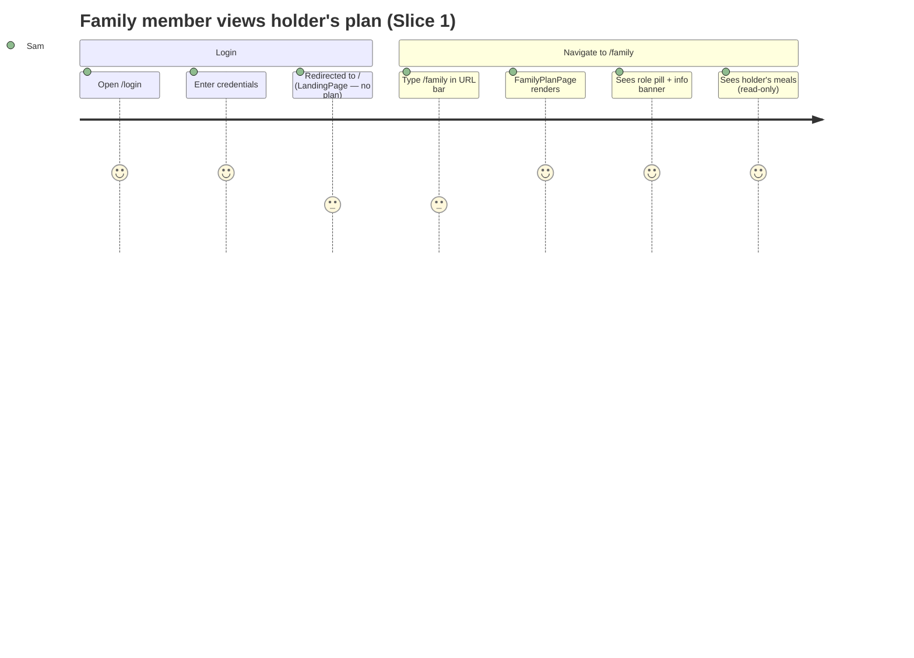
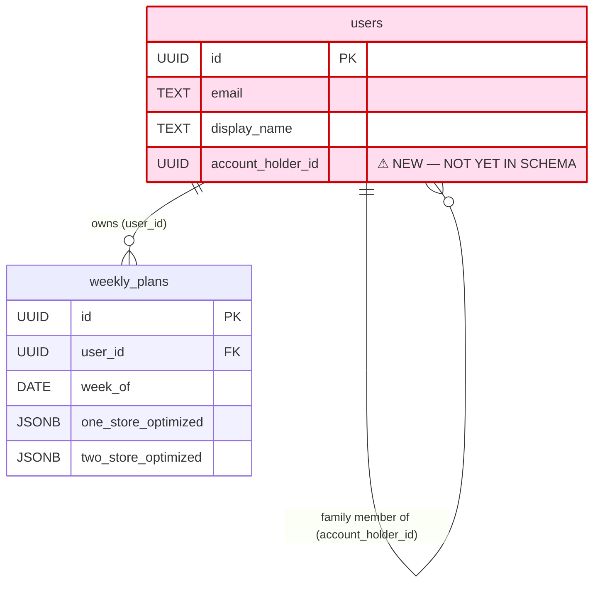
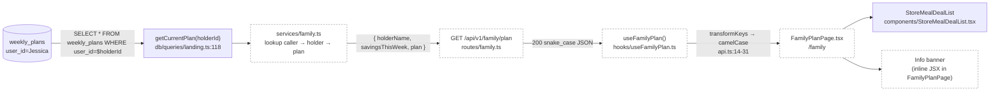

# Slice Abstract — Slice 1: Walking skeleton — family member sees the account holder's plan

> **Status:** APPROVED — 2026-06-17
> Status legend: **VERIFIED** (cited from a file opened this session, with snippet) · **ASSUMED** (inference) · **UNKNOWN** (needs input)
> Citations are `path:Lstart-Lend`. No implementation has been started — this is a design document for review.

## At a glance

|                           |                                                                        |
| ------------------------- | ---------------------------------------------------------------------- |
| **Slice**                 | 1 — Walking skeleton (source: `slice-specs/family-member-meal-suggestions/slice-1/slice.md`) |
| **Mockup**                | `mockups/groceryhack-mockups.html:864-978` (Screen 3 — Family Member · Meal Plan) |
| **Conflicts / decisions** | **4** (below)                                                          |
| **Open questions**        | **0**                                                                  |

### What this slice touches

| Op | File | Why |
|----|------|-----|
| 🆕 | `backend/src/db/migrations/006_add_account_holder_link.sql` | New migration: nullable self-FK `users.account_holder_id` + index |
| ✏️ | `schema.sql` | Mirror the migration (CLAUDE.md rule) |
| ✏️ | `packages/shared/types.ts` | Add `accountHolderId: string \| null` to `User`; add `UserRole` alias; add `FamilyPlanResponse` |
| ✏️ | `backend/src/db/queries/users.ts` | `mapUserRow` and `findUserById` SELECT list must include `account_holder_id` |
| ✏️ | `backend/src/services/auth.ts` | `userToSnakeCase` must include `account_holder_id` so login returns it |
| 🆕 | `backend/src/db/queries/family.ts` | New query: resolve caller's holder, fetch holder's plan via `getCurrentPlan` pattern |
| 🆕 | `backend/src/services/family.ts` | Business logic: validate role, fetch holder plan + savings, return error codes |
| 🆕 | `backend/src/routes/family.ts` | `GET /api/v1/family/plan`; register with `requireAuth` |
| ✏️ | `backend/src/app.ts` | Register `familyRoutes` under `/api/v1/family` |
| ✏️ | `backend/src/db/seed.ts` | Add `sam@test.groceryhack.com` ("Sam M") with `account_holder_id = Jessica's deterministic UUID` and `bcrypt.hash('testpassword123', 10)` — same password pattern as all other test users — so Sam can log in |
| 🆕 | `frontend/src/pages/FamilyPlanPage.tsx` | New page: displays holder's plan read-only with role pill + info banner |
| 🆕 | `frontend/src/hooks/useFamilyPlan.ts` | TanStack Query hook: `GET /api/v1/family/plan` |
| ✏️ | `frontend/src/App.tsx` | Add `<Route path="/family" element={<FamilyPlanPage />} />` |

---

### Conflicts & decisions needed first

> **⚠️ 1 · Mockup Screen 3 shows "Suggest a swap" and "Suggestion pending" UI — Slice 1 must omit them**  ✅ _decided_
> The mockup (`mockups/groceryhack-mockups.html:914-918`) renders "Suggest a swap" buttons and a "Suggestion pending" pill on each meal row. Slice 1 explicitly scopes these out: *"the suggest affordance is inert/absent this slice."* The implementer renders the plan read-only using `StoreMealDealList` without any per-meal action controls; those are added in Slice 2. The mockup shows the final Slice-2 state, not the Slice-1 state.
> `slice-specs/family-member-meal-suggestions/slice-1/slice.md:56` — `"the suggest affordance is inert/absent this slice"`

> **⚠️ 2 · `mapUserRow`, `userToSnakeCase`, and `findUserById` SELECT list must be updated for `account_holder_id`** ✅ _decided_
> All three locations are in scope for this slice. Update `backend/src/db/queries/users.ts` (SELECT list + `mapUserRow`), `backend/src/services/auth.ts` (`userToSnakeCase`), and `packages/shared/types.ts` (`User.accountHolderId`) as a single change alongside the migration — they are a hard sequential dependency for the frontend to know the caller's role.
> `backend/src/db/queries/users.ts:56-62` — `"SELECT id, email, display_name, ... FROM users WHERE id = $1"` (add `account_holder_id` here)

> **⚠️ 3 · `AuthGate` is the wrong guard for `FamilyPlanPage`; post-login routing leaves Sam on an empty `/`** ✅ _decided_
> `AuthGate` (`frontend/src/components/shared/AuthGate.tsx:11-152`) is a click-interceptor that shows a "Sign up" prompt — it does not redirect. `FamilyPlanPage` needs a hard redirect: inline `useAuth().isAuthenticated` + `useNavigate('/login')` at the top of the page, same pattern as `LandingPage`. Separately, `LoginPage` always redirects to `/` after login (`LoginPage.tsx:122` — `navigate('/')`), so Sam lands on `LandingPage` which shows her an empty state (no plan, no swipes). She must manually navigate to `/family`. This is a known Slice 1 UX limitation — post-login auto-routing for family members is deferred to Slice 8.

> **⚠️ 4 · `seed.ts` adds Sam (including login credentials); `seedPlans.ts` does not need to change** ✅ _decided_
> `backend/src/db/seed.ts` **does** need a new user entry for Sam — email, display name, postal code, `account_holder_id`, and crucially a `password_hash` (same `bcrypt.hash('testpassword123', 10)` pattern as all other test users) so she can log in. `backend/src/db/seedPlans.ts:4-10` is a separate script that hardcodes `TEST_USER_EMAILS` (Jessica through Sarah) and generates optimizer plans for those users only. Sam has no plan of her own and must not be added there — she reads Jessica's plan via the new endpoint. Jessica is already in `TEST_USER_EMAILS`, so `seedPlans.ts` needs no change.
> `backend/src/db/seedPlans.ts:4-10` — `"const TEST_USER_EMAILS = [ 'jessica@test.groceryhack.com', ..."`

---

## 1. User capability & journey

- **New capability:** A family member can sign in with their own credentials, navigate to `/family`, and see the account holder's current-week meal plan read-only with a visible "Family member" role label and an info banner explaining the relationship.
- **Getting there:** User logs in at `/login` (existing) → navigates manually to `/family` (post-login auto-routing to `/family` is deferred to Slice 8).
- **Afterward:** The user sees the plan but cannot act on it yet. "Suggest a swap" affordances arrive in Slice 2.



_Note: Post-login redirect to `/family` is a Slice 8 concern; Slice 1 requires manual navigation._

---

## 2. Entities

- **Named in the spec (Gherkin Background):** "account holder," "family member linked to that account," "meal plan for the current week."
- **Actually in the DB:**
  - `users` — VERIFIED: `schema.sql:13-33` — no `account_holder_id` column exists today. `"CREATE TABLE users ("` … no self-FK.
  - `weekly_plans` — VERIFIED: `schema.sql:282-292` — `"user_id UUID NOT NULL REFERENCES users(id)"` — plan belongs to a single user (the account holder).
- **Relationships as the spec describes them:** A `users` row is either an account holder (`account_holder_id IS NULL`) or a family member (`account_holder_id` references another `users.id`). The family member has no `weekly_plans` row of their own; they read the holder's plan.
- **Already enforced in DB/codebase:** None of the linkage exists today. `users` has no `account_holder_id`, `weekly_plans` has no secondary-user concept, and neither the routes nor the frontend know about roles.
- **CONFLICT — column missing from `mapUserRow` / `userToSnakeCase` / SELECT list:** When the migration adds `account_holder_id`, the following files will silently drop it unless updated:
  - `backend/src/db/queries/users.ts:56-68` — `findUserById` SELECT list explicitly enumerates columns and does not include `account_holder_id`. **VERIFIED snippet:** `"SELECT id, email, display_name, postal_code, lat, lng, budget, dietary_restrictions, max_stores, household_size, household_members, household_names, taste_profile, subscription_active, created_at, updated_at FROM users WHERE id = $1"`
  - `backend/src/db/queries/users.ts:8-27` — `mapUserRow` builds the `User` object from a row and has no `accountHolderId` mapping.
  - `backend/src/services/auth.ts:39-58` — `userToSnakeCase` serialises `User` to snake_case for API responses and has no `account_holder_id` key. **VERIFIED snippet:** `"return { id: user.id, email: user.email, display_name: user.displayName, ..."`
  - `packages/shared/types.ts:172-191` — `User` interface has no `accountHolderId` field. **VERIFIED snippet:** `"export interface User { id: string; email: string; displayName: string | null; ..."`



_Legend: red/⚠ = column does not yet exist in schema; the self-FK `account_holder_id` is added by migration 006._

---

## 3. Contracts

**New endpoint — does not exist yet:**

| Endpoint | Status | Shape the slice expects | Notes |
|----------|--------|------------------------|-------|
| `GET /api/v1/family/plan` | MISSING | See below | New file `routes/family.ts`; no entry in `api-contract.yaml` yet (deferred per slice spec) |
| `GET /api/v1/landing` | EXISTS | Unchanged — not called by family member | `backend/src/routes/landing.ts`; used by `LandingPage` only |

**Expected `GET /api/v1/family/plan` response (snake_case, per CLAUDE.md convention):**

```json
{
  "holder_name": "Jessica M",
  "savings_this_week": 23.34,
  "savings_ytd": 26.22,
  "plan": { /* WeeklyPlan object — same shape as landing getCurrentPlan output */ }
}
```

**Error cases:**

| Condition | Error code | HTTP status |
|-----------|-----------|-------------|
| Caller has `account_holder_id IS NULL` | `NOT_A_FAMILY_MEMBER` | 403 |
| Holder has no current-week plan | `NO_PLAN` | 404 |

**Reusable backend pattern — VERIFIED:**
`getCurrentPlan(userId)` at `backend/src/db/queries/landing.ts:118-143` already fetches a holder's current-week plan by `user_id` and returns the snake_case `WeeklyPlan`-shaped object. The family endpoint calls it with the holder's `user_id`, not the caller's.

---

## 4. Annotated mockup

**Relevant section:** `mockups/groceryhack-mockups.html:864-978` — Screen 3 — Family Member · Meal Plan.

**Elements in Slice 1 scope:**

| Element | Mockup line | Notes |
|---------|-------------|-------|
| `<span class="role-pill">Family member</span>` | L873 | New inline element in the page header. Not part of `StoreMealDealList`. |
| Info banner | L894-L896 | `"Same plan Jessica sees. You can suggest a swap on any meal — only Jessica can change the plan directly."` — lives above the plan section. |
| 1 Store / 2 Stores toggle | L887-L890 | `StoreMealDealList` already renders this via `StoreLimitToggle`. |
| Shopping plan (store cards, meals, items) | L904-L960 | Rendered by `StoreMealDealList` reused from `LandingPage`. |
| "Also needed" block | L962-L975 | Already rendered by `StoreMealDealList:694-733`. |

**Elements explicitly OUT of Slice 1 (Slice 2/3):**

| Element | Mockup line | Deferred to |
|---------|-------------|-------------|
| `<button class="btn-xs">Suggest a swap</button>` | L914-918 | Slice 2 |
| `<span class="pill-pending">Suggestion pending</span>` | L916, L947 | Slice 2/3 |

**Generic components (reusable):**
- `StoreMealDealList` — already used on `LandingPage` with the identical store-card / meal-list / shopping-item structure. VERIFIED: `frontend/src/components/StoreMealDealList.tsx:576-748`. Props: `{ plan: WeeklyPlan; onStoreLimitChange: (s: 1|2) => void; storeLimit: 1|2 }`.
- `StoreLimitToggle` — rendered inside `StoreMealDealList` when `plan.twoStoreOptimized !== null`. No changes needed.

**One-off components:**
- Role pill (inline `<span>` in the page header).
- Info banner (new `<div>` element; matches `div.info-banner` at mockup L893-L896).
- `FamilyPlanPage` itself (page shell with header greeting, role pill, savings stats, banner, plan).

**State-management intuition (ASSUMED):**
- `useFamilyPlan()` hook fetches `GET /api/v1/family/plan`, returns `{ holderName, savingsThisWeek, plan }`.
- `FamilyPlanPage` manages `storeLimit` via `useState<1|2>(2)`, mirroring the `LandingPage` pattern (VERIFIED: `frontend/src/pages/LandingPage.tsx:142` — `"const [storeLimit, setStoreLimit] = useState<1 | 2>(2)"`).
- No mutations; all state is UI-local (storeLimit) or server-derived (plan).

---

## 5. Data flow



_Legend: dashed/(ASSUMED) = file does not yet exist; solid = VERIFIED in existing codebase._

**Per-hop status:**

| Hop | Status | Citation / snippet |
|-----|--------|-------------------|
| DB → `getCurrentPlan` | VERIFIED | `backend/src/db/queries/landing.ts:119-122` — `"SELECT * FROM weekly_plans WHERE user_id = $1 AND week_of >= date_trunc('week', CURRENT_DATE)"` |
| `getCurrentPlan` → service | ASSUMED | New `services/family.ts` — will call `getCurrentPlan(holderId)` |
| Service → route handler | ASSUMED | New `routes/family.ts` — serialises response to snake_case |
| Route → `useFamilyPlan` | ASSUMED | New hook using `api.get<FamilyPlanResponse>('/family/plan')` |
| `api.ts` snake→camel transform | VERIFIED | `frontend/src/services/api.ts:14-31` — `"function transformKeys(obj: unknown): unknown { ... snakeToCamel }"` |
| Hook → `FamilyPlanPage` | ASSUMED | New page component |
| Page → `StoreMealDealList` | VERIFIED (component exists) | `frontend/src/components/StoreMealDealList.tsx:576` — `"export function StoreMealDealList({ plan, onStoreLimitChange, storeLimit }"` |

---

## 6. Assumptions & load-bearing decisions register

| # | Description | Type | Load-bearing? | Needs confirmation? |
|---|-------------|------|---------------|---------------------|
| 1 | `mapUserRow`, `findUserById` SELECT, and `userToSnakeCase` must all be updated to include `account_holder_id` — all three locations are in scope for this slice alongside the migration. | VERIFIED (decided) | Yes | No |
| 2 | Mockup Screen 3 shows "Suggest a swap" / "Suggestion pending" per meal — Slice 1 omits these interactive controls entirely. | VERIFIED (resolved) | Yes | No |
| 3 | `seed.ts` adds Sam with email, display name, `account_holder_id`, AND `password_hash` (`testpassword123`) so she can log in. `seedPlans.ts` is a separate script and does not change — Sam has no plan; she reads Jessica's. | VERIFIED (decided) | Yes | No |
| 4 | `FamilyPlanPage` manages `storeLimit` state locally (same pattern as `LandingPage`), passes it to `StoreMealDealList`. | ASSUMED | No | No |
| 5 | `GET /api/v1/family/plan` response includes `holder_name`, `savings_this_week`, and `savings_ytd` — all the holder's figures, displayed to Sam in the page header. Both DB functions already exist in `landing.ts`. | VERIFIED (decided) | Yes | No |
| 6 | `FamilyPlanPage` uses inline `useAuth().isAuthenticated` + `useNavigate('/login')` guard — `AuthGate` is a click-interceptor (not a redirect guard) and is the wrong tool here. Post-login, Sam lands on `/` (empty `LandingPage`) and must manually navigate to `/family`; auto-routing deferred to Slice 8. | VERIFIED (decided) | Yes | No |
| 7 | `api-contract.yaml` entry for the new endpoint is deferred (confirmed in slice spec). | VERIFIED (deferred) | No | No |
| 8 | Migration number `003` is absent from `backend/src/db/migrations/` — this is a pre-existing gap, not a conflict with this slice. Next migration is correctly `006`. | VERIFIED | No | No |
| 9 | `sam@test.groceryhack.com` deterministic UUID = `makeUuid('user:sam@test.groceryhack.com')` using the same helper as the rest of `seed.ts`. | ASSUMED | Yes | No (follow existing pattern) |
| 10 | Login page navigates to `/` after success — Sam lands on `LandingPage` which shows no plan for her. Manual navigation to `/family` required (confirmed by slice spec). | VERIFIED | No | No |

---

## 7. Verification plan (Chrome)

**Tooling:** Chrome MCP (`chrome_navigate`, `chrome_execute_script`, `chrome_get_visible_text`, `chrome_screenshot`) if available; otherwise `python3 backend/scripts/cdp.py goto/eval/screenshot`.

---

### Step 1 — Migration + schema compile check

```bash
cd backend && npm run migrate
```
**Expect:** Migration `006` reported as applied. No errors.

```bash
grep "account_holder_id" schema.sql
```
**Expect:** Line present; `ALTER TABLE`/column definition matches migration.

```bash
cd backend && npx tsc --noEmit
cd frontend && npx tsc --noEmit
```
**Expect:** Zero errors. Confirms `User.accountHolderId`, `UserRole`, `FamilyPlanResponse` are in shared types and all consumers compile.

---

### Step 2 — Seed + Sam user check

```bash
cd backend && npm run seed && npm run seed:plans
```
**Expect:** No errors. `sam@test.groceryhack.com` inserted with `account_holder_id` = Jessica's UUID.

```sql
SELECT email, account_holder_id FROM users WHERE email IN ('sam@test.groceryhack.com', 'jessica@test.groceryhack.com');
```
**Expect:** Sam's `account_holder_id` equals Jessica's `id`. Jessica's `account_holder_id` IS NULL.

```sql
SELECT count(*) FROM weekly_plans WHERE user_id = (SELECT id FROM users WHERE email = 'jessica@test.groceryhack.com');
```
**Expect:** Count >= 1.

Verify Sam can authenticate (confirms password hash was seeded):

```bash
curl -s -X POST http://localhost:3000/api/v1/auth/login \
  -H 'Content-Type: application/json' \
  -d '{"email":"sam@test.groceryhack.com","password":"testpassword123"}' | jq '{token_present: (.token != null), account_holder_id: .user.account_holder_id}'
```
**Expect:** `token_present: true`, `account_holder_id` is a non-null UUID (Jessica's id).

---

### Step 3 — API: Happy path (Sam → Jessica's plan)

```bash
# Login as Sam
curl -s -X POST http://localhost:3000/api/v1/auth/login \
  -H 'Content-Type: application/json' \
  -d '{"email":"sam@test.groceryhack.com","password":"testpassword123"}' | jq '.token'
```

```bash
# Fetch family plan
curl -s http://localhost:3000/api/v1/family/plan \
  -H "Authorization: Bearer <TOKEN>" | jq '{holder_name, savings_this_week, plan_id: .plan.id}'
```
**Expect:** `holder_name: "Jessica M"`, `savings_this_week` is a number, `plan.id` matches Jessica's weekly plan UUID.

---

### Step 4 — API: 403 for non-family member (Jessica calling her own endpoint)

```bash
# Login as Jessica
curl -s -X POST http://localhost:3000/api/v1/auth/login \
  -H 'Content-Type: application/json' \
  -d '{"email":"jessica@test.groceryhack.com","password":"testpassword123"}' | jq '.token'

curl -s http://localhost:3000/api/v1/family/plan \
  -H "Authorization: Bearer <JESSICA_TOKEN>" | jq .
```
**Expect:** `{"error":true,"code":"NOT_A_FAMILY_MEMBER","message":"..."}`

---

### Step 5 — API: 404 when holder has no plan

```bash
# Temporarily delete Jessica's plan (or use a different holder with no plan)
# Then call GET /api/v1/family/plan as Sam
```
**Expect:** `{"error":true,"code":"NO_PLAN","message":"..."}`

---

### Step 6 — UI: Login as Sam and navigate to /family

```
goto http://localhost:5173/login
```
Log in as `sam@test.groceryhack.com` / `testpassword123`.

```
goto http://localhost:5173/family
```
**Expect:** Page renders with no console errors.

---

### Step 7 — UI: Role pill and info banner visible

```js
// chrome_execute_script or cdp eval:
document.querySelector('[data-testid="role-pill"]')?.textContent
// OR check visible text:
document.body.innerText.includes('Family member')
document.body.innerText.includes("Same plan Jessica sees")
```
**Expect:** `"Family member"` pill visible; info banner text present with Jessica's name. _(ASSUMED: `data-testid` attributes — implementer must add them or use text matching.)_

---

### Step 8 — UI: Holder's meal names appear

```js
document.body.innerText
```
**Expect:** Meal names from Jessica's `weekly_plans` row appear in the plan section (e.g., "Honey Garlic Chicken Stir-Fry", "Sheet Pan Pork Chops", etc. — exact names depend on optimizer output).

---

### Step 9 — UI: No mutation controls present

```js
document.querySelectorAll('button').length
// and/or check that no button has text "Suggest a swap"
[...document.querySelectorAll('button')].map(b => b.textContent).join(',')
```
**Expect:** No button with text "Suggest a swap" or similar edit controls. Checkbox items in the shopping list are acceptable (they are UI-local, not server mutations).

---

### Step 10 — UI: Screenshot

```
screenshot /tmp/family-plan-slice1.png
```
**Expect:** Role pill, info banner, and store cards with meal names and shopping items visible. No "Suggest a swap" buttons.

---

## Questions for the developer

_All questions resolved._
