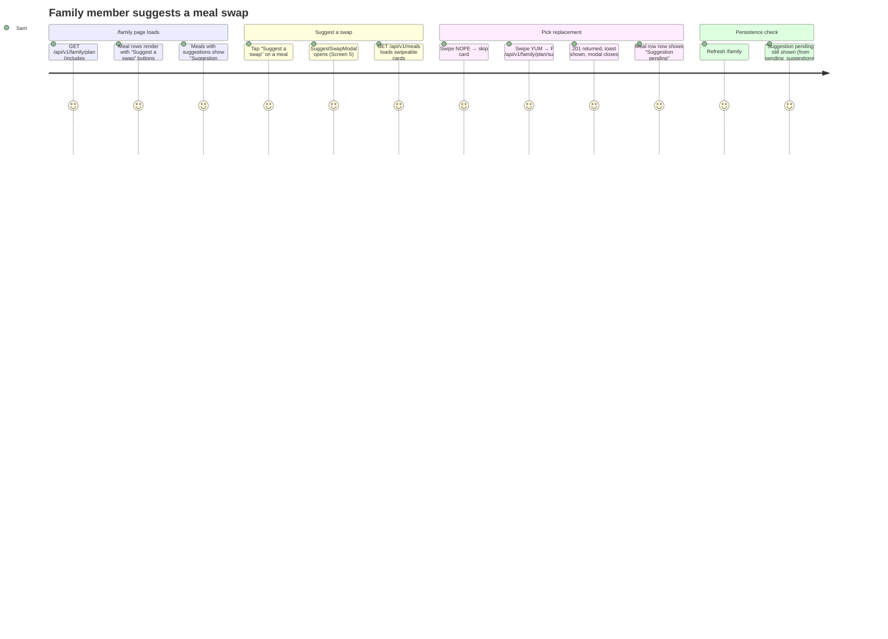
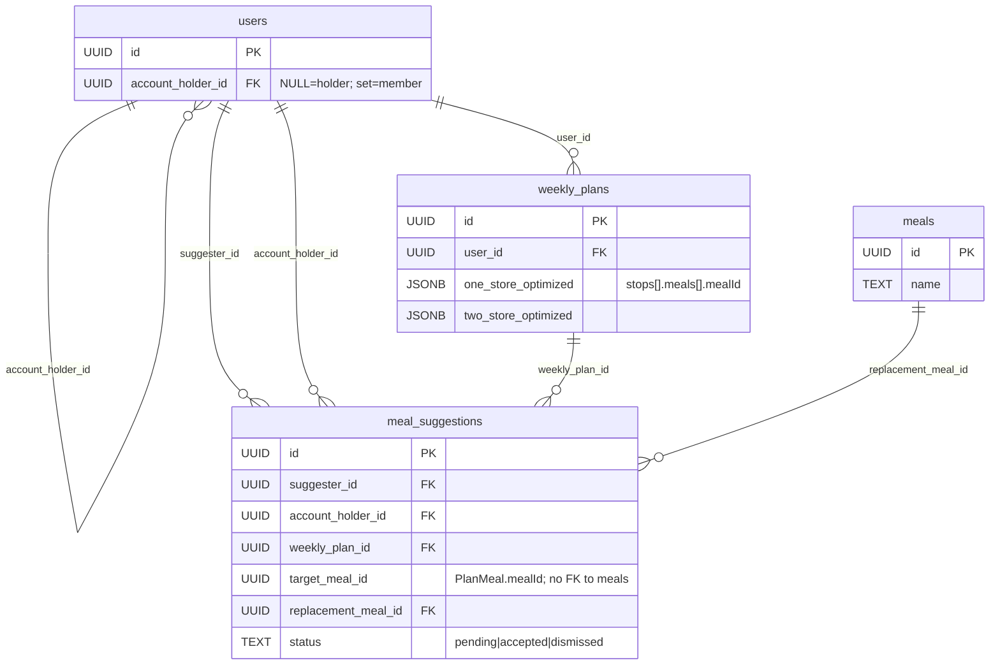

# Slice Abstract — Slice 2: Family member suggests a meal replacement

> **Status:** APPROVED — 2026-06-17
> Status legend: **VERIFIED** (cited from a file opened this session, with snippet) · **ASSUMED** (inference) · **UNKNOWN** (needs input)
> Citations are `path:Lstart-Lend`. No implementation has been started — this is a design document for review.

## At a glance

|                           |                                                                                      |
| ------------------------- | ------------------------------------------------------------------------------------ |
| **Slice**                 | 2 — Family member suggests a meal replacement (source: `slice-specs/family-member-meal-suggestions/slice-2/slice.md`) |
| **Mockup**                | `mockups/groceryhack-mockups.html` — Screens 3, 4, 5                                |
| **Conflicts / decisions** | **3** — all resolved                                                                 |
| **Open questions**        | **0**                                                                                |

### What this slice touches

|     | File                                                                | Why                                                                                          |
| --- | ------------------------------------------------------------------- | -------------------------------------------------------------------------------------------- |
| 🆕  | `backend/src/db/migrations/007_add_meal_suggestions.sql`            | New `meal_suggestions` table + indexes                                                       |
| ✏️  | `schema.sql`                                                        | Mirror migration 007 (source of truth)                                                       |
| ✏️  | `packages/shared/types.ts`                                          | Add `MealSuggestionStatus`, `MealSuggestion`, `SuggestMealRequest`; add `pending_suggestions` to `FamilyPlanResponse` |
| ✏️  | `backend/src/db/queries/family.ts`                                  | Add `createMealSuggestion`, `getMySuggestionsForPlan`                                        |
| ✏️  | `backend/src/services/family.ts`                                    | Add `suggestMeal`; update `getFamilyPlan` to include `pending_suggestions`                   |
| 🆕  | `backend/src/schemas/family.ts`                                     | Zod schema for `POST /family/plan/suggestions` body                                          |
| ✏️  | `backend/src/routes/family.ts`                                      | Add `POST /api/v1/family/plan/suggestions`                                                   |
| ✏️  | `frontend/src/services/api.ts`                                      | Add `suggestMeal(targetMealId, replacementMealId)`                                           |
| ✏️  | `frontend/src/hooks/useFamilyPlan.ts`                               | Surface `pendingSuggestions` from updated `FamilyPlanResponse`                               |
| 🆕  | `frontend/src/hooks/useMeals.ts` _(or similar)_                     | TanStack Query hook for `GET /api/v1/meals` (no existing `useSwipeableMeals`)                |
| ✏️  | `frontend/src/components/StoreMealDealList.tsx`                     | Add `onSuggestSwap` + `pendingSuggestionMealIds` optional props; render button/pill in meals section |
| ✏️  | `frontend/src/pages/FamilyPlanPage.tsx`                             | Add `suggestingFor` state; wire `onSuggestSwap`; render `SuggestSwapModal`                   |
| 🆕  | `frontend/src/modals/SuggestSwapModal.tsx`                          | New modal: swipe-deck UI to pick a replacement meal                                          |

---

### Conflicts & decisions needed first

> **⚠️ 1 · "By meal" mode button placement diverges from mockup** ✅ _decided_
> By-meal mode renders a single `.meal-action` panel at the `StoreMealDealList` level (between pill tabs and first store card), not per-store meal rows. Meals with a pending suggestion show a gold dot on their pill tab. `StoreSection` is unchanged for by-meal mode.
> `mockups/groceryhack-mockups.html:1021-1027` — `"<div class=\"meal-action\">…<button class=\"btn-sm\">Suggest a swap</button>"`

> **⚠️ 2 · `pill-pending` color: slice spec says teal, mockup renders amber/gold** ✅ _decided_
> Use the mockup values: `background: #FBEEDB; color: #9A6A12` — amber/gold, not teal. Closest design token is `accent` (`#C9A84C`); the exact hex values should be used inline or as a new token.
> `mockups/groceryhack-mockups.html:444-448` — `".pill-pending { background:#FBEEDB; color:#9A6A12; … }"`

> **⚠️ 3 · `useSwipeableMeals` hook referenced in spec doesn't exist** ✅ _decided_
> The slice itself offers the escape hatch: "reuse the existing `useSwipeableMeals` hook **or a direct query**." The hook doesn't exist, so the implementer creates a new hook (e.g. `useMeals`) wrapping `GET /api/v1/meals`.
> `frontend/src/hooks/useSwipe.ts:1-13` — `"export function useSwipe() { return useMutation({…"` (useSwipe exists; useSwipeableMeals does not)

---

## 1. User capability & journey

- **New capability:** A family member can tap "Suggest a swap" next to any meal in the holder's plan, pick a replacement from a swipe-card deck, and submit it. The submitted meal row immediately shows "Suggestion pending" in place of the button, and that state persists across page refreshes.
- **Getting there:** User is logged in as a family member (`sam@test.groceryhack.com`), already on `/family` (delivered by Slice 1). The "Suggest a swap" button appears on each meal row — either in the MEALS section of each store card (view-all mode) or in a dedicated action panel above the store cards (by-meal mode).
- **Afterward:** The modal closes; the meal row shows "Suggestion pending." The holder's plan data is unchanged. The holder's review UI is deferred to Slices 4–6.



_Legend: all steps are expected happy-path; no conflicts or assumptions in this journey._

---

## 2. Entities

- **Named in the spec:** `meal_suggestions`, `users` (suggester + holder), `weekly_plans`, `meals` (target meal via plan JSONB, replacement meal).
- **Actually in the DB:**
  - `users` — VERIFIED `schema.sql:13-38` — includes `"account_holder_id UUID REFERENCES users(id) ON DELETE CASCADE"` (Slice 1 migration applied)
  - `weekly_plans` — VERIFIED `schema.sql:284-298` — `"one_store_optimized JSONB NOT NULL"`, `"two_store_optimized JSONB"` — meals live inside JSONB as `stops[].meals[].mealId`
  - `meals` — VERIFIED `schema.sql:126-152` — replacement meal is a real FK to this table
  - `meal_suggestions` — **NOT YET IN SCHEMA** — migration 007 creates it
- **Relationships (as the spec describes them):**
  - One family member → many suggestions (per plan)
  - One account holder → many suggestions (received)
  - One suggestion → one `weekly_plans` row (the holder's current-week plan)
  - One suggestion → one target meal (via `target_meal_id`, a `PlanMeal.mealId` UUID inside the plan JSONB — no FK to `meals`)
  - One suggestion → one replacement meal (FK → `meals.id`)
- **Already enforced in DB/codebase:** The `users.account_holder_id` self-FK is VERIFIED at `schema.sql:31`. The `meals` table FK for `replacement_meal_id` will be enforced by migration 007. The partial-unique index (one pending suggestion per meal per member) is **deferred to Slice 3**.



_Legend: no conflicts in ER diagram. `meal_suggestions` is new (not yet in schema)._

---

## 3. Contracts

### Endpoints for this slice

| Endpoint (method + path)                     | Status    | Shape the slice expects                                                                                                       | Notes / citation |
| -------------------------------------------- | --------- | ----------------------------------------------------------------------------------------------------------------------------- | ---------------- |
| `GET /api/v1/family/plan`                     | PARTIAL   | Currently returns `{ holder_display_name, holder_savings_this_week, plan }`. Slice adds `pending_suggestions: MealSuggestion[]` to response. | `backend/src/routes/family.ts:8-15` — `"router.get('/plan', requireAuth, async (req, res, next) => {"` |
| `POST /api/v1/family/plan/suggestions`        | MISSING   | Body: `{ target_meal_id: string (UUID), replacement_meal_id: string (UUID) }`. Returns `201` with created `MealSuggestion`. Errors: `400 MEAL_NOT_IN_PLAN`, `400 INVALID_MEAL`, `403 NOT_A_FAMILY_MEMBER`. | New route on the existing `family` router |
| `GET /api/v1/meals`                           | EXISTS    | Returns `{ meals: SwipeableMeal[] }` — the pool for the swipe deck in `SuggestSwapModal`. Query param: `?limit=N` (default 20, max 50). Auth required. | `backend/src/routes/meals.ts:11-23` — `"router.get('/', requireAuth, …"` |

### Existing `GET /family/plan` response gap

The current service at `backend/src/services/family.ts:11-34` returns a `FamilyPlanServiceResponse` with snake_case keys. The shared type `FamilyPlanResponse` at `packages/shared/types.ts:775-779`:
```ts
export interface FamilyPlanResponse {
  holderDisplayName: string | null;
  holderSavingsThisWeek: number;
  plan: WeeklyPlan;
}
```
**The `pending_suggestions` field is absent from both the shared type and the service response.** The `api.ts` `transformKeys` function (`frontend/src/services/api.ts:14-31`) converts snake_case → camelCase automatically, so adding `pending_suggestions: MealSuggestion[]` to the DB query result propagates to `pendingSuggestions` in the frontend with no extra mapping code.

### api-contract.yaml status

No `Family` tag and no `/family/*` paths exist in `api-contract.yaml` — VERIFIED by grep (only mention is in a comment inside a schema description). Slice spec explicitly defers this update to Slice 3, so it is out-of-scope here.

---

## 4. Annotated mockup

**File:** `mockups/groceryhack-mockups.html`

**Relevant screens:** Screen 3 (lines 864–960), Screen 4 (lines 980–1064), Screen 5 (lines 1066–1111).

### Screen 3 — Family Member · Meal Plan (view-all mode)
`mockups/groceryhack-mockups.html:864-960`

The store card has two visual groups:
- **MEALS group** (lines 913–919): `.meal-line.fm` rows, each with `[meal name] [.ml-right > [.btn-xs | .pill-pending] + [.pv price/serving]]`. The button and pending pill appear **before** the price within `.ml-right`.
- **ALL ITEMS group** (lines 921–929): shopping items (unchanged from Slice 1).

This maps to the meals summary section inside `StoreSection` in "view all" mode — `StoreMealDealList.tsx:517-535`.

**Generic component:** Each `.meal-line.fm` row maps to the meal row inside `stop.meals.map()` within `StoreSection`. A single reusable pattern with a conditional render: `.btn-xs` when no pending suggestion, `.pill-pending` when one exists.

### Screen 4 — Family Member · Shopping List (by-meal mode)
`mockups/groceryhack-mockups.html:980-1064`

In by-meal mode, the "Suggest a swap" affordance is **NOT** inside a store card. Instead, it is a **dedicated `.meal-action` panel** (lines 1021–1027) rendered at the `StoreMealDealList` level, between the meal pill tabs and the store cards:
```html
<div class="meal-action">
  <div>
    <div class="ma-label">SHOWING INGREDIENTS FOR</div>
    <div class="ma-name">Sheet Pan Pork Chops</div>
  </div>
  <button class="btn-sm">Suggest a swap</button>
</div>
```
Meals with a pending suggestion show a gold `.dot-p` dot inside their pill tab (line 1017): `Beef Taco Bowl <span class="dot-p"></span>`.

**This is structurally different from view-all mode.** The "by meal" button is a single instance above all store cards, not duplicated inside `StoreSection`. See Question 1.

### Screen 5 — Suggest a Replacement · Swipe Mode
`mockups/groceryhack-mockups.html:1068-1111`

- Context bar: swap icon + "Finding a replacement for **Beef Taco Bowl**" — maps to `targetMeal.name`.
- Card: standard `big-meal-card` layout (image gradient, meal name, tagline, meta, ingredients) — reusable from `MealCard` or built inline in `SuggestSwapModal`.
- Action bar: `[NOPE] [YUM]` buttons — same swipe gesture pattern as `SwipeMode`.
- Counter "1 of 5" at top — ASSUMED to use same counter logic as `SwipeMode`.

### State-management intuition (ASSUMED)
`FamilyPlanPage` holds `suggestingFor: PlanMeal | null` (local state). When `onSubmitted` fires, the page either optimistically adds to a local `Set<string>` of pending meal IDs, or invalidates the `['familyPlan']` query key to re-fetch. The slice spec mentions both options — query invalidation is simpler and avoids stale state if the server assigns different timing. ASSUMED.

---

## 5. Data flow

```mermaid
flowchart LR
  classDef assumed fill:#fff,stroke:#888,stroke-dasharray:4 3;

  DB_WP["weekly_plans\n(JSONB plan)"]
  DB_MS["meal_suggestions\n(MISSING — new)"]
  DB_M["meals\n(replacement pool)"]

  SVC_FP["getFamilyPlan(userId)\nfamily.ts service"]
  SVC_SM["suggestMeal(userId,…)\nfamily.ts service\n(ASSUMED new)"]:::assumed
  Q_FP["getMySuggestionsForPlan\nfamily.ts queries\n(ASSUMED new)"]:::assumed
  Q_CS["createMealSuggestion\nfamily.ts queries\n(ASSUMED new)"]:::assumed

  RT_GET["GET /family/plan\nfamily.ts route"]
  RT_POST["POST /family/plan/suggestions\nfamily.ts route\n(MISSING)"]

  HOOK_FP["useFamilyPlan()\nreturns FamilyPlanResponse\n+ pendingSuggestions"]
  HOOK_M["useMeals()\n(hook to create)\ncalls GET /api/v1/meals"]:::assumed
  HOOK_SM["useMutation → suggestMeal()\n(ASSUMED new hook or inline)"]:::assumed

  PAGE["FamilyPlanPage\nsuggestingFor state\npendingSuggestionMealIds Set"]
  SMDL["StoreMealDealList\n+ onSuggestSwap prop\n+ pendingSuggestionMealIds prop"]
  MODAL["SuggestSwapModal\ntargetMeal + onSubmitted"]

  DB_WP --> SVC_FP
  DB_MS --> Q_FP --> SVC_FP
  SVC_FP --> RT_GET --> HOOK_FP --> PAGE

  PAGE --> SMDL
  SMDL -- "onSuggestSwap(meal)" --> PAGE
  PAGE -- "suggestingFor = meal" --> MODAL

  DB_M --> RT_M["GET /api/v1/meals\n(EXISTS)"]
  RT_M --> HOOK_M --> MODAL

  MODAL -- "YUM swipe" --> HOOK_SM --> RT_POST --> Q_CS --> DB_MS
  HOOK_SM -- "onSubmitted(suggestion)" --> PAGE
  PAGE -- "invalidate ['familyPlan']\nor optimistic Set update" --> HOOK_FP
```



_Legend: dashed/(ASSUMED) = inferred, not yet verified in code. Solid = verified or explicitly in spec._

**Per-hop status:**

| Hop | Status |
| --- | ------ |
| DB `weekly_plans` / `meal_suggestions` → `getFamilyPlan` | ASSUMED (new code) |
| `getFamilyPlan` → `GET /family/plan` | VERIFIED — `backend/src/routes/family.ts:8-15` |
| `GET /family/plan` → `useFamilyPlan` → `FamilyPlanPage` | VERIFIED — `frontend/src/hooks/useFamilyPlan.ts:1-10` |
| `FamilyPlanPage` → `StoreMealDealList` with new props | ASSUMED (new code) |
| `StoreMealDealList` → `onSuggestSwap` callback → `SuggestSwapModal` open | ASSUMED (new code) |
| `GET /api/v1/meals` → `useMeals` → `SuggestSwapModal` deck | ASSUMED (hook to create) |
| YUM swipe → `POST /family/plan/suggestions` → `meal_suggestions` row | ASSUMED (new code) |

---

## 6. Assumptions & load-bearing decisions register

| #  | Description                                                                                                      | Type     | Load-bearing? | Needs confirmation? |
| -- | ---------------------------------------------------------------------------------------------------------------- | -------- | ------------- | ------------------- |
| 1  | **By-meal mode uses a dedicated `meal-action` panel at `StoreMealDealList` level**, not per-store meal rows — contradicts slice spec wording "in the meal row render" | CONFLICT-RESOLVED | Yes | No |
| 2  | **`pill-pending` color**: mockup renders amber/orange (`#FBEEDB` / `#9A6A12`); slice spec says "teal border, teal text" | CONFLICT-RESOLVED | No (style only) | No |
| 3  | `useSwipeableMeals` hook doesn't exist — a new hook must be created | CONFLICT-RESOLVED | Yes | No (settled: create new hook) |
| 4  | `MealSuggestion`, `MealSuggestionStatus`, `SuggestMealRequest` absent from `packages/shared/types.ts` | VERIFIED-gap | Yes | No (must add per spec) |
| 5  | `FamilyPlanResponse.pending_suggestions` absent from `packages/shared/types.ts:775-779` | VERIFIED-gap | Yes | No (must add per spec) |
| 6  | `StoreSection` component (`StoreMealDealList.tsx:446-569`) needs `onSuggestSwap` + `pendingSuggestionMealIds` props drilled in for view-all mode meal rows | ASSUMED | Yes | No (follow-through from props design) |
| 7  | `target_meal_id` references `PlanMeal.mealId` (UUID from plan JSONB, no FK to `meals`) — validation traverses both JSONB representations | VERIFIED (`types.ts:379-385`) | Yes | No (spec is explicit) |
| 8  | `SuggestSwapModal` uses the same `MealCard` / swipe gesture patterns from `SwipeMode.tsx` — reuse is assumed | ASSUMED | No | No |
| 9  | On `onSubmitted`, `FamilyPlanPage` invalidates the `['familyPlan']` query (vs optimistic local Set update) | DECIDED | No | No |
| 10 | `api-contract.yaml` not updated in this slice (explicitly deferred) | VERIFIED (`slice.md:164`) | No | No |
| 11 | Migration numbered `007` — confirmed by directory listing (last is `006_add_account_holder_link.sql`) | VERIFIED (migration dir listing) | Yes | No |
| 12 | By-meal mode pill tabs need a gold dot marker (`.dot-p`) for meals with a pending suggestion, per Screen 4 mockup line 1017 | VERIFIED (mockup) | No | No |

---

## 7. Verification plan (Chrome)

**Tooling:** Chrome MCP tools (`chrome_navigate`, `chrome_execute_script`, `chrome_get_visible_text`, `chrome_screenshot`) if available; otherwise `python3 backend/scripts/cdp.py`.

### Step 1 — Compile check (backend + frontend)
```bash
cd backend && npx tsc --noEmit
cd frontend && npx tsc --noEmit
```
**Expect:** zero errors on both.

### Step 2 — Migration runs clean
```bash
cd backend && npm run migrate
npm run migrate:status
```
**Expect:** migration `007` shows as applied; `schema.sql` and DB match.

### Step 3 — POST suggestion (happy path)
```bash
# Obtain Sam's JWT (seed user: sam@test.groceryhack.com / testpassword123)
TOKEN=$(curl -s -X POST http://localhost:3000/api/v1/auth/login \
  -H 'Content-Type: application/json' \
  -d '{"email":"sam@test.groceryhack.com","password":"testpassword123"}' \
  | jq -r .token)

# Get Sam's family plan to extract a target_meal_id
PLAN=$(curl -s -H "Authorization: Bearer $TOKEN" http://localhost:3000/api/v1/family/plan)
TARGET_MEAL_ID=$(echo $PLAN | jq -r '.plan.one_store_optimized.stops[0].meals[0].meal_id')

# Get a replacement meal id
REPLACEMENT_MEAL_ID=$(curl -s -H "Authorization: Bearer $TOKEN" http://localhost:3000/api/v1/meals \
  | jq -r '.meals[0].id')

# POST suggestion
curl -s -X POST http://localhost:3000/api/v1/family/plan/suggestions \
  -H "Authorization: Bearer $TOKEN" \
  -H 'Content-Type: application/json' \
  -d "{\"target_meal_id\":\"$TARGET_MEAL_ID\",\"replacement_meal_id\":\"$REPLACEMENT_MEAL_ID\"}"
```
**Expect:** `201` with `{ id, suggester_id, account_holder_id, weekly_plan_id, target_meal_id, replacement_meal_id, status: "pending", created_at, replacement_meal_name, target_meal_name }`.

### Step 4 — GET plan includes pending suggestion
```bash
curl -s -H "Authorization: Bearer $TOKEN" http://localhost:3000/api/v1/family/plan \
  | jq '.pending_suggestions'
```
**Expect:** array with at least the just-created suggestion, `status: "pending"`.

### Step 5 — Error cases
```bash
# MEAL_NOT_IN_PLAN
curl -s -X POST http://localhost:3000/api/v1/family/plan/suggestions \
  -H "Authorization: Bearer $TOKEN" -H 'Content-Type: application/json' \
  -d "{\"target_meal_id\":\"00000000-0000-0000-0000-000000000000\",\"replacement_meal_id\":\"$REPLACEMENT_MEAL_ID\"}"
# Expect: 400 { error: true, code: "MEAL_NOT_IN_PLAN", message: "..." }

# NOT_A_FAMILY_MEMBER (use Jessica's token — ASSUMED jessica@test.groceryhack.com)
JESSICA_TOKEN=$(curl -s -X POST http://localhost:3000/api/v1/auth/login \
  -H 'Content-Type: application/json' \
  -d '{"email":"jessica@test.groceryhack.com","password":"testpassword123"}' | jq -r .token)
curl -s -X POST http://localhost:3000/api/v1/family/plan/suggestions \
  -H "Authorization: Bearer $JESSICA_TOKEN" -H 'Content-Type: application/json' \
  -d "{\"target_meal_id\":\"$TARGET_MEAL_ID\",\"replacement_meal_id\":\"$REPLACEMENT_MEAL_ID\"}"
# Expect: 403 { error: true, code: "NOT_A_FAMILY_MEMBER", message: "..." }
```

### Step 6 — UI happy path in Chrome
```
chrome_navigate → http://localhost:5173/login
  → log in as sam@test.groceryhack.com
chrome_navigate → http://localhost:5173/family
  → chrome_screenshot (Step 1: view-all mode with "Suggest a swap" buttons visible)
  → chrome_get_visible_text → confirm "Suggest a swap" buttons appear in MEALS section
  → click "Suggest a swap" on a meal without a pending suggestion
  → chrome_screenshot (Step 2: SuggestSwapModal open — ASSUMED selector: modal overlay visible)
  → confirm context bar shows "Finding a replacement for [meal name]"
  → click YUM button (swipe right)
  → chrome_screenshot (Step 3: modal closed, toast shown)
  → confirm meal row now shows "Suggestion pending" pill
```
**Expect:** no console errors at any step; "Suggestion pending" appears on the correct meal.

### Step 7 — Persistence after refresh
```
chrome_navigate → http://localhost:5173/family   (re-navigate / refresh)
→ chrome_get_visible_text
```
**Expect:** "Suggestion pending" still shown on the same meal (loaded from `pending_suggestions` in GET /family/plan response).

### Step 8 — Holder's plan unchanged
```
chrome_navigate → http://localhost:5173/login
  → log in as jessica@test.groceryhack.com
chrome_navigate → http://localhost:5173
  → chrome_get_visible_text → confirm original meals are shown, no swap applied
```
**Expect:** Jessica's landing page shows the original plan, unchanged.

---

## Decisions log

All questions resolved by developer on 2026-06-17.

| # | Question | Decision |
| - | -------- | -------- |
| 1 | By-meal mode button placement | Match mockup: dedicated `.meal-action` panel at `StoreMealDealList` level; gold dot on pill tabs for pending meals; `StoreSection` unchanged for by-meal mode. |
| 2 | `pill-pending` color | Match mockup: `background: #FBEEDB; color: #9A6A12` (amber/gold). Use inline or add a token — NOT teal. |
| 3 | On submit: query invalidation vs optimistic update | Query invalidation: `queryClient.invalidateQueries({ queryKey: ['familyPlan'] })` after `POST` succeeds. |
