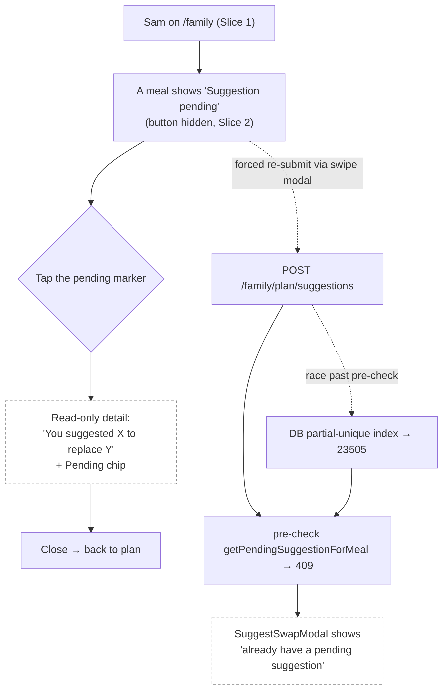
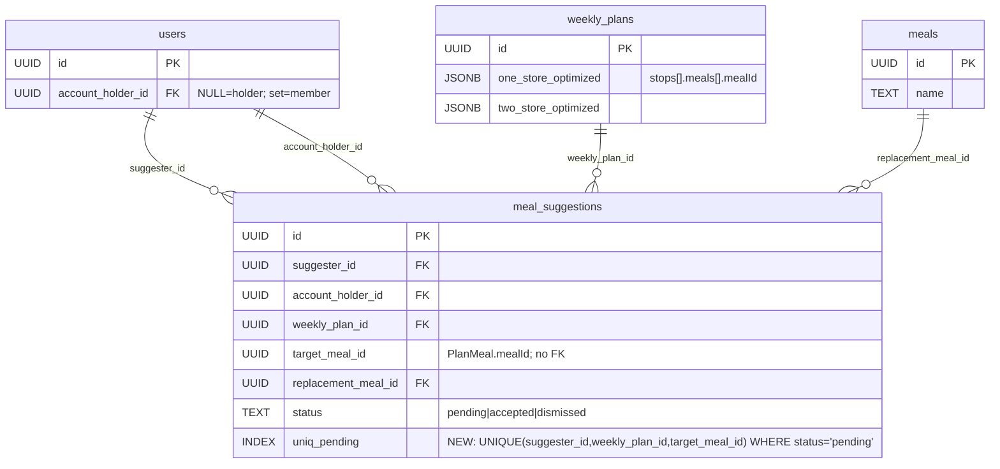
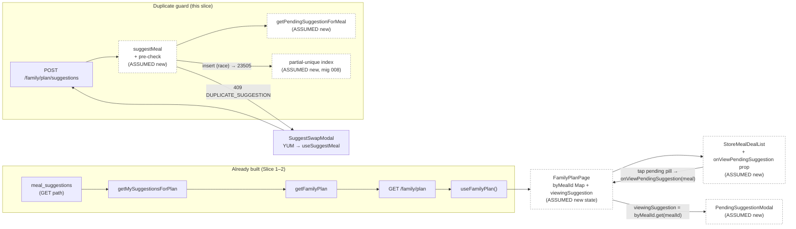

# Slice Abstract — Slice 3: One pending suggestion per meal + view existing

> **Status:** APPROVED — 2026-06-22
> Status legend: **VERIFIED** (cited from a file opened this session, with snippet) · **ASSUMED** (inference) · **UNKNOWN** (needs input)
> Citations are `path:Lstart-Lend`. No implementation has been started — this is a design document for review.

## At a glance

|                           |                                                                                                          |
| ------------------------- | -------------------------------------------------------------------------------------------------------- |
| **Slice**                 | 3 — One pending suggestion per meal + view existing (source: `slice-specs/family-member-meal-suggestions/slice-3/slice.md`) |
| **Mockup**                | `mockups/groceryhack-mockups.html` — Screens 3, 4 (pending markers); Screen 6 chip vocabulary. **No mockup for the click-to-reveal modal — flagged.** |
| **Conflicts / decisions** | **5** — all resolved (0 open, 5 decided ✅)                                                               |
| **Open questions**        | **0** — Q1 resolved 2026-06-22: use the read-only `PendingSuggestionModal`                               |

### What this slice touches

|     | File                                                            | Why                                                                                                   |
| --- | -------------------------------------------------------------- | ----------------------------------------------------------------------------------------------------- |
| 🆕  | `backend/src/db/migrations/008_unique_pending_suggestion.sql`  | Partial-unique index: one *pending* suggestion per `(suggester_id, weekly_plan_id, target_meal_id)`   |
| ✏️  | `schema.sql`                                                   | Mirror migration 008 (source of truth), after the existing `meal_suggestions` indexes                 |
| ✏️  | `backend/src/db/queries/family.ts`                             | Add `getPendingSuggestionForMeal(suggesterId, weeklyPlanId, targetMealId)`                             |
| ✏️  | `backend/src/services/family.ts`                               | `suggestMeal`: pre-check → `409 DUPLICATE_SUGGESTION`; defensively map pg `23505` to the same 409      |
| ✏️  | `backend/src/services/family.test.ts`                          | Mock `getPendingSuggestionForMeal`; add duplicate-guard + non-duplicate happy-path cases              |
| ✏️  | `docs/architecture/error-codes.md`                             | Add `DUPLICATE_SUGGESTION | 409 | POST /family/plan/suggestions` row to the Family section            |
| ✏️  | `api-contract.yaml`                                            | Add `Family` tag, `GET /family/plan`, `POST /family/plan/suggestions` (incl. 409), `MealSuggestion` / `FamilyPlanResponse` schemas |
| ✏️  | `frontend/src/components/StoreMealDealList.tsx`                | Add `onViewPendingSuggestion?` prop (drilled through `StoreSection`); render the two "Suggestion pending" pills as buttons |
| ✏️  | `frontend/src/pages/FamilyPlanPage.tsx`                        | Build `Map<targetMealId, MealSuggestion>`; hold `viewingSuggestion`; wire `onViewPendingSuggestion`; render the read-only detail |
| 🆕  | `frontend/src/modals/PendingSuggestionModal.tsx`               | New small read-only dialog naming the replacement meal + `Pending` chip (recommended approach)         |
| ✏️  | `frontend/src/modals/SuggestSwapModal.tsx`                     | On `409 DUPLICATE_SUGGESTION`, show the specific "already have a pending suggestion" toast             |

_No new shared type required — `MealSuggestion`, `MealSuggestionStatus`, `FamilyPlanResponse.pendingSuggestions` all already exist (see §2)._

---

### Conflicts & decisions needed first

_One line per item. Stop signs only — detail lives in the Questions section._

> **⚠️ 1 · How "see my existing pending suggestion" is surfaced — modal vs inline** ✅ _decided_
> **Decided (2026-06-22): the read-only `PendingSuggestionModal`**, built on the existing `ModalOverlay`. Both pending pills become buttons calling `onViewPendingSuggestion(meal)`; the dialog renders uniformly from the view-all pill and the by-meal action panel. The inline `→ {replacementMealName}` alternative is rejected.
> `frontend/src/modals/ModalOverlay.tsx:33-38` — `"export function ModalOverlay({ isOpen, onClose, title, children }: ModalOverlayProps)"`

> **⚠️ 2 · Pending markers become interactive — diverges from the static mockup** ✅ _decided_
> In the mockup the "Suggestion pending" pills are passive `<span>` labels (no click). This slice makes them buttons that open the read-only detail. The mockup has no screen for the click-to-reveal; the modal reuses Screen 6's `.status`/`.st-pending` chip + info-banner vocabulary.
> `mockups/groceryhack-mockups.html:916` — `"<span class=\"pill-pending\">Suggestion pending</span>"` (passive); `:536` — `".st-pending{background:#FBEEDB;color:#9A6A12;}"`

> **⚠️ 3 · Three pending-marker render sites exist; only TWO become buttons** ✅ _decided_
> Convert the view-all meal-row pill (`StoreMealDealList.tsx:621`) and the by-meal action-panel pill (`:828-829`) to buttons calling `onViewPendingSuggestion`. **Leave the by-meal pill-tab gold dot (`:812-814`) non-interactive** — selecting the tab routes the user to the action-panel pill.
> `frontend/src/components/StoreMealDealList.tsx:813` — `"<span style={dotPendingStyle} aria-label=\"Suggestion pending\" />"`

> **⚠️ 4 · The `23505` → 409 mapping must live in the service, not the error handler** ✅ _decided_
> `errorHandler` derives HTTP status from `appErr.status`; a raw pg unique-violation has no `.status`, so it would fall through to 500. The service must catch `err.code === '23505'` around `createMealSuggestion` and rethrow `throwConflict('DUPLICATE_SUGGESTION', …)`.
> `backend/src/middleware/errorHandler.ts:40` — `"const status = appErr.status ?? 500;"`

> **⚠️ 5 · Migration 008 fails if duplicate pending rows already exist** ✅ _decided_
> `CREATE UNIQUE INDEX` aborts if the table already holds two `pending` rows with the same `(suggester_id, weekly_plan_id, target_meal_id)` — possible after manual Slice-2 testing. Run migration on a clean/seeded DB (the seed creates **no** `meal_suggestions`), or dedupe first.
> `backend/src/db/seed.ts` — no `meal_suggestions` insert (grep clean); `backend/src/db/migrate.ts:25-27` — `"fs.readdirSync(dir).filter(f => f.endsWith('.sql')).sort()"` (008 runs after 007).

---

## 1. User capability & journey

- **New capability:** A family member who already submitted a suggestion for a meal can now **tap the "Suggestion pending" marker** to see *what* they proposed (the replacement meal name + a `Pending` status), and a second submission for that meal is **impossible at every layer** — the hidden button (UI, Slice 2), a `409 DUPLICATE_SUGGESTION` pre-check (API), and a partial-unique index (DB).
- **Getting there:** Logged in as `sam@test.groceryhack.com`, on `/family` (Slice 1), Sam has already used "Suggest a swap" (Slice 2) on at least one meal — that meal now shows "Suggestion pending" instead of the button.
- **Afterward:** Tapping the marker opens a read-only detail; closing it returns to the plan. The holder's review/accept/dismiss loop (Slices 4–6) and Sam's full "My Suggestions" status list (Slice 7) remain out of scope.



_Legend: dashed/(ASSUMED) = new behavior this slice introduces, not yet in code. Red = conflict (none in this diagram)._

---

## 2. Entities

- **Named in the spec:** `meal_suggestions`, `users` (suggester + holder), `weekly_plans`, `meals` (replacement). Slice 3 adds **no new entity** — only a partial-unique index on the existing `meal_suggestions` table.
- **Actually in the DB:**
  - `meal_suggestions` — **EXISTS** (created in Slice 2 / migration 007) — VERIFIED `schema.sql:371-385` and `backend/src/db/migrations/007_add_meal_suggestions.sql:6-21` — `"status TEXT NOT NULL DEFAULT 'pending' CHECK (status IN ('pending','accepted','dismissed'))"`. Current indexes are **single-column, non-unique** (`idx_meal_suggestions_suggester` / `_holder` / `_plan`).
  - `users.account_holder_id` self-FK — VERIFIED (Slice 1) by reference in `getFamilyMemberLink` `backend/src/db/queries/family.ts:43-47` — `"SELECT u.account_holder_id, h.display_name AS holder_display_name FROM users u LEFT JOIN users h ON h.id = u.account_holder_id"`.
  - `weekly_plans`, `meals` — referenced by FK in migration 007 (`weekly_plan_id`, `replacement_meal_id`).
- **Relationship the slice adds (DB-enforced):** a **partial-unique** constraint — at most one row per `(suggester_id, weekly_plan_id, target_meal_id)` **where `status = 'pending'`**. Accepted/dismissed rows do not occupy the index, so a re-suggestion is allowed once a prior one leaves `pending`. The grain matches Approach note #3 in `slices.md:42` — `"one pending suggestion per meal per family member"`.
- **Shared types (all present, no change needed):**
  - `MealSuggestionStatus` — VERIFIED `packages/shared/types.ts:23` — `"export type MealSuggestionStatus = 'pending' | 'accepted' | 'dismissed';"`
  - `MealSuggestion` — VERIFIED `packages/shared/types.ts:781-793` — includes `replacementMealName: string` and `targetMealName: string | null` (the fields the modal renders).
  - `FamilyPlanResponse.pendingSuggestions: MealSuggestion[]` — VERIFIED `packages/shared/types.ts:801`.
  - `PlanMeal` — VERIFIED `packages/shared/types.ts:380-386` — `{ mealId, name, costPerServing, totalCost, savings }`; `target_meal_id` is a `PlanMeal.mealId` (no FK to `meals`).
- **CONFLICTS (spec vs. codebase):** none. The only schema change is additive (the partial-unique index), and the index columns exactly match the pre-check query the slice specifies.



_Legend: no spec-vs-code conflicts. The `uniq_pending` partial-unique index is the only structural addition (migration 008)._

---

## 3. Contracts

- **No new request/response shape.** Slice 3 adds an **error response** (`409`) to an existing endpoint and **documents** two already-built endpoints in `api-contract.yaml`. The "view existing suggestion" feature uses data already on the client (`data.pendingSuggestions`) — **no new fetch**.

| Endpoint (method + path)              | Status  | Shape the slice expects                                                                                       | Notes / citation |
| ------------------------------------- | ------- | ------------------------------------------------------------------------------------------------------------- | ---------------- |
| `POST /api/v1/family/plan/suggestions`| PARTIAL | Adds `409 { error:true, code:"DUPLICATE_SUGGESTION", message }` when a pending suggestion already exists for the target meal. Body unchanged: `{ target_meal_id, replacement_meal_id }`. | `backend/src/routes/family.ts:21-34` — `"router.post('/plan/suggestions', requireAuth, validate({ body: suggestMealBody }), …"`; body schema `backend/src/schemas/family.ts:4-12` |
| `GET /api/v1/family/plan`             | EXISTS  | Unchanged — already returns `pending_suggestions[]` (each with `replacement_meal_name`, `target_meal_name`). Slice only **documents** it in the contract. | `backend/src/services/family.ts:39-65` — `"pending_suggestions: pendingSuggestions"`; `backend/src/db/queries/family.ts:96-115` |

### Service-layer change (`suggestMeal`)

Current flow — VERIFIED `backend/src/services/family.ts:72-109`: link → plan → `planContainsMeal` → `findMealById` → `createMealSuggestion`. Slice 3 inserts a **pre-check** between `findMealById` and `createMealSuggestion`:
```ts
// after step 4 (replacement validated), before step 5 (insert):
const existing = await getPendingSuggestionForMeal(userId, plan.id as string, targetMealId);
if (existing) throwConflict('DUPLICATE_SUGGESTION', "You already have a pending suggestion for this meal.");
```
`throwConflict` already exists — VERIFIED `backend/src/middleware/errorHandler.ts:21-23` — `"export function throwConflict(code: string, message: string): never { throw createAppError(code, 409, message); }"`. The defensive `23505` catch (⚠️ 4) wraps the `createMealSuggestion` call at `family.ts:102-108`.

### Query-layer change (`getPendingSuggestionForMeal`)

New function in `backend/src/db/queries/family.ts`, mirroring `getMySuggestionsForPlan` (`:96-115`) but filtered to one target meal and returning a single row or `null`. The module-local `mapSuggestionRow` (`:20-35`) can be reused; for `mapSuggestionRow` to populate `replacement_meal_name`/`target_meal_name` the query should keep the same `JOIN meals rm` / `LEFT JOIN meals tm` (the service only checks existence, so the joins are fidelity-only — see Register #9).

### api-contract.yaml status

No `Family` tag and no `/family/*` paths exist today — VERIFIED by grep (only mention is a comment at `api-contract.yaml:933`). Slices 1–2 deferred this; Slice 3 lands it. The `MealSuggestion` / `FamilyPlanResponse` schemas in the contract use **snake_case** (matching the wire payload), per CLAUDE.md serialization rules.

---

## 4. Annotated mockup

**File:** `mockups/groceryhack-mockups.html`

- **Relevant sections:**
  - **Screen 3 — view-all** (`:864-960`): two store cards each render the Beef Taco Bowl pending pill — `:916` and `:947` — `"<span class=\"pill-pending\">Suggestion pending</span>"`. Maps to the view-all meal-row site `StoreMealDealList.tsx:619-631`.
  - **Screen 4 — by-meal** (`:980-1064`): the gold dot `:1017` — `"Beef Taco Bowl <span class=\"dot-p\"></span>"` — maps to the pill-tab dot `StoreMealDealList.tsx:812-814` (stays non-interactive). The by-meal action-panel pending pill maps to `StoreMealDealList.tsx:828-829`.
  - **Screen 6 — My Suggestions** (`:1113-1162`): **not this slice** (that's Slice 7), but its `.status`/`.st-pending` chip (`:532-538`) and info-banner ("only Jessica can accept or dismiss") supply the visual vocabulary for the new modal.
- **No dedicated mockup exists for the click-to-reveal detail** (⚠️ 2). The slice prescribes its content: `"You suggested **{replacementMealName}** to replace **{targetMealName ?? meal.name}**"`, a `Pending` chip (`#FBEEDB`/`#9A6A12`), and `"Only {holderName} can accept or dismiss this."`
- **Generic / reusable components:**
  - `pill-pending` style — already in code at `StoreMealDealList.tsx:213-223` (`pillPendingStyle`), exact-matching mockup `:444-448`. Becomes a `<button>` (same visual, add `cursor:pointer` + `onClick`).
  - `ModalOverlay` (`frontend/src/modals/ModalOverlay.tsx:33-149`) — the reusable centered (desktop) / bottom-sheet (mobile) dialog with backdrop, Escape-to-close, and `aria-modal`. The recommended base for `PendingSuggestionModal`.
- **One-off components:** `PendingSuggestionModal` body (replacement/target line + `Pending` chip + holder note) — new, single use here.
- **State-management intuition (ASSUMED):** `FamilyPlanPage` builds `byMealId: Map<string, MealSuggestion>` from `data.pendingSuggestions`, holds `viewingSuggestion: MealSuggestion | null`, sets it from `onViewPendingSuggestion={(meal) => setViewingSuggestion(byMealId.get(meal.mealId) ?? null)}`, and renders the modal when non-null. Mirrors the existing `suggestingFor` pattern at `FamilyPlanPage.tsx:139, 199-214`. ASSUMED (matches slice text).

---

## 5. Data flow



_Legend: dashed/(ASSUMED) = new code this slice adds. Solid = verified existing path._

**Per-hop status:**

| Hop | Status |
| --- | ------ |
| `meal_suggestions` → `getMySuggestionsForPlan` → `getFamilyPlan` → `GET /family/plan` | VERIFIED — `backend/src/db/queries/family.ts:96-115`, `backend/src/services/family.ts:57-64` |
| `GET /family/plan` → `useFamilyPlan` → `FamilyPlanPage` | VERIFIED — `frontend/src/hooks/useFamilyPlan.ts:5-10`, `FamilyPlanPage.tsx:137` |
| `FamilyPlanPage` builds `byMealId` Map + `viewingSuggestion` | ASSUMED (new; today it builds only the `Set` at `FamilyPlanPage.tsx:143-146`) |
| `StoreMealDealList` pending pill → `onViewPendingSuggestion(meal)` | ASSUMED (new prop; pills are passive at `:621`, `:828-829`) |
| `PendingSuggestionModal` renders `replacementMealName` / `targetMealName` | ASSUMED (new component; data already on client) |
| `suggestMeal` pre-check via `getPendingSuggestionForMeal` → `409` | ASSUMED (new query + service step) |
| pg `23505` from `createMealSuggestion` → `409` | ASSUMED (new service catch) |
| `SuggestSwapModal` maps `409` to specific toast | ASSUMED (new; today `onError` shows generic at `SuggestSwapModal.tsx:80-82, 183-188`) |

---

## 6. Assumptions & load-bearing decisions register

| #  | Description                                                                                                                          | Type     | Load-bearing? | Needs confirmation? |
| -- | ---------------------------------------------------------------------------------------------------------------------------------- | -------- | ------------- | ------------------- |
| 1  | **"See my existing pending suggestion" is surfaced via the read-only `PendingSuggestionModal`** (developer-approved 2026-06-22; inline alternative rejected). | DECIDED | Yes | No |
| 2  | Pending pills become **interactive buttons**, diverging from the mockup's passive `<span>` labels; no mockup for the modal itself. | DECIDED (slice) | No (UX) | No |
| 3  | Three marker sites exist; only the **view-all pill (`:621`)** and **by-meal action-panel pill (`:828-829`)** become buttons — the **pill-tab gold dot (`:812-814`) stays non-interactive.** | DECIDED (slice) | Yes | No |
| 4  | `23505` unique-violation must be mapped to 409 **in the service**; `errorHandler` keys off `appErr.status` and would otherwise 500. | DECIDED (slice) | Yes | No |
| 5  | `CREATE UNIQUE INDEX` (mig 008) **fails on pre-existing duplicate pending rows**; run on clean/seeded DB (seed creates none) or dedupe. | VERIFIED (seed/migrate) | Yes | No |
| 6  | Partial-unique index grain `(suggester_id, weekly_plan_id, target_meal_id) WHERE status='pending'` matches Approach note #3 and the pre-check query columns. | VERIFIED (`slices.md:42`, `slice.md:54-57`) | Yes | No |
| 7  | `meal_suggestions` table + 007 indexes already exist; 008 is purely additive. | VERIFIED (`schema.sql:371-385`) | Yes | No |
| 8  | No new shared type needed — `MealSuggestion`/`MealSuggestionStatus`/`FamilyPlanResponse.pendingSuggestions` already in `packages/shared/types.ts`. | VERIFIED (`types.ts:23,781-802`) | Yes | No |
| 9  | `getPendingSuggestionForMeal` reuses module-local `mapSuggestionRow`; meal-name JOINs are fidelity-only (service checks existence, not fields). | ASSUMED | No | No |
| 10 | Pre-check is placed **after** `findMealById`, so an `INVALID_MEAL` replacement on a duplicate target returns `INVALID_MEAL` (not 409) — matches slice wording "after validating the target/replacement meals." | VERIFIED (`slice.md:67-70`) | No | No |
| 11 | `FamilyPlanPage` builds `byMealId` Map + `viewingSuggestion` state, mirroring the existing `suggestingFor` pattern. | ASSUMED | Yes | No |
| 12 | `SuggestSwapModal` inspects the thrown `ApiError.code === 'DUPLICATE_SUGGESTION'` (it exposes `.code`/`.status`) to pick the specific toast. | VERIFIED (`api.ts:39-49`) | No | No |
| 13 | `DUPLICATE_SUGGESTION` follows the existing `DUPLICATE_*` 409 naming (`DUPLICATE_ITEM`, `DUPLICATE_FLYER_REQUEST`). | VERIFIED (`error-codes.md:108,147`) | No | No |
| 14 | Migration runner discovers `008_*.sql` automatically (sorted glob). | VERIFIED (`migrate.ts:25-27`) | Yes | No |
| 15 | No `meal_suggestions` are seeded — Chrome verification must first **create** a pending suggestion (Slice-2 flow) before a "Suggestion pending" marker appears. | VERIFIED (seed grep clean) | Yes | No |

---

## 7. Verification plan (Chrome)

**Tooling:** Chrome MCP tools (`chrome_navigate`, `chrome_execute_script`, `chrome_get_visible_text`, `chrome_screenshot`) if available; otherwise `python3 backend/scripts/cdp.py` (`goto`, `eval`, `screenshot`, `click`). Seed creds: `sam@test.groceryhack.com` / `testpassword123` (VERIFIED `seed.ts:687-693`).

### 1 — Compile check
```bash
cd backend && npx tsc --noEmit
cd frontend && npx tsc --noEmit
```
**Expect:** zero errors both sides.

### 2 — Migration runs clean (on a DB with no duplicate pending rows)
```bash
cd backend && npm run migrate && npm run migrate:status
```
**Expect:** `008_unique_pending_suggestion` shows applied; no error. _If it errors with a unique-violation, pre-existing duplicate pending rows must be cleared first (Register #5)._

### 3 — Schema mirror + index exists
```bash
psql "$DATABASE_URL" -c "\d meal_suggestions" | grep -i one_pending
```
**Expect:** `idx_meal_suggestions_one_pending_per_meal` listed as a partial unique index with predicate `WHERE status = 'pending'`. Also confirm `schema.sql` contains it (grep).

### 4 — Duplicate POST returns 409, single row preserved
```bash
TOKEN=$(curl -s -X POST http://localhost:3000/api/v1/auth/login \
  -H 'Content-Type: application/json' \
  -d '{"email":"sam@test.groceryhack.com","password":"testpassword123"}' | jq -r .token)
PLAN=$(curl -s -H "Authorization: Bearer $TOKEN" http://localhost:3000/api/v1/family/plan)
TARGET=$(echo "$PLAN" | jq -r '.plan.one_store_optimized.stops[0].meals[0].meal_id')
REPL=$(curl -s -H "Authorization: Bearer $TOKEN" http://localhost:3000/api/v1/meals | jq -r '.meals[0].id')
# first submit (201)
curl -s -o /dev/null -w "%{http_code}\n" -X POST http://localhost:3000/api/v1/family/plan/suggestions \
  -H "Authorization: Bearer $TOKEN" -H 'Content-Type: application/json' \
  -d "{\"target_meal_id\":\"$TARGET\",\"replacement_meal_id\":\"$REPL\"}"
# second submit, same target (expect 409 DUPLICATE_SUGGESTION)
curl -s -X POST http://localhost:3000/api/v1/family/plan/suggestions \
  -H "Authorization: Bearer $TOKEN" -H 'Content-Type: application/json' \
  -d "{\"target_meal_id\":\"$TARGET\",\"replacement_meal_id\":\"$REPL\"}"
```
**Expect:** first `201`; second `{ error:true, code:"DUPLICATE_SUGGESTION", message:"You already have a pending suggestion for this meal." }` with status `409`. `SELECT count(*) FROM meal_suggestions WHERE target_meal_id=$TARGET AND status='pending'` = **1**. _ASSUMED: meals[0] of stop[0] is the target; adjust if empty._

### 5 — Different meal still 201 (per-meal, not per-plan)
Repeat step 4's POST with `stops[0].meals[1].meal_id` (a different target).
**Expect:** `201`.

### 6 — Index is correctly partial
```sql
-- move the pending row off 'pending' (accept/dismiss is Slices 4–6, so do it directly)
UPDATE meal_suggestions SET status='accepted' WHERE target_meal_id='<TARGET>' AND status='pending';
```
Then re-POST the same target.
**Expect:** `201` — the freed index slot allows a new pending row. A direct `INSERT` of a *second* pending row for the same `(suggester, plan, meal)` is rejected with `23505`.

### 7 — UI: pending marker reveals the replacement (view-all + by-meal)
```
chrome_navigate → http://localhost:5173/login → log in as sam@test.groceryhack.com
chrome_navigate → http://localhost:5173/family
  → (precondition) create a pending suggestion via "Suggest a swap" → YUM, if none exists (Register #15)
  → confirm the meal shows "Suggestion pending" and NO "Suggest a swap" control
  → click the "Suggestion pending" pill (view-all mode)
  → chrome_get_visible_text → expect "You suggested <replacement> to replace <target>" + "Pending"
  → toggle "By Meal", select the same meal, click the action-panel "Suggestion pending" pill
  → expect the same detail; confirm the pill-tab gold dot itself is NOT a button (ASSUMED selector)
```
**Expect:** no console errors; the detail names the correct replacement meal in both modes; close returns to plan. _ASSUMED selectors — re-check once `PendingSuggestionModal` exists._

### 8 — UI: forced duplicate shows the specific message
With a meal that already has a pending suggestion, force a resubmit through the swipe modal (e.g. via a meal whose marker was stale, or by replaying the POST).
**Expect:** `SuggestSwapModal` shows "You already have a pending suggestion for this meal." (not the generic error) and **no** second pending row is created (`SELECT count(*) … = 1`).

### 9 — Backend service tests
```bash
cd backend && npx vitest run src/services/family.test.ts
```
**Expect:** new cases pass — (a) when `getPendingSuggestionForMeal` resolves a row, `suggestMeal` throws `409 DUPLICATE_SUGGESTION` and `createMealSuggestion` is **not** called; (b) when it resolves `null`, the happy path still calls `createMealSuggestion`. Existing Slice-2 cases still green (the mock for `../db/queries/family.js` gains `getPendingSuggestionForMeal`).

### 10 — Docs
**Expect:** `docs/architecture/error-codes.md` Family section lists `DUPLICATE_SUGGESTION | 409`; `api-contract.yaml` has a `Family` tag with `GET /family/plan` and `POST /family/plan/suggestions` (incl. the `409`).

---

## Decisions log

All questions resolved by the developer on 2026-06-22.

| # | Question | Decision |
| - | -------- | -------- |
| 1 | How "see my existing pending suggestion" is surfaced — read-only modal vs inline sub-line | **Read-only `PendingSuggestionModal`** — new `frontend/src/modals/PendingSuggestionModal.tsx`, built on the existing `ModalOverlay`. Both pending pills (`StoreMealDealList.tsx:621` view-all, `:828-829` by-meal) become buttons calling `onViewPendingSuggestion(meal)`; `FamilyPlanPage` holds `viewingSuggestion` and renders the dialog with the replacement/target line + `Pending` chip + "Only {holderName} can accept or dismiss this." The inline `→ {replacementMealName}` alternative was rejected (cramped in both render sites; leaves the pill-tab gold dot with nothing to reveal). |

_Everything else in this slice is decided by the slice text or verified in code; the four other ✅-decided items in "Conflicts & decisions needed first" are load-bearing implementation notes, not open questions._
