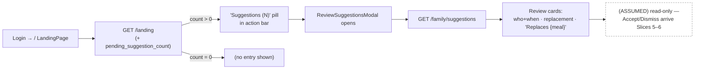
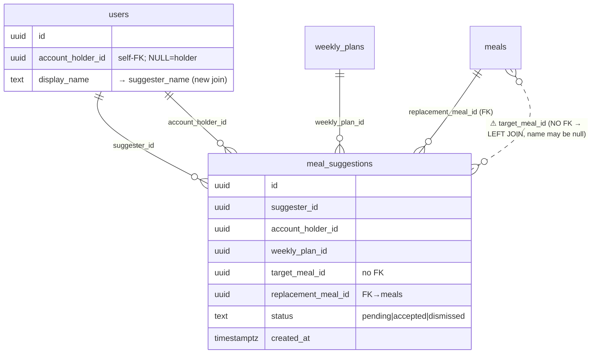
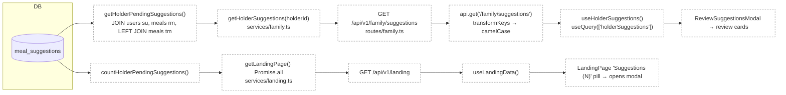

# Slice Abstract — Slice 4: Account holder reviews pending suggestions

> **Status:** APPROVED — 2026-06-23
> Status legend: **VERIFIED** (cited from a file opened this session, with snippet) · **ASSUMED** (inference) · **UNKNOWN** (needs input)
> Citations are `path:Lstart-Lend`. No implementation has been started — this is a design document for review.

## At a glance

|                           |                                                                                   |
| ------------------------- | --------------------------------------------------------------------------------- |
| **Slice**                 | 4 — Account holder reviews pending suggestions (source: `slice-4/slice.md`)        |
| **Mockup**                | `mockups/groceryhack-mockups.html:1166-1224` (Screen 7)                            |
| **Conflicts / decisions** | **5** (all resolved, below)                                                        |
| **Open questions**        | **0** — all 3 confirmed by the developer ([jump](#questions-for-the-developer))    |

> Note on args: the skill was invoked as `/slice-abstract slice 4`; the loader read `SLICE_PATH="4"` (missing) and no spec path. The real files were located in the repo and used: slice `slice-specs/family-member-meal-suggestions/slice-4/slice.md`, roadmap `…/slices.md`, Gherkin `specs/family-member-meal-suggestions/family-member-meal-suggestions.md`.

### What this slice touches

|       | File                                              | Why                                                                                          |
| ----- | ------------------------------------------------- | -------------------------------------------------------------------------------------------- |
| ✏️    | `packages/shared/types.ts`                        | Add `suggesterName?` to `MealSuggestion`; add `HolderSuggestionsResponse`; add `pendingSuggestionCount` to `LandingPage` |
| ✏️    | `backend/src/db/queries/family.ts`                | `mapSuggestionRow` carries `suggester_name`; new `getHolderPendingSuggestions` + `countHolderPendingSuggestions` |
| ✏️    | `backend/src/services/family.ts`                  | New `getHolderSuggestions(holderId)` (holder-scoped read)                                     |
| ✏️    | `backend/src/services/landing.ts`                 | Add count to `Promise.all`; add `pending_suggestion_count` to `LandingPageResponse`          |
| ✏️    | `backend/src/routes/family.ts`                    | `GET /api/v1/family/suggestions` (`requireAuth`)                                              |
| ✏️    | `backend/src/db/seedPlans.ts`                     | Seed one deterministic pending Sam→Jessica suggestion (idempotent)                            |
| 🆕    | `frontend/src/hooks/useHolderSuggestions.ts`      | `useQuery(['holderSuggestions'])` → `GET /family/suggestions`                                 |
| 🆕    | `frontend/src/modals/ReviewSuggestionsModal.tsx`  | Read-only review surface (Screen 7) on `ModalOverlay`                                         |
| ✏️    | `frontend/src/pages/LandingPage.tsx`              | Count-gated "Suggestions (N)" action-bar entry + render the modal                            |
| ✏️    | `api-contract.yaml`                               | Document `GET /family/suggestions`; add `suggester_name` + `pending_suggestion_count`         |
| ✏️?   | `frontend/src/services/api.ts`                     | Optional typed helper — **no change needed** if the hook uses generic `api.get`               |

_No migration in this slice — it is a pure read over data migrations 006/007/008 already created._

### Conflicts & decisions needed first

_One line per item. Stop signs only — detail lives in the Questions section._

> **⚠️ 1 · Mockup Screen 7 shows Accept/Dismiss buttons + a notification bell w/ unread dot ("2"); this slice ships neither.** ✅ _decided — developer confirmed._ Discovery is the **count-gated "Suggestions (N)" action-bar pill**, no bell; the surface is read-only.

> **⚠️ 2 · Read-only vs. inert disabled Accept/Dismiss placeholders.** ✅ _decided — developer confirmed._ Render **no action buttons at all** this slice (nothing on screen is dead); Accept/Dismiss arrive wired-up in Slices 5/6.

> **⚠️ 3 · `suggesterName` on `MealSuggestion` vs. a new `HolderSuggestion` type.** ✅ _decided — developer confirmed._ **Extend `MealSuggestion`** with optional `suggesterName?: string | null` (matches the existing denormalised display-field pattern); no separate type.

> **⚠️ 4 · `holderName: string` prop fed from `data.user.displayName` which is `string | null`.** ✅ _decided (recommended fix)_
> `LandingPage` passes `holderName={data.user.displayName}` (slice line 120) but `User.displayName` is nullable, so under strict/no-`any` it won't satisfy a `string` prop. Use a fallback at the call site (e.g. `data.user.displayName ?? 'you'`) — same pattern the codebase already uses for nullable display names.
> `packages/shared/types.ts:177` — `"displayName: string | null;"`

> **⚠️ 5 · Seed: Sam is not in `seedPlans.ts`'s user loop, and the loop doesn't retain Jessica's generated plan.** ✅ _decided (implementation note)_
> `seedPlans.ts` only iterates the 5 **holder** emails (Sam is a family member seeded in `seed.ts`). The insert must additionally look up Sam's id and capture Jessica's `optimize()` result inside the loop, before `pool.end()`.
> `backend/src/db/seedPlans.ts:4-10` — `"const TEST_USER_EMAILS = [ 'jessica@…', 'marcus@…', 'priya@…', 'david@…', 'sarah@…' ]"` (no Sam)

## 1. User capability & journey

- **New capability:** the account holder (Jessica) can, for the first time, **see** the pending meal-swap suggestions her family members submitted — each with **who** suggested it, **when**, the **replacement** meal, and the **meal it replaces**. Until now suggestions could only be written (Slice 2) and viewed by the suggester (Slice 3); the holder's side was invisible. VERIFIED against the Gherkin scenario `specs/family-member-meal-suggestions/family-member-meal-suggestions.md:58-62` — `"Then I see each suggestion, the meal it would replace, and who suggested it."`
- **Getting there:** Jessica is already authenticated and lands on `/` (`LandingPage`). `GET /landing` now also returns `pending_suggestion_count`; when `> 0` a **"Suggestions (N)"** pill appears in the existing action bar (`LandingPage.tsx:227-250`). Clicking it opens `ReviewSuggestionsModal`, which fetches the full list from `GET /family/suggestions`.
- **Afterward:** read-only this slice. **Accept** (Slice 5, mutates the plan) and **Dismiss** (Slice 6) attach their actions to these same cards later; the suggester's status view is Slice 7; explicit 403s for family members are Slice 8. VERIFIED `slice-4/slice.md:133-139`.

_Legend: dashed = deferred/assumed (not built this slice)._

## 2. Entities

- **Named in the spec/slice:** account holder, family member, meal suggestion (pending), the holder's current-week plan, target meal, replacement meal, suggester name.
- **Actually in the DB (VERIFIED):**
  - `meal_suggestions` table — `schema.sql:371-391` and migration `007_add_meal_suggestions.sql:6-16`: `suggester_id`, `account_holder_id`, `weekly_plan_id`, `target_meal_id` (no FK), `replacement_meal_id` (FK→meals), `status` CHECK(`pending|accepted|dismissed`) default `pending`, `created_at`.
  - `users.account_holder_id` self-FK — `schema.sql:31` — `"account_holder_id UUID REFERENCES users(id) … -- NULL = account holder; set = family member"` (migration `006`).
  - Partial-unique pending index — migration `008_unique_pending_suggestion.sql:6-8` — `"… (suggester_id, weekly_plan_id, target_meal_id) WHERE status = 'pending'"`.
  - The holder's display name lives on `users.display_name` (joined as `suggester_name` for the holder read).
- **Relationships the slice needs:** the holder read selects all `meal_suggestions` where `account_holder_id = caller AND status='pending'`, joined to `users` (suggester name), `meals` (replacement name via inner JOIN — FK-guaranteed), and `meals` (target name via **LEFT** JOIN — `target_meal_id` has no FK). This mirrors the existing `getMySuggestionsForPlan` join shape exactly. VERIFIED `backend/src/db/queries/family.ts:96-115`.
- **CONFLICTS / caveats (spec vs. code):**
  - `suggester_name` is **not yet emitted** by `mapSuggestionRow` — current map carries only `replacement_meal_name` + `target_meal_name` (`family.ts:20-35`). The slice adds `suggester_name`. _Additive, not a contradiction — flagged so the implementer extends the mapper, the shared type, and the contract together._
  - `target_meal_id` is a `PlanMeal.mealId` with **no FK** to `meals` (`migration 007:11` — `"-- PlanMeal.mealId (meal from the holder's plan)"`), so `target_meal_name` can be `null` for a meal no longer in the pool. The card must tolerate null → `"Replaces a meal in this week's plan"`. VERIFIED `slice-4/slice.md:104-106`.

_Legend: red/⚠ = the dashed `target_meal_id` relation has no FK; the target meal name is best-effort (LEFT JOIN, nullable)._

## 3. Contracts

| Endpoint (method + path)        | Status      | Shape the slice expects                                                                 | Notes / citation |
| ------------------------------- | ----------- | --------------------------------------------------------------------------------------- | ---------------- |
| `GET /api/v1/family/suggestions`| **MISSING** | `{ suggestions: MealSuggestion[] }` (snake_case wire; each row incl. `suggester_name`, `replacement_meal_name`, `target_meal_name`, `status:"pending"`, `created_at`) | New route alongside the registered family router. `routes/family.ts:11-18` is the `GET /plan` template; `app.ts:45` — `"app.use('/api/v1/family', familyRoutes)"` |
| `GET /api/v1/landing`           | **PARTIAL** | existing payload **+** `pending_suggestion_count: number`                                | `services/landing.ts:32-73` assembles via `Promise.all`; `LandingPageResponse` (`landing.ts:15-26`) and the returned object both need the new field. `api-contract.yaml:1537-1613` LandingPage schema needs `pending_suggestion_count`. |
| `GET /api/v1/family/plan`       | EXISTS      | unchanged — reference for auth + service conventions                                    | `routes/family.ts:11-18`; service `services/family.ts:56-82` |

Gaps for `GET /family/suggestions`:
- **Query:** new `getHolderPendingSuggestions(accountHolderId)` modeled on `getMySuggestionsForPlan` (`family.ts:96-115`) but filtered on `account_holder_id = $1 AND status='pending'`, adding `su.display_name AS suggester_name`, ordered `created_at DESC`. Returns snake_case via the extended `mapSuggestionRow`.
- **Service:** `getHolderSuggestions(holderId)` returns `{ suggestions: await getHolderPendingSuggestions(holderId) }`. **No family-link lookup** — the caller *is* the holder; a family member calling it gets `[]` because their id is never an `account_holder_id`. The explicit 403 is **deferred to Slice 8** (`slice-4/slice.md:64-69`). This differs from `getFamilyPlan`, which *does* `throwForbidden('NOT_A_FAMILY_MEMBER')` (`services/family.ts:59-61`) — intentional asymmetry; flagged so the reviewer confirms the empty-array-for-now behavior.
- **Route:** `res.json(await getHolderSuggestions(req.user!.userId))` under `requireAuth`, same as `GET /plan` (`routes/family.ts:11-18`).
- **Contract:** add `suggester_name` to the `MealSuggestion` schema (`api-contract.yaml:2513-2548`) and a `HolderSuggestionsResponse` (`{ suggestions: [MealSuggestion] }`).

## 4. Annotated mockup

- **Relevant section:** **Screen 7 — Account Holder · Pending Suggestions**, `mockups/groceryhack-mockups.html:1166-1224`. VERIFIED.
- **Reusable component — the review card** (`.review-card`, recurs at `:1190-1203` and `:1205-1218`): a configurable card rendered once per suggestion. Sub-parts:
  - `.review-who` (`:1191-1194`) — avatar (`.avatar` "SM") + `"Sam M · suggested 2 days ago"`. Maps to `InitialsAvatar` (`frontend/src/components/shared/InitialsAvatar.tsx:43-77`, takes `name`, derives initials + color) + a relative-time string from `createdAt`.
  - `.review-body` (`:1195-1198`) — `.review-new` (replacement meal, bold) + `.review-replace` (`"Replaces Beef Taco Bowl in this week's plan"`).
  - `.review-actions` (`:1199-1202`) — **Accept/Dismiss buttons. OMITTED this slice** (Conflict 2).
- **One-offs:**
  - Header `"Pending Suggestions"` + sub `"Meal swaps suggested by your family members"` (`:1187-1188`) → modal title + sub-line.
  - `.info-banner` (`:1220-1223`) — verbatim `"Accepting swaps the meal in your plan. Dismissing leaves your plan unchanged."` Kept as guidance even though actions are deferred (`slice-4/slice.md:107-109`).
  - Header **bell + `.dot` "2"** (`:1179-1182`) — **NOT built** (Conflict 1); discovery is the action-bar pill instead.
- **State-management intuition (`ASSUMED`):** the modal owns a single TanStack Query (`useHolderSuggestions`) and maps over `data.suggestions` to render cards; loading → spinner, `[]` → empty state, error → message/toast. No per-card local state this slice (no actions). Slices 5/6 will add mutations that invalidate `['holderSuggestions']`.

## 5. Data flow

_Legend: dashed/(ASSUMED) = new code this slice (not yet in the repo). Solid DB node is VERIFIED._

Per-hop status:
- **DB → query:** the table and join columns are VERIFIED (`schema.sql:371-391`); the two new query functions are **ASSUMED** (to be written, patterned on `family.ts:96-115`).
- **Query → service → route:** **ASSUMED** new code; conventions VERIFIED from `getFamilyPlan`/`GET /plan` (`services/family.ts:56-82`, `routes/family.ts:11-18`).
- **Route → service client:** `api.get` exists and runs `transformKeys` (snake→camel) — VERIFIED `frontend/src/services/api.ts:18-31,136-141`. So `suggester_name`→`suggesterName`, `pending_suggestion_count`→`pendingSuggestionCount` automatically.
- **Hooks:** `useHolderSuggestions` ASSUMED (template `useFamilyPlan` — VERIFIED `frontend/src/hooks/useFamilyPlan.ts:5-10`); `useLandingData` VERIFIED `frontend/src/hooks/useLandingData.ts:5-10`.
- **Modal/landing render:** ASSUMED new; `ModalOverlay` + `PendingSuggestionModal` patterns VERIFIED (`frontend/src/modals/ModalOverlay.tsx:33-149`, `PendingSuggestionModal.tsx:62-82`); action bar VERIFIED `LandingPage.tsx:227-250`.

## 6. Assumptions & load-bearing decisions register

| #   | Description                                                                                                   | Type     | Load-bearing? | Needs confirmation? |
| --- | ----------------------------------------------------------------------------------------------------------- | -------- | ------------- | ------------------- |
| 1   | **Mockup Screen 7 has Accept/Dismiss + bell badge; slice ships read-only cards + action-bar pill only.**     | VERIFIED | Yes           | ✅ confirmed         |
| 2   | **No Accept/Dismiss buttons (not even disabled) this slice.**                                                | VERIFIED | Yes           | ✅ confirmed         |
| 3   | **Extend `MealSuggestion` with optional `suggesterName` rather than a new `HolderSuggestion` type.**          | VERIFIED | Yes           | ✅ confirmed         |
| 4   | `holderName: string` prop fed from nullable `data.user.displayName` — needs a fallback to compile.            | VERIFIED | Yes           | No (recommended fix)|
| 5   | Seed: Sam absent from `seedPlans` loop; must fetch Sam's id + retain Jessica's plan before `pool.end()`.      | VERIFIED | Yes           | No (impl note)      |
| 6   | `getHolderSuggestions` does **no** link/role check; family member naturally gets `[]`; explicit 403 → Slice 8.| VERIFIED | Yes           | No (per roadmap)    |
| 7   | `pending_suggestion_count` rides on `/landing` (one-endpoint rule); top-level field, not nested under `user`. | VERIFIED | Yes           | No                  |
| 8   | `target_meal_name` may be null (no FK on `target_meal_id`); card renders "a meal" fallback.                   | VERIFIED | No            | No                  |
| 9   | No existing relative-time helper found in the files read; a small `"N days ago"` util is new code.            | ASSUMED  | No            | No (UNKNOWN if one exists) |
| 10  | `api.get` `transformKeys` makes `suggester_name`→`suggesterName` automatically; no manual mapping in the hook. | VERIFIED | No            | No                  |

## 7. Verification plan (Chrome)

Run after implementation. **Tooling:** chrome-mcp does not work in WSL — use `python3 backend/scripts/cdp.py` on `:9222` (`goto`, `eval`, `screenshot`, `click`). Seed first: `cd backend && npm run seed && npm run seed:plans`.

1. **Compile.** `cd backend && npx tsc --noEmit` and `cd frontend && npx tsc --noEmit`. **Expect:** both exit 0 (proves shared-type, query, service, route, modal, and the nullable-`holderName` fix all typecheck).
2. **Seed + idempotency.** Run `npm run seed && npm run seed:plans` twice. **Expect:** second run does not error and does not create a duplicate pending row (partial-unique index `idx_meal_suggestions_one_pending_per_meal` holds). Verify: `psql -c "SELECT count(*) FROM meal_suggestions WHERE status='pending';"` → ≥ 1 and stable across re-runs.
3. **Holder API happy path.** Log in as `jessica@test.groceryhack.com` (password `testpassword123`) to get a token, then `GET /api/v1/family/suggestions`. **Expect:** `{ suggestions: [ { suggester_name:"Sam M", replacement_meal_name, target_meal_name, status:"pending", created_at, … } ] }`; no `accepted`/`dismissed` rows. _(ASSUMED seed produces exactly one Sam→Jessica row referencing a real plan meal.)_
4. **Landing count.** `GET /api/v1/landing` as Jessica. **Expect:** `pending_suggestion_count >= 1`. As a holder with none (e.g. `marcus@test.groceryhack.com`): **Expect:** `pending_suggestion_count == 0`.
5. **UI — entry visible + modal.** `cdp.py goto http://localhost:5173/` logged in as Jessica.
   - `eval` for the pill: `[...document.querySelectorAll('button')].some(b=>/Suggestions \(\d+\)/.test(b.textContent))`. **Expect:** `true`.
   - `click` it, then `eval document.body.innerText`. **Expect:** contains `"Pending Suggestions"`, `"Sam M"`, the replacement meal name, `"Replaces"`, and the info-banner sentence. **Expect NOT** present: any `"Accept"` / `"Dismiss"` button text (read-only). `screenshot` the modal.
   - Console check: `eval` for thrown errors / run the `debug-frontend` flow. **Expect:** no console exceptions.
6. **UI — count-gated hidden.** Log in as a holder with zero pending (`marcus@…`). **Expect:** no `"Suggestions (N)"` pill on `/`. `ASSUMED` selector — re-check the exact pill text once `LandingPage.tsx` is written.
7. **No write side-effect.** Capture Jessica's `weekly_plans` row (`one_store_optimized` hash) before and after opening the modal. **Expect:** identical — the surface performs no writes.
8. **Contract.** Lint/inspect `api-contract.yaml`: `GET /family/suggestions` documented under `Family`; `suggester_name` on `MealSuggestion`; `pending_suggestion_count` on `LandingPage`. **Expect:** all present.

## Questions for the developer

_All three confirmed by the developer — recommendations accepted as written._

1. **Entry point & notification chrome** _(Register #1)_ — ✅ **RESOLVED: count-gated action-bar pill, no bell.**

   Mockup Screen 7 (`mockups/groceryhack-mockups.html:1179-1182`, the header bell with `.dot` "2") implies a notification-bell + unread-badge discovery affordance. The slice instead surfaces the review modal via a **count-gated "Suggestions (N)" pill in the existing action bar** and ships **no bell**.

   **Concrete impact:** `LandingPage.tsx:227-250` gains one more `<button>` rendered only when `data.pendingSuggestionCount > 0`; no header changes. The count rides on `/landing` (`services/landing.ts:61-72` return object + `LandingPageResponse` at `landing.ts:15-26`), honoring the one-endpoint rule. The _alternative_ is an always-visible entry that everyone sees with an empty state for holders with nothing pending — simpler but noisier and less faithful to the mockup's "you have suggestions" badge.

   **Recommendation:** confirm the **count-gated action-bar pill, no bell** (slice's recommendation, `slice-4/slice.md:144-151`).

2. **Read-only vs. inert disabled actions** _(Register #2)_ — ✅ **RESOLVED: no Accept/Dismiss buttons this slice.**

   Screen 7 cards carry Accept/Dismiss (`mockups/…:1199-1202`). Accept (Slice 5) mutates the plan; Dismiss (Slice 6) is also later. This slice can either render the cards with **no action buttons** or with **disabled placeholders**.

   **Concrete impact:** affects `ReviewSuggestionsModal.tsx` (new) only. No buttons → nothing on screen is dead, but the card looks different from the final mockup. Disabled placeholders → visually closer to Screen 7 but presents controls that do nothing (and invite "why is this greyed out?").

   **Recommendation:** confirm **no Accept/Dismiss buttons this slice** (slice's recommendation, `slice-4/slice.md:152-155`).

3. **`suggesterName` on `MealSuggestion` vs. a dedicated `HolderSuggestion` type** _(Register #3)_ — ✅ **RESOLVED: extend `MealSuggestion` with optional `suggesterName`.**

   The holder read needs the suggester's display name. The slice adds an **optional** `suggesterName?: string | null` to the existing `MealSuggestion` (`packages/shared/types.ts:781-793`), matching the existing denormalised-display-field pattern (`replacementMealName`, `targetMealName`). Slices 2–3 family-member queries simply leave it unset.

   **Concrete impact:** `packages/shared/types.ts:790-792` gains one optional field; `mapSuggestionRow` (`backend/src/db/queries/family.ts:20-35`) emits `suggester_name`; `api-contract.yaml:2542-2548` gains `suggester_name`. The _alternative_ — a separate `HolderSuggestion` interface — duplicates a near-identical shape and forces the modal/hook to use a different type than `PendingSuggestionModal` already consumes.

   **Recommendation:** confirm **extend `MealSuggestion`** (slice's recommendation, `slice-4/slice.md:156-159`). Note: since the field is optional, it does not break the existing Slice 2–3 producers or the `FamilyPlanResponse.pendingSuggestions` consumers.
