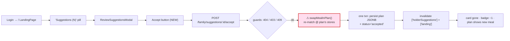
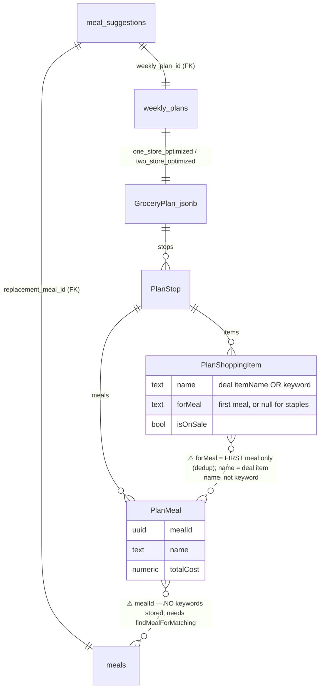
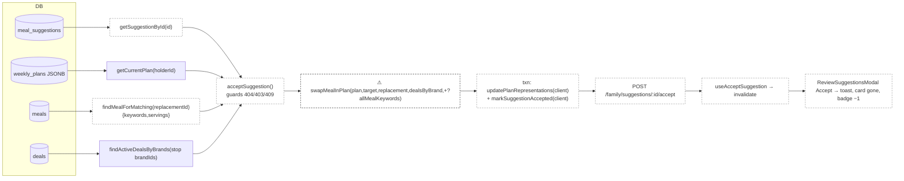

# Slice Abstract — Slice 5: Account holder accepts a suggestion → plan updated

> **Status:** APPROVED — 2026-06-24
> Status legend: **VERIFIED** (cited from a file opened this session, with snippet) · **ASSUMED** (inference) · **UNKNOWN** (needs input)
> Citations are `path:Lstart-Lend`. No implementation has been started — this is a design document for review.

## At a glance

|                           |                                                                                   |
| ------------------------- | --------------------------------------------------------------------------------- |
| **Slice**                 | 5 — Account holder accepts a suggestion → plan updated (source: `slice-specs/family-member-meal-suggestions/slice-5/slice.md`) |
| **Mockup**                | `mockups/groceryhack-mockups.html:1166-1227` (Screen 7 — the `.btn-accept` at `:1201`) |
| **Conflicts / decisions** | **6** (all decided ✅)                                                              |
| **Open questions**        | **0** — both resolved by the developer ([jump](#questions-for-the-developer))       |

> Note on args: `/slice-abstract` loaded with the slice path but the template's `<slice_md>`/`<gherkin_spec>` came through as MISSING placeholders. The real files were located and used: slice `slice-specs/family-member-meal-suggestions/slice-5/slice.md`, roadmap `…/slices.md`, Gherkin `specs/family-member-meal-suggestions/family-member-meal-suggestions.md`. The slice's own `Status:` is already `APPROVED — 2026-06-23`; this abstract surfaced two technical under-specifications in that approved slice that would force rework if built as literally written — both are now **resolved** (Q1, Q2 below): expand the swap's inputs and rebuild affected stops; mirror the optimizer's single-brand assignment for two-store.

### What this slice touches

|       | File                                              | Why                                                                                          |
| ----- | ------------------------------------------------- | -------------------------------------------------------------------------------------------- |
| 🆕    | `backend/src/services/mealSwap.ts`                | Pure, testable `swapMealInPlan(...)` — re-matches replacement, edits each affected stop, recomputes subtotals/total/savings |
| ✏️    | `backend/src/services/family.ts`                  | New `acceptSuggestion(holderId, suggestionId)` — guards (404/403/409), loads plan + deals, runs swap, transactional persist |
| ✏️    | `backend/src/db/queries/family.ts`                | `getSuggestionById`, `markSuggestionAccepted(client,…)`, `updatePlanRepresentations(client,…)` |
| ✏️    | `backend/src/db/queries/meals.ts`                 | New `findMealForMatching(mealId)` → `{id,name,ingredientKeywords,servings}` (`mapMealRow` omits keywords) |
| ✏️    | `backend/src/routes/family.ts`                    | `POST /api/v1/family/suggestions/:id/accept` (`requireAuth`, `validate({params})`)           |
| ✏️    | `backend/src/schemas/family.ts`                   | `acceptSuggestionParams = z.object({ id: z.string().uuid() })`                                |
| 🆕    | `frontend/src/hooks/useAcceptSuggestion.ts`       | `useMutation` → `POST …/accept`; invalidate `['holderSuggestions']` + `['landing']`          |
| ✏️    | `frontend/src/modals/ReviewSuggestionsModal.tsx`  | Add **Accept** button per card + success/error `Toast`; disabled+spinner while pending       |
| ✏️    | `api-contract.yaml`                               | Document `POST /family/suggestions/{id}/accept` + 403/404/409 cases under `Family`           |
| ✏️    | `docs/architecture/error-codes.md`                | **(abstract-added — slice omits it)** add the 4 new codes to the `Family` table (`:131-139`) |

_No new migration — `meal_suggestions.status` already allows `'accepted'` (`backend/src/db/migrations/007_add_meal_suggestions.sql:13-14`). No new shared type — response is the existing `MealSuggestion` (`packages/shared/types.ts:784-799`)._

### Conflicts & decisions needed first

_One line per item. Stop signs only — detail lives in the Questions section._

> **⚠️ 1 · `swapMealInPlan`'s signature can't enforce its own drop rule.** ✅ _decided — **expand inputs + rebuild stop**._ `acceptSuggestion` fetches every remaining stop-meal's keywords (`findMealForMatching` per `mealId`); `swapMealInPlan` rebuilds each affected stop from the real keyword sets via the optimizer's own helpers, preserving `forMeal=null` staple lines — so shared-line retention, `forMeal` re-tagging, and dedup come from the optimizer's logic, not the lossy `forMeal` tag. **Signature gains the remaining-meals' keywords** beyond the slice's 4 args.
> `backend/src/services/optimizer.ts:191-199` — `"if (!seen.has(lower)) { seen.add(lower); keywords.push({ keyword: kw, forMeal: meal.name }); }"` (first-meal-wins ⇒ the tag isn't ownership)

> **⚠️ 2 · Two-store swap placement is under-defined.** ✅ _decided — **mirror the optimizer (single-brand assignment)**._ Assign each replacement keyword to the cheaper of the plan's two *existing* brands (no store re-pick), rebuild both stops, recompute both subtotals + `total` + `estimatedSavings`, and route keywords neither brand carries to `unmatchedItems`. Keeps `total == Σ subtotal`, no double-count.
> `backend/src/services/optimizer.ts:397` — `"const stop = buildPlanStop(brandCostResult, brandLocation, meals);"` (full meal list per stop ⇒ target is in both stops)

> **⚠️ 3 · Endpoint shape — action POST vs RESTful PATCH.** ✅ _decided (slice recommendation)._ `POST /api/v1/family/suggestions/:id/accept` returning the updated `MealSuggestion`; avoids a PATCH that invites arbitrary status writes.
> `slice-5/slice.md:165-168` — `"Recommended: POST /family/suggestions/:id/accept (an explicit action verb…)"`

> **⚠️ 4 · Other now-stale pending suggestions on the swapped-out meal.** ✅ _decided (slice recommendation)._ Leave them `pending` for MVP (no scenario covers them); revisit if needed.
> `slice-5/slice.md:169-173` — `"Recommended for MVP: leave them pending … simplest"`

> **⚠️ 5 · Accept-only vs Accept + disabled Dismiss.** ✅ _decided (slice recommendation)._ Ship Accept alone; Dismiss lands wired in Slice 6 so nothing on screen is dead.
> `slice-5/slice.md:174-176` — `"Recommended: ship Accept alone this slice"`

> **⚠️ 6 · Accept response must satisfy the non-optional `MealSuggestion` shape.** ✅ _decided (implementation note)._ A bare `UPDATE … RETURNING *` omits `replacement_meal_name` (required on `MealSuggestion`, `types.ts:794`); re-join meal names like `createMealSuggestion` does, or the typed `200` body is incomplete. Frontend refetches so it's cosmetic at runtime, but the contract documents returning a `MealSuggestion`.
> `backend/src/db/queries/family.ts:74-79` — `"JOIN meals rm ON rm.id = i.replacement_meal_id  LEFT JOIN meals tm …"`

## 1. User capability & journey

- **New capability:** the account holder (Jessica) can, for the first time, **accept** a family member's pending suggestion and have it **actually change her current-week plan** — the target meal is swapped for the replacement, the replacement's on-sale groceries appear on the shopping list, and the stop subtotals / plan total / `estimatedSavings` are recomputed. VERIFIED against the Gherkin: `specs/family-member-meal-suggestions/family-member-meal-suggestions.md:6-10` — `"either accepts one (which swaps the meal in the plan) or dismisses it … the only plan mutation a family member can cause is via an accepted suggestion."` This is the feature's whole point.
- **Getting there:** Jessica is authenticated on `/` (`LandingPage`). `GET /landing` already returns `pendingSuggestionCount`; the count-gated **"Suggestions (N)"** pill (`frontend/src/pages/LandingPage.tsx:252-260`) opens the Slice-4 `ReviewSuggestionsModal` (`:346-350`), which lists each pending suggestion. This slice adds an **Accept** button to each card.
- **Afterward:** on success the modal invalidates `['holderSuggestions']` + `['landing']`; the accepted card disappears, the badge decrements, and the landing plan section re-renders with the new meal. **Dismiss** (Slice 6) and the suggester's status view (Slice 7) reuse this surface; **direct edit** (Slice 8) reuses `swapMealInPlan`; the **403 for a family member** is written here but made observable/tested in Slice 8. VERIFIED `slice-5/slice.md:35-38,150-162`.

_Legend: red/⚠ = `swapMealInPlan` carries the two load-bearing under-specifications (Questions 1 & 2)._

## 2. Entities

- **Named in the spec/slice:** account holder (Jessica), family member (Sam), the pending `meal_suggestion`, the holder's current-week `weekly_plan`, target meal (a `PlanMeal` in the plan), replacement meal (from the shared `meals` pool), the per-stop deals.
- **Actually in the DB (VERIFIED):**
  - `meal_suggestions` — `migration 007:6-16`: `status TEXT … CHECK (status IN ('pending','accepted','dismissed')) DEFAULT 'pending'`. Marking `accepted` needs **no migration**.
  - `weekly_plans.one_store_optimized` / `two_store_optimized` JSONB hold a **camelCase `GroceryPlan`** — `saveWeeklyPlan` writes `JSON.stringify(oneStoreOptimized)` (`backend/src/db/queries/optimizer.ts:212`) and `getCurrentPlan` reads `row.one_store_optimized as GroceryPlan` (`backend/src/db/queries/landing.ts:135`). Keys are `stops[].meals[].mealId`, `forMeal`, `estimatedSavings` (confirmed by `planContainsMeal` at `services/family.ts:44-58` and `getSavingsThisWeek` reading `one_store_optimized->>'estimatedSavings'` at `landing.ts:14-19`).
  - `meals.ingredient_keywords` — the swap re-match source. **Not exposed** by `mapMealRow` / `findMealById` (`backend/src/db/queries/meals.ts:7-29,79-89`), which is why the slice adds `findMealForMatching` (mirroring `findLikedMealsFull`'s `LikedMealRow`, `optimizer.ts:61-83`).
- **The plan-as-data shape (this is where the risk lives — VERIFIED `packages/shared/types.ts:380-414`):**
  - `PlanMeal` = `{ mealId, name, costPerServing, totalCost, savings }` — **no keywords**.
  - `PlanShoppingItem` = `{ name, quantity, salePrice, regularPrice, isOnSale, dealNote, forMeal }` — `name` is the **deal's item name** (or the keyword only when no deal): `optimizer.ts:245` — `"name: assignment.deal?.itemName ?? keyword"`. So a line for keyword `chicken` is stored as e.g. `"Fresh Chicken Breast"`, not `chicken`.
  - `GroceryPlan` = `{ stops[], total, budgetRemaining, estimatedSavings, unmatchedItems? }`.
- **CONFLICTS / caveats (spec/slice vs. code):**
  - **`forMeal` is first-meal-only.** `buildNeededKeywords` dedups keywords across meals and tags each to the first meal needing it (`optimizer.ts:188-199`); `calculateBrandCost` keeps the first assignment (`optimizer.ts:157-158` — `"Skip duplicates — if we already assigned this keyword, keep the first assignment"`). ⇒ a line the target meal needs may be tagged to a *different* meal, and vice versa. The slice's drop predicate ("keyword no longer needed by any remaining meal") therefore **cannot** be evaluated from the plan alone (Question 1).
  - **In two-store every meal is in every stop.** `buildTwoStorePlan` calls `buildPlanStop(brandCostResult, brandLocation, meals)` with the **full** meal list per stop (`optimizer.ts:397`), and `buildPlanStop` maps **all** meals into `planMeals` (`optimizer.ts:221`). ⇒ the target `PlanMeal` appears in both stops, each carrying only that brand's share of cost (Question 2).
  - `target_meal_id` has **no FK** (`migration 007:11` — `"-- PlanMeal.mealId (meal from the holder's plan)"`); irrelevant to the swap math but relevant to the `weekly_plan_id` staleness guard the slice adds (`PLAN_CHANGED`).

_Legend: red/⚠ = the two relations that make the swap hard — keywords aren't in the plan, and `forMeal` is first-meal-only._

## 3. Contracts

| Endpoint (method + path)                         | Status      | Shape the slice expects                                                              | Notes / citation |
| ------------------------------------------------ | ----------- | ----------------------------------------------------------------------------------- | ---------------- |
| `POST /api/v1/family/suggestions/:id/accept`     | **MISSING** | params `{id:uuid}`; body none; `200` → updated `MealSuggestion` (`status:"accepted"`) | New route beside `GET /suggestions` (`backend/src/routes/family.ts:21-28`); registered router `app.use('/api/v1/family', …)` |
| `GET /api/v1/family/suggestions`                 | EXISTS      | unchanged — list refetched after accept                                              | `routes/family.ts:21-28`; query `getHolderPendingSuggestions` (`db/queries/family.ts:156-175`) re-filters `status='pending'`, so the accepted row drops out automatically |
| `GET /api/v1/landing`                            | EXISTS      | unchanged — `pending_suggestion_count` recomputed on refetch                         | Count = `countHolderPendingSuggestions` (already wired in Slice 4); decrements once the row flips to `accepted` |

Gaps for the new endpoint:
- **Schema:** `acceptSuggestionParams = z.object({ id: z.string().uuid() })` in `backend/src/schemas/family.ts` (existing file uses the snake→camel `.transform` pattern, `schemas/family.ts:4-12`; params need no transform).
- **Route:** `validate({ params: acceptSuggestionParams })` then `res.json(await acceptSuggestion(req.user!.userId, req.params.id))`, mirroring `GET /suggestions` (`routes/family.ts:21-28`).
- **Service `acceptSuggestion`** guards (all helpers VERIFIED in `backend/src/middleware/errorHandler.ts`): `getSuggestionById` missing → `throwNotFound('SUGGESTION_NOT_FOUND')` (404, `:13-14`); `account_holder_id !== holderId` → `throwForbidden('NOT_SUGGESTION_HOLDER')` (403, `:25-26`); `status !== 'pending'` → `throwConflict('SUGGESTION_NOT_PENDING')` (409, `:21-22`); no current plan → `throwNotFound('NO_PLAN')` (404); `suggestion.weekly_plan_id !== plan.id` → `throwConflict('PLAN_CHANGED')` (409).
- **Transaction:** persist plan JSONB + `markSuggestionAccepted` on one client with `BEGIN/COMMIT/ROLLBACK`, exactly like `recordSwipe` (`backend/src/db/queries/meals.ts:96-156`).
- **Contract:** add the path under `Family` next to the existing entries (`api-contract.yaml:1428-1507`); `MealSuggestion` schema already exists (`api-contract.yaml:2537`).

## 4. Annotated mockup

- **Relevant section:** **Screen 7 — Account Holder · Pending Suggestions**, `mockups/groceryhack-mockups.html:1166-1227`. This slice activates the part Slice 4 deliberately omitted: `.review-actions` (`:1199-1202`) — `<button class="btn-dismiss">Dismiss</button>` + `<button class="btn-accept">Accept</button>`.
- **This slice ships the Accept button only** (`.btn-accept`, styled at `:562-566`). Dismiss is Slice 6 (Conflict 5). Map `.btn-accept` to a primary pill using `theme/tokens` (`colors.primary`, `radii.pill`), matching the existing modal styling in `ReviewSuggestionsModal.tsx:41-95`.
- **Reusable component — the review card** (`ReviewCard`, `frontend/src/modals/ReviewSuggestionsModal.tsx:97-112`): already renders who/when + replacement + "Replaces {target}". This slice adds an actions row inside it. The `.info-banner` copy ("Accepting swaps the meal in your plan…", `mockup :1220-1223`, rendered at `ReviewSuggestionsModal.tsx:146-150`) now describes a **live** action.
- **One-off:** the per-card Accept button wiring (pending/disabled/spinner + toast).
- **State-management intuition (`ASSUMED`):** the modal keeps a single `useHolderSuggestions` query; each card calls `useAcceptSuggestion()` and tracks the in-flight id (e.g. `mutation.isPending && variables.id === suggestion.id`) to disable just that card. On success a `Toast` ("Swapped {replacement} into your plan") shows — same `Toast` component already used in `SuggestSwapModal.tsx:193-198`. On error, an error `Toast`. The two `invalidateQueries` calls drive the card-removal + badge decrement (no manual list edit).

## 5. Data flow

_Legend: dashed/(ASSUMED) = new code this slice; red/⚠ = the swap node carries the open under-specifications. Solid DB nodes + `getCurrentPlan`/`findActiveDealsByBrands` are VERIFIED._

Per-hop status:
- **`meals` → `findMealForMatching`:** ASSUMED new; the SQL+map mirror `findLikedMealsFull` VERIFIED `optimizer.ts:61-83`. Needed because `mapMealRow` omits `ingredient_keywords` (VERIFIED `meals.ts:7-29`).
- **`weekly_plans` → `getCurrentPlan`:** VERIFIED `landing.ts:118-143` (returns `id`, camelCase `GroceryPlan`).
- **`deals` → `findActiveDealsByBrands`:** VERIFIED `optimizer.ts:108-145` — accepts **brand** ids, current-date window. The plan's stops expose `storeBrandId` (`types.ts:402`), so the brands are derivable from the plan with no re-pick.
- **`swapMealInPlan`:** ASSUMED new; reuses exported pure helpers `findBestDealForKeyword` (`optimizer.ts:113-130`), `calculateBrandCost` (`:145-178`), `buildPlanStop` (`:216-264`), `buildDealsByBrand` (`:70-81`) — all VERIFIED exported. Its correct inputs are the open question (1 & 2).
- **txn persist:** ASSUMED new `updatePlanRepresentations` + `markSuggestionAccepted`; pattern VERIFIED `recordSwipe` (`meals.ts:96-156`) and `saveWeeklyPlan` JSONB write (`optimizer.ts:186-217`).
- **route → hook → modal:** ASSUMED new; mutation+invalidate pattern VERIFIED `useAddImportantItem` (`frontend/src/hooks/useImportantItems.ts:38-48` invalidates `['landing']`), `api.post` + camel→snake VERIFIED `useShare.ts:14-32`, Accept-button host VERIFIED `ReviewSuggestionsModal.tsx:97-152`.

## 6. Assumptions & load-bearing decisions register

| #   | Description                                                                                                          | Type     | Load-bearing? | Needs confirmation? |
| --- | ------------------------------------------------------------------------------------------------------------------ | -------- | ------------- | ------------------- |
| 1   | **`swapMealInPlan` needs every remaining stop-meal's keywords (not just the replacement) + must preserve `forMeal=null` staple lines; `forMeal` is first-meal-only so it can't be the drop predicate.** → **resolved: expand inputs + rebuild stop.** | VERIFIED | **Yes**       | ✅ decided (Q1)      |
| 2   | **Two-store: target is in both stops; per-stop independent re-match diverges from the optimizer's single-brand assignment and can double-count; `unmatchedItems` handling undefined.** → **resolved: mirror optimizer (single-brand).** | VERIFIED | **Yes**       | ✅ decided (Q2)      |
| 3   | Endpoint is action-style `POST …/accept` returning the updated `MealSuggestion`.                                     | VERIFIED | Yes           | ✅ (slice rec.)      |
| 4   | Other stale pending suggestions on the swapped-out meal are left `pending`.                                          | VERIFIED | No            | ✅ (slice rec.)      |
| 5   | Ship Accept only (no disabled Dismiss); Dismiss is Slice 6.                                                          | VERIFIED | No            | ✅ (slice rec.)      |
| 6   | Accept response must re-join `replacement_meal_name`/`target_meal_name` to satisfy the non-optional `MealSuggestion`. | VERIFIED | No            | No (impl note)      |
| 7   | `findMealForMatching` is required because `mapMealRow`/`findMealById` omit `ingredient_keywords`.                    | VERIFIED | Yes           | No                  |
| 8   | Plan JSONB is camelCase `GroceryPlan`; persisted via `JSON.stringify` like `saveWeeklyPlan`.                         | VERIFIED | Yes           | No                  |
| 9   | All five error codes map to existing `errorHandler` helpers (404/403/409); none new in code, but **4 are new to `error-codes.md`** (abstract-added).         | VERIFIED | No            | No                  |
| 10  | No migration and no new shared type required (status already allows `accepted`; response is existing `MealSuggestion`). | VERIFIED | Yes           | No                  |
| 11  | Accepted row leaves `GET /suggestions` and the `/landing` count automatically (both filter `status='pending'`).      | VERIFIED | No            | No                  |

## 7. Verification plan (Chrome)

Run after implementation. **Tooling:** chrome-mcp does not work in WSL — use `python3 backend/scripts/cdp.py` on `:9222` (`goto`, `eval`, `screenshot`, `click`). Seed first: `cd backend && npm run seed && npm run seed:plans` (creates the deterministic pending Sam→Jessica row, `seedPlans.ts:27-78`).

1. **Compile.** `cd backend && npx tsc --noEmit` and `cd frontend && npx tsc --noEmit`. **Expect:** both exit 0 (proves the new service/query/route/schema, `findMealForMatching`, the mutation hook, and the modal button all typecheck; and that the accept response satisfies `MealSuggestion`).
2. **Unit — `swapMealInPlan` (the load-bearing math).** Run the new `mealSwap` tests (`cd backend && npm test`). **Expect:** (a) replacement's matched deals become `isOnSale` items tagged `forMeal=replacement.name`; (b) a keyword shared with a remaining meal is **not** dropped; (c) a `forMeal=null` staple line is **not** dropped; (d) stop `subtotal`, plan `total`, `estimatedSavings` recomputed; (e) a representation not containing the target is returned untouched. _ASSUMED test file — these encode Q1/Q2 resolutions._
3. **Holder API happy path.** Log in as `jessica@test.groceryhack.com` (`testpassword123`); `POST /api/v1/family/suggestions/<seededId>/accept`. **Expect:** `200` body is the suggestion with `status:"accepted"`; `psql -c "SELECT status FROM meal_suggestions WHERE id='<id>';"` → `accepted`.
4. **Plan mutation — one-store.** Before/after `GET /api/v1/landing` (or read `weekly_plans.one_store_optimized`). **Expect:** target `mealId` gone from every stop's `meals[]`; replacement `mealId` present; every deal that exists for the replacement's keywords **at the plan's existing brand(s)** is an `isOnSale` item tagged `forMeal=replacement`; affected `subtotal` + plan `total` + `estimatedSavings` changed; stop count and `storeBrandId`s unchanged (no store added/removed).
5. **Plan mutation — two-store (Q2 = mirror optimizer).** As a holder whose plan has `two_store_optimized != null`. **Expect:** the replacement appears in **both** stops' `meals[]`; each replacement ingredient on sale at the plan's brands is a **single** line at the cheaper of the two stops (**not** duplicated across both); plan `total` equals the sum of stop subtotals (no double-count); ingredients neither brand carries are in `unmatchedItems`.
6. **Shared-ingredient + staple safety (Q1).** Pick a replacement sharing a keyword with another remaining meal, in a plan that also has an active important item. **Expect:** the shared line stays (no duplicate added), and the staple line (`forMeal=null`) stays.
7. **Error cases.** (a) accept as a different holder/family member → `403 NOT_SUGGESTION_HOLDER`; (b) random uuid → `404 SUGGESTION_NOT_FOUND`; (c) accept the same id twice → second is `409 SUGGESTION_NOT_PENDING`. **Expect:** standard `{error,code,message}` each. _ASSUMED Sam (family member) login for (a)._
8. **UI happy path.** `cdp.py goto http://localhost:5173/` as Jessica → click "Suggestions (N)" pill → `eval [...document.querySelectorAll('button')].some(b=>b.textContent.trim()==='Accept')` **Expect:** `true`. `click` Accept; `eval document.body.innerText` **Expect:** the accepted card gone; the "Suggestions (N)" count decremented; the landing plan section shows the replacement meal name and not the target. `screenshot`. Run `debug-frontend` flow — **Expect:** no console exceptions.
9. **Contract + docs.** `api-contract.yaml` documents `POST /family/suggestions/{id}/accept` + 403/404/409 under `Family`; `error-codes.md` `Family` table lists the 4 new codes. **Expect:** present.

## Questions for the developer

1. **`swapMealInPlan` inputs & drop-safety — the plan doesn't store keywords, and `forMeal` is first-meal-only** _(Register #1)_ — ✅ **RESOLVED: option (A) — expand inputs + rebuild stop.**

   The slice's swap rule (`slice-5/slice.md:72-77`) is: when removing the old meal, "only drop items whose keyword is **no longer needed by any remaining meal in that stop**"; when adding the new meal, "**skip keywords already present**"; and "re-tag `forMeal` if the only meal that owned a still-needed item was the one being removed." All three clauses require knowing **each remaining meal's `ingredientKeywords`** — but the plan JSONB stores none of that, and `PlanShoppingItem.name` is the **deal's** item name, not the keyword.

   **Concrete impact (files the implementer touches):**
   - The plan only carries `PlanMeal = {mealId,name,costPerServing,totalCost,savings}` (`packages/shared/types.ts:380-386`) and `PlanShoppingItem.name = deal.itemName ?? keyword` (`backend/src/services/optimizer.ts:245`). No keyword, no keyword→item index.
   - `forMeal` is the **first** meal that needed the keyword: `buildNeededKeywords` (`optimizer.ts:188-199`) + `calculateBrandCost`'s `"keep the first assignment"` (`optimizer.ts:157-167`). So `forMeal === targetMeal.name` is **neither necessary nor sufficient** to decide a line belongs only to the target.
   - Important-item lines are tagged `forMeal=null` (`optimizer.ts:206`, `buildPlanStop:251`). A drop rule phrased around "needed by a meal" must explicitly **keep** these.
   - The slice's signature `swapMealInPlan(plan, targetMealId, replacementMeal, dealsByBrand)` (`slice-5/slice.md:60-62`) has **no parameter** for the remaining meals' keywords.

   **Options:**
   - **(A — recommended) Pass all plan meals' keywords in.** `acceptSuggestion` calls `findMealForMatching` for **every** distinct `mealId` across the affected stops (not just the replacement) and passes a `Map<mealId,{keywords,servings}>` to `swapMealInPlan`. Then the cleanest implementation is **rebuild each affected stop from its post-swap meal set**: rebuild `neededKeywords` (deduped, `forMeal=first`) from `(remaining meals + replacement)` **plus the stop's existing `forMeal=null` staple lines preserved verbatim**, then reuse `calculateBrandCost` + `buildPlanStop`. This reproduces the optimizer's own dedup exactly, so shared lines and `forMeal` re-tagging fall out for free. Cost: N extra `meals` reads per accept (small).
   - **(B) Surgical edit using `forMeal` as a proxy.** Cheaper but the first-meal-only tagging makes it wrong for shared keywords — the exact caveat the slice flags. Not recommended.

   **Recommendation:** confirm **(A)** and amend the swap signature to receive the remaining meals' keywords (and to preserve `forMeal=null` lines). This is the single thing most likely to force rework if the slice is built from its literal signature.

2. **Two-store placement semantics** _(Register #2)_ — ✅ **RESOLVED: option (A) — mirror the optimizer (single-brand assignment).**

   In `two_store_optimized` the target meal is in **both** stops' `meals[]`, each carrying only that brand's share of cost, and the optimizer originally assigned each keyword to a **single** cheapest brand across all brands (`buildTwoStorePlan`, `optimizer.ts:306-443`). The slice says re-match "for each stop where the target meal appears" (`slice-5/slice.md:62-68`) — but re-matching the replacement **independently against each stop's brand** would place its on-sale items at **both** stops if both carry them, double-counting cost and diverging from the optimizer's single-assignment model. It also doesn't say what happens to the top-level `unmatchedItems` (`types.ts:413`).

   **Concrete impact:**
   - `buildPlanStop(brandCostResult, brandLocation, meals)` is called per stop with the full meal list (`optimizer.ts:397`), and maps every meal into `planMeals` (`optimizer.ts:221`) — so both stops' `PlanMeal` for the replacement must be recomputed, and the plan `total`/`estimatedSavings` summed across stops (`optimizer.ts:436-441`).
   - Whatever rule is chosen has to keep `total == Σ subtotal` (Verification step 5).

   **Options:**
   - **(A — recommended) Mirror the optimizer: assign each replacement keyword to the cheaper of the plan's *existing* two brands**, build each stop from its assigned subset (+ remaining meals + preserved staples per Q1), recompute both subtotals + total + savings. No re-pick of stores; single assignment preserved; `unmatchedItems` recomputed for keywords neither plan brand carries.
   - **(B) Treat each stop independently** (slice's literal wording) and accept possible duplication — simpler to code, but violates the "never double-count" expectation and the optimizer's model.
   - **(C) Scope two-store out of this slice** (only mutate `one_store_optimized`) — contradicts acceptance criterion `slice-5/slice.md:184-187` ("in **both** `one_store_optimized` and (where present) `two_store_optimized`"), so not viable without changing the criteria.

   **Recommendation:** confirm **(A)**. If (A) is too heavy for MVP, explicitly relax the acceptance criterion rather than ship (B)'s double-count.
