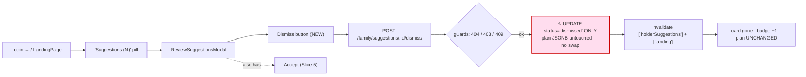
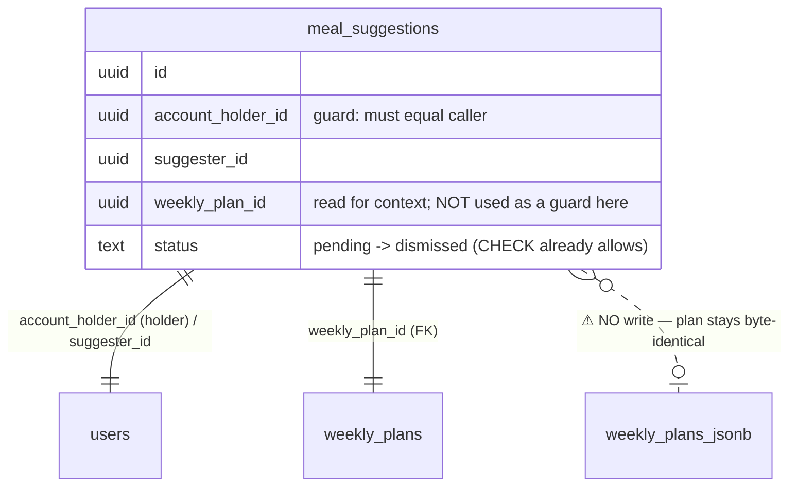
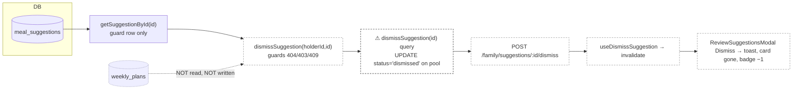

# Slice Abstract — Slice 6: Account holder dismisses a suggestion

> **Status:** APPROVED — 2026-06-24
> Status legend: **VERIFIED** (cited from a file opened this session, with snippet) · **ASSUMED** (inference) · **UNKNOWN** (needs input)
> Citations are `path:Lstart-Lend`. No implementation has been started — this is a design document for review.

## At a glance

|                           |                                                                                  |
| ------------------------- | -------------------------------------------------------------------------------- |
| **Slice**                 | 6 — Account holder dismisses a suggestion (source: `slice-specs/family-member-meal-suggestions/slice-6/slice.md`) |
| **Mockup**                | `mockups/groceryhack-mockups.html:1199-1200` (Screen 7 — the `.btn-dismiss`, styled `:567-572`) |
| **Conflicts / decisions** | **4** (all decided ✅)                                                            |
| **Open questions**        | **0** — Q1 resolved by the developer ([jump](#questions-for-the-developer))      |

> Note on args: `/slice-abstract` loaded with only the slice path; the template's `<slice_md>` / `<gherkin_spec>` came through as MISSING placeholders. The real files were located and used: slice `slice-specs/family-member-meal-suggestions/slice-6/slice.md`, roadmap `…/slices.md`, Gherkin `specs/family-member-meal-suggestions/family-member-meal-suggestions.md`, mockup `mockups/groceryhack-mockups.html`. The slice's own `Status:` is already `APPROVED — 2026-06-24`. **Slice 5's code is in the working tree, uncommitted** (last commit is Slice 4), so every accept-path citation below is to the live working-tree file, not a committed blob.

### What this slice touches

|     | File                                              | Why                                                                                              |
| --- | ------------------------------------------------- | ------------------------------------------------------------------------------------------------ |
| ✏️  | `backend/src/db/queries/family.ts`                | `dismissSuggestion(id)` — race-safe single `UPDATE … status='dismissed' WHERE id=$1 AND status='pending' RETURNING …` on **`pool`** (no `PoolClient`, no txn), re-joined to names via `mapSuggestionRow` |
| ✏️  | `backend/src/services/family.ts`                  | `dismissSuggestion(holderId, suggestionId)` — guards 404/403/409 only; **no plan load, no swap** |
| ✏️  | `backend/src/routes/family.ts`                    | `POST /api/v1/family/suggestions/:id/dismiss` (`requireAuth`, `validate({ params })`)            |
| ✏️  | `backend/src/schemas/family.ts`                   | **rename** `acceptSuggestionParams` → `suggestionIdParams` (+ type `AcceptSuggestionParams` → `SuggestionIdParams`), shared by both the accept and dismiss routes (Q1 resolved → rename) |
| ✏️  | `backend/src/routes/family.ts` (accept route too) | **(rename fallout)** update the Slice-5 accept route's import + usage to the renamed `suggestionIdParams` / `SuggestionIdParams` (`routes/family.ts:4-5,34,37`) |
| 🆕  | `frontend/src/hooks/useDismissSuggestion.ts`      | `useMutation` → `POST …/dismiss`; invalidate `['holderSuggestions']` + `['landing']`             |
| ✏️  | `frontend/src/modals/ReviewSuggestionsModal.tsx`  | Add a **Dismiss** ghost pill per card; track `dismissingId`; disable **both** buttons on a card while **either** mutation is in flight for it |
| ✏️  | `api-contract.yaml`                               | Document `POST /family/suggestions/{id}/dismiss` + 403/404/409 under `Family` (mirror the accept entry `:1449-1496`) |
| ✏️  | `docs/architecture/error-codes.md`                | **(abstract-added — slice omits it)** append `…/dismiss` to the Endpoint column of the 3 reused rows (`:140-142`) |
| ✏️  | `backend/src/services/family.test.ts`             | **(convention — slice omits explicit mention)** add a `dismissSuggestion` describe block mirroring `acceptSuggestion`'s, minus the plan/swap cases |

_No new migration — `meal_suggestions.status` already allows `'dismissed'` (`backend/src/db/migrations/007_add_meal_suggestions.sql:13-14`, mirrored `schema.sql:379`). No new shared type — response is the existing `MealSuggestion` (`packages/shared/types.ts:784-799`)._

### Conflicts & decisions needed first

_One line per item. Stop signs only — detail lives in the Questions section._

> **⚠️ 1 · Params schema — reuse `acceptSuggestionParams` for a `/dismiss` route, or rename it?** ✅ _decided — **rename** to a neutral `suggestionIdParams` shared by both routes._
> Both routes take an identical `{ id: uuid }`; the neutral name reads cleaner than an `accept…`-named schema validating a dismiss route. Costs a light touch to the Slice-5 accept route's import/usage (the rename fallout).
> `backend/src/schemas/family.ts:15-17` — `"export const acceptSuggestionParams = z.object({ id: z.string().uuid() })"` → renamed to `suggestionIdParams`

> **⚠️ 2 · Endpoint shape — action POST vs RESTful PATCH.** ✅ _decided — action POST `…/dismiss`, mirroring Slice 5._
> Slice 5 already shipped `POST …/accept` returning the updated `MealSuggestion`; a `PATCH …{status}` invites arbitrary status writes the service must reject. Match the precedent.
> `backend/src/routes/family.ts:31-44` — `"router.post('/suggestions/:id/accept', requireAuth, validate({ params: acceptSuggestionParams }), …)"`

> **⚠️ 3 · Dismiss button style — neutral/ghost vs `danger` red.** ✅ _decided — neutral ghost pill; the mockup already specifies it._
> Dismiss is a non-destructive "no thanks"; the design system reserves red for deletes/errors. The mockup's `.btn-dismiss` is a bordered card-bg ghost, not red.
> `mockups/groceryhack-mockups.html:567-572` — `"border:1.5px solid #D7E2DC;background:var(--card);color:var(--ink-soft);"`

> **⚠️ 4 · `error-codes.md` doesn't list `/dismiss` as an endpoint for the 3 reused codes.** ✅ _decided — append it (abstract-added; the slice's scope list omits the doc)._
> `SUGGESTION_NOT_FOUND` / `NOT_SUGGESTION_HOLDER` / `SUGGESTION_NOT_PENDING` are documented only against `…/accept`; dismiss reuses all three (no **new** codes). `NO_PLAN` / `PLAN_CHANGED` stay accept-only.
> `docs/architecture/error-codes.md:140-142` — `"| `SUGGESTION_NOT_FOUND` | 404 | POST /family/suggestions/{id}/accept | …"`

## 1. User capability & journey

- **New capability:** on the holder's existing **Pending Suggestions** review surface (the Slice-4/5 `ReviewSuggestionsModal`, opened from the landing page), each pending suggestion now has a **Dismiss** action beside the Slice-5 **Accept**. Dismissing marks the suggestion `dismissed` and leaves the holder's plan **completely unchanged** — no swap, no re-match, no shopping-list/savings change. VERIFIED against the Gherkin: `specs/family-member-meal-suggestions/family-member-meal-suggestions.md:72-78` — `"When I dismiss that suggestion / Then the meal plan is unchanged / And the suggestion is marked as dismissed"`. This is the negative half of the review loop — reject input as cleanly as Slice 5 accepts it, and provably inert on the plan.
- **Getting there:** Jessica is authenticated on `/` (`LandingPage`). `GET /landing` returns `pendingSuggestionCount`; the count-gated **"Suggestions (N)"** pill (`frontend/src/pages/LandingPage.tsx:252-260` — `"data.pendingSuggestionCount > 0 && …onClick={() => setReviewSuggestionsOpen(true)}"`) opens `ReviewSuggestionsModal` (`:346-348`), which lists each pending suggestion. This slice adds a **Dismiss** button to each card.
- **Afterward:** on success the modal invalidates `['holderSuggestions']` + `['landing']`; the dismissed card disappears, the "Suggestions (N)" badge decrements, and — because `getMySuggestionsForPlan` is **pending-only** (`backend/src/db/queries/family.ts:110-112`) — the suggestion also stops showing as a pending marker on the family member's `GET /family/plan`. The suggester's explicit **"My Suggestions" status view** that renders the word *dismissed* is **Slice 7**; the **provable 403** for a family member attempting to dismiss is written here but made observable/tested in **Slice 8**.

_Legend: red/⚠ = the load-bearing design point — dismiss is the accept path **minus** the plan mutation; getting that inertness right (and not copy-pasting accept's plan/swap machinery) is the whole slice._

## 2. Entities

- **Named in the spec/slice:** account holder (Jessica), family member (Sam), the pending `meal_suggestion`, the holder's current-week `weekly_plan` (read context only — **not mutated**), the suggester's pending markers on `GET /family/plan`.
- **Actually in the DB (VERIFIED):**
  - `meal_suggestions` — `migration 007:13-14`: `status TEXT NOT NULL DEFAULT 'pending' CHECK (status IN ('pending','accepted','dismissed'))`. Marking `dismissed` needs **no migration** (mirrored `schema.sql:379`).
  - The guard row is read via `getSuggestionById(id)` → `SuggestionRow {id, suggesterId, accountHolderId, weeklyPlanId, targetMealId, replacementMealId, status}` (`backend/src/db/queries/family.ts:212-231`). **It omits `created_at` and the denormalised display names**, so the dismiss **write** query must re-join names to return a full `MealSuggestion` (see Conflict-adjacent impl note, register #3).
  - `weekly_plans.one_store_optimized` / `two_store_optimized` JSONB (camelCase `GroceryPlan`) — **untouched by this slice.** Dismiss never calls `getCurrentPlan`, `swapMealInPlan`, or `updatePlanRepresentations`.
- **Relationships & actions (as the spec/slice describes them):** holder dismisses → `status` flips `pending → dismissed`; the row leaves every **pending-only** read (holder's `GET /suggestions`, the `/landing` count, and the suggester's `/family/plan` markers); the plan is byte-identical before/after.
- **Already enforced in DB/codebase:** the `CHECK` constraint already permits `dismissed`; the partial-unique pending index (`schema.sql:390-391`) is on `status='pending'` so flipping to `dismissed` frees the `(suggester, plan, target)` slot — irrelevant to dismiss correctness but consistent.
- **CONFLICTS (spec vs. codebase):** **none structural.** The only Gherkin gap is **coverage, not contradiction**: "And the family member can see that their suggestion was dismissed" is made **true in the data** here (status persisted, pending marker removed) but the *visible* "My Suggestions" status view is **Slice 7** — the same accepted/dismissed split Slice 5 used (`slice-6/slice.md:29-34`). Not a decision; a scope boundary.

_Legend: red/⚠ = the deliberately-absent relation — unlike accept, dismiss does **not** write `weekly_plans`. (No spec-vs-code conflict exists in this slice.)_

## 3. Contracts

| Endpoint (method + path)                         | Status      | Shape the slice expects                                                                | Notes / citation |
| ------------------------------------------------ | ----------- | -------------------------------------------------------------------------------------- | ---------------- |
| `POST /api/v1/family/suggestions/:id/dismiss`    | **MISSING** | params `{id:uuid}`; body none; `200` → updated `MealSuggestion` (`status:"dismissed"`)  | New route beside the accept POST (`backend/src/routes/family.ts:31-44`); router mounted at `app.use('/api/v1/family', …)` |
| `GET /api/v1/family/suggestions`                 | EXISTS      | unchanged — list refetched after dismiss                                               | `routes/family.ts:21-28`; query `getHolderPendingSuggestions` filters `status='pending'` (`db/queries/family.ts:170-171`), so the dismissed row drops out automatically |
| `GET /api/v1/landing`                            | EXISTS      | unchanged — `pending_suggestion_count` recomputed on refetch                           | Count via `countHolderPendingSuggestions` (filters `status='pending'`, `db/queries/family.ts:188-191`); decrements once the row flips to `dismissed` |
| `GET /api/v1/family/plan`                        | EXISTS      | unchanged — Sam's `pending_suggestions` no longer lists the dismissed row              | `getMySuggestionsForPlan` filters `status='pending'` (`db/queries/family.ts:110-112`); the marker disappears for free |

Gaps for the new endpoint (all mirror the Slice-5 accept path):
- **Schema:** route needs `validate({ params })` with `{ id: z.string().uuid() }`. **Q1 resolved → rename** `acceptSuggestionParams` (`backend/src/schemas/family.ts:15-17`) to a neutral `suggestionIdParams` (+ type `SuggestionIdParams`), shared by both the accept and dismiss routes; update the accept route's import/usage as fallout (`backend/src/routes/family.ts:4-5,34,37`).
- **Route:** `validate({ params })` then `res.json(await dismissSuggestion(req.user!.userId, req.params.id))`, mirroring the accept block (`routes/family.ts:31-44`).
- **Service `dismissSuggestion(holderId, suggestionId)`** — the **first half** of `acceptSuggestion` (`backend/src/services/family.ts:216-244`) and **nothing after**: (1) `getSuggestionById` missing → `throwNotFound('SUGGESTION_NOT_FOUND')` (404); (2) `accountHolderId !== holderId` → `throwForbidden('NOT_SUGGESTION_HOLDER')` (403); (3) `status !== 'pending'` → `throwConflict('SUGGESTION_NOT_PENDING')` (409); (4) call `dismissSuggestion(id)` query, and if it returns `null` (lost race) → the same 409. **Omits** the `getCurrentPlan` / `NO_PLAN` / `PLAN_CHANGED` / `findMealForMatching` / `swapMealInPlan` / `acceptSuggestionTransaction` block (`family.ts:236-288`).
- **Query `dismissSuggestion(id)`** — mirror `markSuggestionAccepted`'s SQL (`db/queries/family.ts:238-262`) but: `SET status='dismissed'`, run on **`pool`** not a `PoolClient`, and **re-join** `su.display_name AS suggester_name`, `rm.name AS replacement_meal_name`, `tm.name AS target_meal_name` then `mapSuggestionRow`, so the `200` body satisfies the non-optional `MealSuggestion` (`replacementMealName` is required, `types.ts:794`).
- **Contract:** add the path under `Family` next to accept (`api-contract.yaml:1449-1496`); `MealSuggestion` schema already exists (`api-contract.yaml` ref used by accept `:1476`).

## 4. Annotated mockup

- **Relevant section:** **Screen 7 — Account Holder · Pending Suggestions**. The actions row is `mockups/groceryhack-mockups.html:1199-1201` — `
<button class="btn-dismiss">Dismiss</button><button class="btn-accept">Accept</button>
` (recurs per card at `:1214-1216`).
- **This slice ships the `.btn-dismiss` button.** Its style is already specified: a **neutral ghost pill** (`:567-572` — `"border:1.5px solid #D7E2DC;background:var(--card);color:var(--ink-soft)"`), i.e. bordered, card-bg, muted text — **not** `danger` red. Map to the design tokens: a transparent/`white` bg, `1px solid colors.border`, `colors.textMuted` text, `radii.pill`, `minHeight 44px` — alongside the existing primary `acceptButtonStyle` (`ReviewSuggestionsModal.tsx:106-122`). This settles Conflict 3.
- **Reusable component — the review card** (`ReviewCard`, `frontend/src/modals/ReviewSuggestionsModal.tsx:130-165`): already renders who/when + replacement + "Replaces {target}" + an `actionsRowStyle` row holding the Accept button. This slice adds a second button into that same row.
- **One-off:** the per-card Dismiss wiring (in-flight `dismissingId`, spinner + "Dismissing…" label, success/error toast). The `.info-banner` copy already present ("…Dismissing leaves your plan unchanged.", rendered `ReviewSuggestionsModal.tsx:219-223`) now describes a **live** action.
- **State-management intuition (`ASSUMED`):** the modal keeps one `useHolderSuggestions` query plus two single-mutation hooks (`useAcceptSuggestion`, new `useDismissSuggestion`). A `busyId` derived from **both** mutations (`acceptMutation.isPending ? acceptMutation.variables : dismissMutation.isPending ? dismissMutation.variables : undefined`) disables **both** buttons on the matching card, so a holder can't accept-and-dismiss the same suggestion. The current `handleAccept` global guard (`:183` — `"if (acceptMutation.isPending) return; // one accept at a time"`) generalises to "one action at a time" across both mutations — adequate for MVP; cross-card concurrency is not required by the slice.

## 5. Data flow

_Legend: dashed/(ASSUMED) = new code this slice; red/⚠ = the status-only write; blue dotted = `weekly_plans` is deliberately **never touched** (contrast Slice 5)._

Per-hop status:
- **`meal_suggestions` → `getSuggestionById`:** VERIFIED existing (`db/queries/family.ts:212-231`) — reused unchanged for the guards.
- **`dismissSuggestion` service:** ASSUMED new; structurally the first half of `acceptSuggestion` VERIFIED `services/family.ts:216-244` (steps 1–3 identical), with the plan/swap tail dropped.
- **`dismissSuggestion` query:** ASSUMED new; SQL pattern VERIFIED against `markSuggestionAccepted` `db/queries/family.ts:238-262` (same `WITH updated AS (UPDATE … WHERE id=$1 AND status='pending' RETURNING *) SELECT … JOIN names` + `mapSuggestionRow`), but on `pool` (`db/queries/family.ts:3` — `"import { pool } from '../client.js'"`) instead of a `PoolClient`.
- **route → hook → modal:** ASSUMED new; mutation+invalidate pattern VERIFIED against `useAcceptSuggestion` (`frontend/src/hooks/useAcceptSuggestion.ts:12-21` — invalidates `['holderSuggestions']` + `['landing']`); host card VERIFIED `ReviewSuggestionsModal.tsx:130-165`.

## 6. Assumptions & load-bearing decisions register

_Conflicts/decisions first._

| #   | Description                                                                                                                                  | Type     | Load-bearing? | Needs confirmation? |
| --- | ------------------------------------------------------------------------------------------------------------------------------------------- | -------- | ------------- | ------------------- |
| 1   | **Params schema: rename `acceptSuggestionParams` → neutral `suggestionIdParams` (+ type `SuggestionIdParams`), shared by both routes; update the Slice-5 accept route import/usage as fallout.** | VERIFIED | No            | ✅ decided (rename)  |
| 2   | Endpoint is action-style `POST …/dismiss` returning the updated `MealSuggestion` (mirrors Slice 5).                                          | VERIFIED | Yes           | ✅ decided (precedent) |
| 3   | Dismiss button is a **neutral ghost** pill (mockup `.btn-dismiss`), not `danger` red.                                                        | VERIFIED | No            | ✅ decided (mockup)  |
| 4   | `error-codes.md` Endpoint column for the 3 reused codes must append `…/dismiss` (no **new** codes). Slice scope list omits the doc.          | VERIFIED | No            | ✅ decided (abstract-added) |
| 5   | **Dismiss must NOT load or mutate the plan** — no `getCurrentPlan`, no `NO_PLAN`/`PLAN_CHANGED`, no `swapMealInPlan`, no transaction. The literal opposite of the accept template it mirrors. | VERIFIED | **Yes**       | No (slice explicit) |
| 6   | `dismissSuggestion(id)` query runs on **`pool`** (no `PoolClient`/txn) — diverges from `markSuggestionAccepted(client,…)`; don't copy the `client` param. | VERIFIED | No            | No (impl note)      |
| 7   | The dismiss **write** query must re-join `suggester_name`/`replacement_meal_name`/`target_meal_name` (a bare `UPDATE … RETURNING` omits them) to satisfy the non-optional `MealSuggestion`. | VERIFIED | No            | No (impl note)      |
| 8   | No new migration / no new shared type (`status` already allows `'dismissed'`; response is existing `MealSuggestion`).                        | VERIFIED | Yes           | No                  |
| 9   | Dismissed row auto-drops from `GET /suggestions`, the `/landing` count, **and** Sam's `GET /family/plan` markers (all filter `status='pending'`). | VERIFIED | Yes           | No                  |
| 10  | Disable **both** buttons on a card while **either** mutation is in flight for it (`busyId` from both single-mutation hooks).                  | VERIFIED | No            | No                  |
| 11  | Gherkin "family member can see … dismissed" is made **true** here; the **visible** status view is Slice 7 (coverage split, not a conflict).   | VERIFIED | No            | No                  |
| 12  | 403 for a family member dismissing is **written** here (the holder guard) but made **observable/tested** in Slice 8.                          | VERIFIED | No            | No                  |

## 7. Verification plan (Chrome)

Run after implementation. **Tooling:** chrome-mcp does not work in WSL — use `python3 backend/scripts/cdp.py` on `:9222` (`goto`, `eval`, `screenshot`, `click`). Seed first: `cd backend && npm run seed && npm run seed:plans` (creates the deterministic pending Sam→Jessica row; accepting **or** dismissing it consumes it, so re-seed to re-demo — `slice-6/slice.md:56-58`).

1. **Compile.** `cd backend && npx tsc --noEmit` and `cd frontend && npx tsc --noEmit`. **Expect:** both exit 0 (proves the new query/service/route, the params wiring, the `useDismissSuggestion` hook, and the modal button all typecheck, and the dismiss response satisfies `MealSuggestion`).
2. **Unit — `dismissSuggestion` service.** `cd backend && npm test` over the new `family.test.ts` describe block. **Expect:** (a) happy path returns the row with `status:"dismissed"` and **never** calls `getCurrentPlan` / swap / transaction; (b) unknown id → `404 SUGGESTION_NOT_FOUND`; (c) caller ≠ holder → `403 NOT_SUGGESTION_HOLDER`; (d) already-reviewed status → `409 SUGGESTION_NOT_PENDING`; (e) query returns `null` (lost race) → `409 SUGGESTION_NOT_PENDING`. _ASSUMED test file — mock the new `dismissSuggestion` query in the `vi.mock('../db/queries/family.js')` block (`family.test.ts:7-14`)._
3. **Holder API happy path.** Log in as `jessica@test.groceryhack.com` (`testpassword123`); `POST /api/v1/family/suggestions/<seededId>/dismiss`. **Expect:** `200` body is the suggestion with `status:"dismissed"`; `psql -c "SELECT status FROM meal_suggestions WHERE id='<id>';"` → `dismissed`.
4. **Plan-unchanged proof (the core AC).** Capture `weekly_plans.one_store_optimized` + `two_store_optimized` for Jessica **before** the dismiss; repeat **after**. **Expect:** byte-identical JSONB (no meal swapped, no shopping-list / subtotal / `total` / `estimatedSavings` change). `eval` diff or `psql` md5 compare both columns.
5. **Pending lists drop the row.** As Jessica: `GET /api/v1/family/suggestions` no longer includes the id; `GET /api/v1/landing` shows `pending_suggestion_count` decreased by one. As **Sam**: `GET /api/v1/family/plan` `pending_suggestions` no longer lists it. **Expect:** all three reflect the drop (each query filters `status='pending'`).
6. **Error cases.** (a) dismiss as Sam / a different holder → `403 NOT_SUGGESTION_HOLDER`; (b) random uuid → `404 SUGGESTION_NOT_FOUND`; (c) dismiss the same id twice → second is `409 SUGGESTION_NOT_PENDING`; (d) dismiss an already-**accepted** id → `409 SUGGESTION_NOT_PENDING`. **Expect:** standard `{error,code,message}` each. _ASSUMED Sam (family member) login for (a)._
7. **UI happy path.** `cdp.py goto http://localhost:5173/` as Jessica → click "Suggestions (N)" pill → `eval [...document.querySelectorAll('button')].map(b=>b.textContent.trim())` **Expect:** contains both `"Accept"` and `"Dismiss"`. `click` Dismiss; `eval document.body.innerText` **Expect:** the dismissed card gone, the "Suggestions (N)" count decremented, the landing plan section unchanged; success toast "Dismissed … your plan is unchanged". `screenshot`. Run the `debug-frontend` flow — **Expect:** no console exceptions.
8. **Both-buttons-disable-in-flight.** While a dismiss is in flight on a card, `eval` the same card's Accept and Dismiss buttons' `disabled` — **Expect:** both `true` for that card. _ASSUMED selector — re-check once the card markup exists._
9. **Contract + docs.** `api-contract.yaml` documents `POST /family/suggestions/{id}/dismiss` + 403/404/409 under `Family`; `error-codes.md` lists `…/dismiss` on the 3 reused-code rows. **Expect:** present.

## Questions for the developer

1. **Params schema — reuse `acceptSuggestionParams`, or rename it?** _(Register #1)_ — ✅ **RESOLVED: option (B) — rename to a neutral `suggestionIdParams`.**

   Both the accept and dismiss routes need exactly `{ id: z.string().uuid() }` as path params. Slice 5 defined `acceptSuggestionParams` for that (`backend/src/schemas/family.ts:15-17` — `"export const acceptSuggestionParams = z.object({ id: z.string().uuid() })"`). The developer chose to rename it rather than have an `accept…`-named schema validate a dismiss route.

   **Concrete impact of the chosen rename (one Zod export + type alias, plus the accept route's import/usage):**
   - `backend/src/schemas/family.ts:15` — rename the const `acceptSuggestionParams` → `suggestionIdParams`; `:19` — rename the type `AcceptSuggestionParams` → `SuggestionIdParams`.
   - `backend/src/routes/family.ts:4` — update the import to `suggestionIdParams`; `:5` — update the type import to `SuggestionIdParams`; `:34` — `validate({ params: suggestionIdParams })`; `:37` — `as unknown as SuggestionIdParams`. The new dismiss route imports the same `suggestionIdParams` / `SuggestionIdParams`.
   - This lightly touches approved/working-tree Slice-5 code (the accept route + schema), so the **accept route is now also a ✏️ touched file** in this slice — captured in the "What this slice touches" table and Register #1. Cosmetic and fully reversible.
