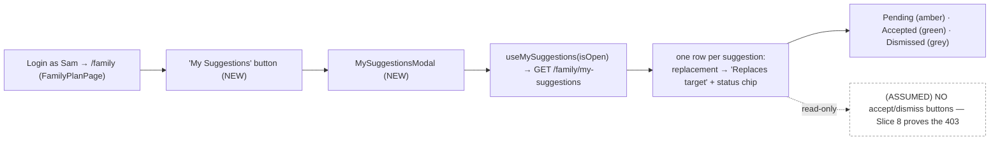
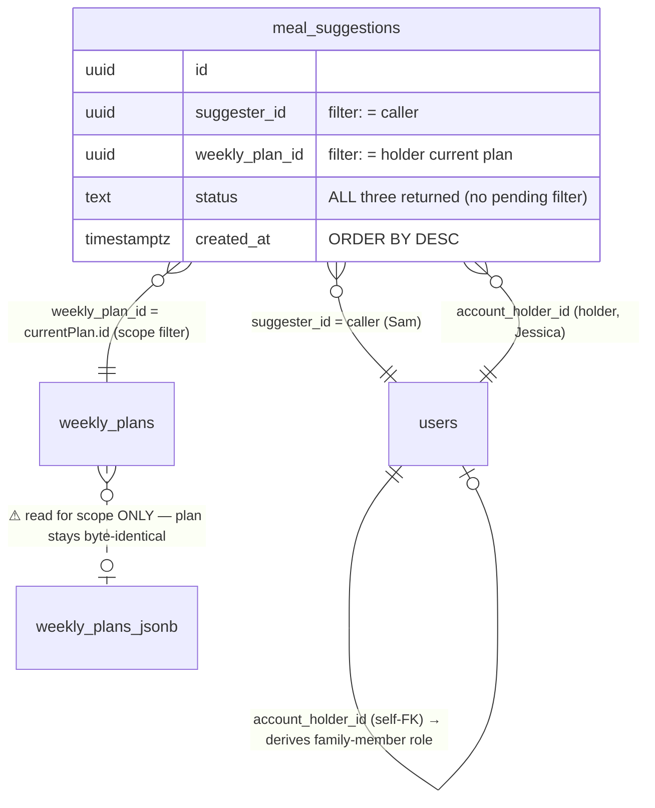
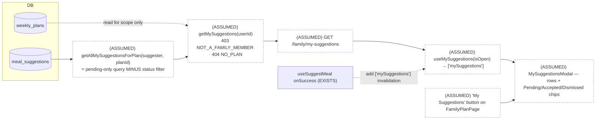

# Slice Abstract — Slice 7: Family member tracks suggestion status

> **Status:** APPROVED — 2026-06-24
> Status legend: **VERIFIED** (cited from a file opened this session, with snippet) · **ASSUMED** (inference) · **UNKNOWN** (needs input)
> Citations are `path:Lstart-Lend`. No implementation has been started — this is a design document for review.

## At a glance

|                           |                                                                                                                   |
| ------------------------- | ----------------------------------------------------------------------------------------------------------------- |
| **Slice**                 | 7 — Family member tracks suggestion status (source: `slice-specs/family-member-meal-suggestions/slice-7/slice.md`) |
| **Mockup**                | **FOUND** — `mockups/groceryhack-mockups.html:1113-1164` (Screen 6 — Family Member · My Suggestions); chip styles `:532-538` |
| **Conflicts / decisions** | **6** (all decided ✅ — see below)                                                                                 |
| **Open questions**        | **0** — Q1–Q4 resolved by the developer ([jump](#questions-for-the-developer))                                     |

> Note on args: `/slice-abstract` loaded with only the slice path; the template's `<slice_md>` / `<gherkin_spec>` / mockup came through as MISSING/empty placeholders. The real files were located and used: slice `…/slice-7/slice.md`, roadmap `…/slices.md`, Gherkin `specs/family-member-meal-suggestions/family-member-meal-suggestions.md`, mockup `mockups/groceryhack-mockups.html` (**Screen 6 exists and is the design source of truth for this slice — the slice.md did not cite it**). The slice's own `Status:` is already `APPROVED — 2026-06-24`. Slices 5 & 6 are **committed** (git log `93de1ab` Slice 6, `8161690` Slice 5), so every citation below is to committed code, not a dirty working tree.

### What this slice touches

|     | File                                              | Why                                                                                                                              |
| --- | ------------------------------------------------- | ------------------------------------------------------------------------------------------------------------------------------- |
| ✏️  | `backend/src/db/queries/family.ts`                | **`getAllMySuggestionsForPlan(suggesterId, weeklyPlanId)`** — `getMySuggestionsForPlan` (`:99-118`) **minus** the `AND s.status = 'pending'` line (`:112`); all statuses, newest-first, `mapSuggestionRow`. A **separate** function — the existing pending-only query must not change |
| ✏️  | `backend/src/services/family.ts`                  | **`getMySuggestions(userId)`** — mirrors `getFamilyPlan` (`:68-94`): `getFamilyMemberLink`→403 `NOT_A_FAMILY_MEMBER`, `getCurrentPlan`→404 `NO_PLAN`, then `{ suggestions: await getAllMySuggestionsForPlan(userId, plan.id) }` |
| ✏️  | `backend/src/routes/family.ts`                    | **`GET /api/v1/family/my-suggestions`** (`requireAuth`) — mirrors the `GET /family/suggestions` block (`:21-28`); no params/body |
| ✏️  | `packages/shared/types.ts`                        | **`MySuggestionsResponse { suggestions: MealSuggestion[] }`** — analogue of `HolderSuggestionsResponse` (`:810-814`) _(or reuse it — Decision 2)_ |
| 🆕  | `frontend/src/hooks/useMySuggestions.ts`          | `useMySuggestions(enabled)` — exact mirror of `useHolderSuggestions` (`:10-16`), `GET /family/my-suggestions`, `enabled`-gated  |
| ✏️  | `frontend/src/hooks/useFamilyPlan.ts`             | Add `['mySuggestions']` to `useSuggestMeal`'s `onSuccess` invalidation (`:25-27`, currently invalidates only `['familyPlan']`)  |
| 🆕  | `frontend/src/modals/MySuggestionsModal.tsx`      | `ModalOverlay`-based, `useMySuggestions(isOpen)`; one row per suggestion + a status chip; **no accept/dismiss buttons**; loading/empty states |
| ✏️  | `frontend/src/pages/FamilyPlanPage.tsx`           | A **"My Suggestions"** button near the role pill/banner (`:199-201`) + `useState` + render `MySuggestionsModal` (`:215-234` modal-render zone) |
| ✏️  | `api-contract.yaml`                               | Document `GET /family/my-suggestions` under `Family` (mirror `/family/plan` `:1398-1426` & `/family/suggestions` `:1428-1447`) + `MySuggestionsResponse` schema (or `$ref HolderSuggestionsResponse` `:2677-2684`) + 403/404 |
| ✏️  | `docs/architecture/error-codes.md`                | **(abstract-added — slice omits it)** append `GET /family/my-suggestions` to the Endpoint column of the reused `NOT_A_FAMILY_MEMBER` (`:135`) and `NO_PLAN` (`:136`) rows — no **new** codes |
| ✏️  | `backend/src/services/family.test.ts`             | **(convention — slice mentions only "tsc passes")** add a `getMySuggestions` describe block mirroring `getFamilyPlan`'s (`:205-237`); add `getAllMySuggestionsForPlan: vi.fn()` to the `vi.mock('../db/queries/family.js')` block (`:7-14`) |

_No new migration — `meal_suggestions.status` already allows all three statuses (`backend/src/db/migrations/007_add_meal_suggestions.sql:13-14`, mirrored `schema.sql:378-379`). No new **domain** type — rows are the existing `MealSuggestion` (`packages/shared/types.ts:784-799`); the only new type is the response envelope. **Pure read — no plan mutation.**_

### Conflicts & decisions needed first

_One line per item. Stop signs only — detail lives in the Questions section._

> **⚠️ 1 · Scope of "my suggestions" — Gherkin says *all* my suggestions; impl scopes to the holder's *current* plan.** ✅ _decided — **current-plan scope**._
> The scenario's "When I view my suggestions" is unqualified (`spec…:45-50`), but the build reuses `getCurrentPlan` and returns **404 `NO_PLAN`** when the holder has no current-week plan, and never shows past-week rows — keeping the whole feature current-week, matching `getFamilyPlan`. Load-bearing: it fixes the query, the 404, and what the modal can ever display.

> **⚠️ 2 · Response type — new `MySuggestionsResponse` vs reuse `HolderSuggestionsResponse`.** ✅ _decided — **dedicated `MySuggestionsResponse`**._
> Identical shape (`{ suggestions: MealSuggestion[] }`); semantics differ (caller's *own* suggestions, all statuses, `suggesterName` unused), so a distinct name reads clearer. ~3 lines in `types.ts` + a schema in `api-contract.yaml`.

> **⚠️ 3 · Entry-point affordance — plain "My Suggestions" button vs a count badge.** ✅ _decided — **plain, count-less button**._
> No count is required by the scenario; a badge would add a count source/endpoint + unread-tracking state for no scenario benefit.

> **⚠️ 4 · Dismissed-chip palette — mockup literal `#EDEBE4`/`#85857C` vs the slice's token mapping.** ✅ _decided — **mockup hex `#EDEBE4`/`#85857C`**._
> Both are neutral grey (the "not danger red" call is settled either way). Precedent: the **Pending** chip is already hard-coded to the mockup's `.st-pending` hex (`#FBEEDB`/`#9A6A12`, `PendingSuggestionModal.tsx:42-43`); matching `.st-dismissed`'s hex is the parallel move and keeps the three-chip set faithful to Screen 6.

> **⚠️ 5 · The new read must be a *separate* query — do NOT relax `getMySuggestionsForPlan`'s pending filter.** ✅ _decided (slice explicit; load-bearing)._
> `getMySuggestionsForPlan` (pending-only) backs `GET /family/plan`'s "Suggestion pending" markers; folding accepted/dismissed rows in would mis-mark swapped/rejected meals as pending and break AC #2. Add `getAllMySuggestionsForPlan` beside it; leave the original untouched.
> `backend/src/db/queries/family.ts:110-113` — `"WHERE s.suggester_id = $1 AND s.weekly_plan_id = $2 AND s.status = 'pending' ORDER BY s.created_at DESC"`

> **⚠️ 6 · "But I cannot accept or dismiss" is a coverage split, not a conflict — the provable 403 is Slice 8.** ✅ _decided (slice + roadmap explicit)._
> This slice satisfies the "can see status" half by **omitting** accept/dismiss controls (observable by absence); the tested 403 on the holder-only endpoints is Slice 8.
> `slice-specs/family-member-meal-suggestions/slice-7/slice.md:38-44` — `"the provable, tested 403 … is Slice 8"`

## 1. User capability & journey

- **New capability:** the family member (Sam) gets a **"My Suggestions"** view on `/family` — a modal listing every suggestion he made on the holder's current-week plan, each with a **status chip**: *Pending* (amber), *Accepted* (green), or *Dismissed* (neutral grey). This **closes the feedback loop** opened in Slices 5–6: an accept/dismiss that was only *true in the database* is now *rendered as a word* to the suggester. VERIFIED against the Gherkin: `specs/family-member-meal-suggestions/family-member-meal-suggestions.md:45-50` — `"When I view my suggestions / Then I see each suggestion with its current status / And the status is one of: pending, accepted, or dismissed"`. The view is **read-only by construction** — no accept/dismiss controls.
- **Getting there:** Sam (`sam@test.groceryhack.com`) is authenticated and lands on `/family` (`App.tsx:29` — `"<Route path=\"/family\" element={<FamilyPlanPage />} />"`), which renders the holder's plan via `useFamilyPlan` (`frontend/src/hooks/useFamilyPlan.ts:5-10`). This slice adds a **"My Suggestions"** button to that page (`FamilyPlanPage.tsx:199-201`, the role-pill/banner zone) that opens the new modal.
- **Afterward:** the modal fetches `GET /family/my-suggestions` (only while open, `enabled`-gated) and renders the list. There is **no onward navigation** — it is a terminal status view. The matching "I cannot act on it" guarantee (a provable 403 when a family member calls the holder-only accept/dismiss endpoints) is **Slice 8**; the holder's own direct meal edit is also **Slice 8**.

_Legend: dashed/(ASSUMED) = the deliberately-absent affordance whose tested negative lands in Slice 8._

## 2. Entities

- **Named in the spec/slice:** family member (Sam, the *suggester* and the caller), account holder (Jessica), the family-member↔holder **link**, the holder's current-week **`weekly_plan`** (read for scope only — **never mutated**), and the **`meal_suggestion`** rows in all three statuses.
- **Actually in the DB (VERIFIED):**
  - `meal_suggestions` — `migration 007:6-16` / `schema.sql:371-381`: `status TEXT NOT NULL DEFAULT 'pending' CHECK (status IN ('pending','accepted','dismissed'))`. **No migration needed** — the read just stops filtering by status.
  - The family-link is a self-FK on `users` resolved by `getFamilyMemberLink` (`backend/src/db/queries/family.ts:44-59` — `"LEFT JOIN users h ON h.id = u.account_holder_id"`). `accountHolderId === null` ⇒ not a family member (drives the 403).
  - The holder's current plan via `getCurrentPlan(holderId)` (imported from `db/queries/landing.js`, used by `getFamilyPlan` `services/family.ts:78`). `plan.id` scopes the read.
- **Relationships & actions (as the spec/slice describes them):** Sam's suggestions for Jessica's current plan are read by `(suggester_id = caller, weekly_plan_id = currentPlan.id)`, **in every status**, newest-first. The plan is byte-identical before/after (pure read).
- **Already enforced in DB/codebase:** the `CHECK` already permits all three statuses; `mapSuggestionRow` (`queries/family.ts:22-38`) already serialises a full `MealSuggestion` (incl. `replacement_meal_name`, nullable `target_meal_name`, nullable `suggester_name`). The new query reuses it verbatim.
- **CONFLICTS (spec vs. codebase):** **none structural.** The only tension is **scope** (Conflict 1): the Gherkin's unqualified "my suggestions" vs. the recommended *current-plan* scoping (which adds a `NO_PLAN` 404 and hides past-week rows). That is a deliberate scope decision the slice flags, not a code contradiction. `suggesterName` being unused for the family-member read is a fidelity nicety, not a conflict — `getMySuggestionsForPlan` already omits the `users` join, so the field is `null`, which the modal never reads (Sam is the suggester).

_Legend: red/⚠ = the deliberately-absent write — this slice never mutates `weekly_plans`. (No spec-vs-code structural conflict exists; the only open item is the **scope** decision, Conflict 1.)_

## 3. Contracts

| Endpoint (method + path)             | Status      | Shape the slice expects                                                                 | Notes / citation |
| ------------------------------------ | ----------- | --------------------------------------------------------------------------------------- | ---------------- |
| `GET /api/v1/family/my-suggestions`  | **MISSING** | no params/body; `200` → `{ suggestions: MealSuggestion[] }` (all statuses, newest first) | New route beside `GET /family/suggestions` (`routes/family.ts:21-28`); router mounted `app.use('/api/v1/family', familyRoutes)` (`backend/src/app.ts:45`) |
| `GET /api/v1/family/plan`            | EXISTS      | **unchanged** — `pending_suggestions` stays pending-only (AC #2)                         | `getMySuggestionsForPlan` keeps `AND s.status = 'pending'` (`db/queries/family.ts:112`); the new query is **separate** |
| `GET /api/v1/family/suggestions`     | EXISTS      | unchanged — holder-side read, untouched                                                  | `routes/family.ts:21-28` → `getHolderSuggestions` (`services/family.ts:102-106`) |

New-endpoint build (mirrors the family read path):
- **Query** `getAllMySuggestionsForPlan(suggesterId, weeklyPlanId)` — copy `getMySuggestionsForPlan` (`db/queries/family.ts:99-118`) and delete the single `AND s.status = 'pending'` line (`:112`); keep `JOIN meals rm`, `LEFT JOIN meals tm`, `ORDER BY s.created_at DESC`, and `.map(mapSuggestionRow)`. _(Optional `LEFT JOIN users su` for `suggester_name` shape-parity — not required.)_
- **Service** `getMySuggestions(userId)` — structurally `getFamilyPlan` (`services/family.ts:68-94`) minus the plan/savings payload: (1) `getFamilyMemberLink` → `throwForbidden('NOT_A_FAMILY_MEMBER', …)` if `!link?.accountHolderId` (`:71-73`); (2) `getCurrentPlan(holderId)` → `throwNotFound('NO_PLAN', …)` if absent (`:82-84`); (3) `return { suggestions: await getAllMySuggestionsForPlan(userId, plan.id as string) }`.
- **Route** `router.get('/my-suggestions', requireAuth, …)` → `res.json(await getMySuggestions(req.user!.userId))` — the `GET /family/suggestions` block verbatim with the new path/service (`routes/family.ts:21-28`).
- **Hook** `useMySuggestions(enabled)` — `useHolderSuggestions` verbatim with `queryKey: ['mySuggestions']`, `queryFn: () => api.get<MySuggestionsResponse>('/family/my-suggestions')` (`hooks/useHolderSuggestions.ts:10-16`).
- **Contract** add the `GET` path + the `MySuggestionsResponse` schema (or `$ref HolderSuggestionsResponse`, `api-contract.yaml:2677-2684`) + `403`/`404`. The `MealSuggestion` schema already exists (`api-contract.yaml:2636-2675`).

## 4. Annotated mockup

- **Relevant section — Screen 6 (Family Member · My Suggestions), `mockups/groceryhack-mockups.html:1113-1164`.** A header (role-pill "Family member", `:1122`), a `head lg` title **"My Suggestions"** (`:1131`), a `sub` "Replacements you've suggested to Jessica" (`:1132`), then a single `.sugg-card` (`:1134`) of one `.sugg-row` per suggestion, and an `.info-banner` (`:1158-1161`).
- **Generic / reusable component — the suggestion row** (`.sugg-row`, recurs `:1135-1141`, `:1142-1148`, `:1149-1155`): left = `.sugg-meal` (replacement name) over `.sugg-sub` "Replaces {target}"; right = a `.status` chip. The three chip variants are styled `:536-538`:
  - `.st-pending` → `background:#FBEEDB;color:#9A6A12;` (`:536`) — **VERIFIED identical** to the live amber chip `PendingSuggestionModal.tsx:42-43`.
  - `.st-accepted` → `background:var(--badge-bg);color:var(--badge-text)` = `#E6F1EA`/`#3E8C63` (`:23-24`) — map to the app's **`greenBadgeBg #E6F4EA` / `greenBadgeText #1A7F37`** tokens (`tokens.ts:14-15`), as the app does everywhere.
  - `.st-dismissed` → `background:#EDEBE4;color:#85857C;` (`:538`) — neutral grey/beige; **palette is Decision 4** (mockup hex vs token mapping).
- **One-off:** the `.info-banner` copy "**You can track status here, but only Jessica can accept or dismiss a suggestion.**" (`:1160`) — abstract-added fidelity item (the slice's scope mentions only loading/empty states); it reinforces the read-only/no-controls design and the "cannot act" half. Optional but faithful.
- **Layout note (intuition, `ASSUMED`):** the mockup groups all rows in **one** bordered `.sugg-card` with `border-top` dividers (`:518-526`), unlike the holder's `ReviewSuggestionsModal`, which uses a **separate** `cardStyle` card per suggestion (`ReviewSuggestionsModal.tsx:45-51`). The new modal should follow Screen 6's single-card/divided-row layout, not copy the review modal's per-card layout.
- **State-management intuition (`ASSUMED`):** the modal owns one `useMySuggestions(isOpen)` query and no mutations (read-only). `FamilyPlanPage` owns a `mySuggestionsOpen` boolean (like its existing `suggestingFor`/`viewingSuggestion` state, `FamilyPlanPage.tsx:140-142`). Implemented as a **modal**, matching how Screen 7 (Pending Suggestions) became `ReviewSuggestionsModal` rather than a route.

## 5. Data flow

_Legend: dashed/(ASSUMED) = new code this slice; `weekly_plans` is read only to scope to the current plan and is never written._

Per-hop status:
- **`meal_suggestions` → `getAllMySuggestionsForPlan`:** ASSUMED new; pattern VERIFIED against `getMySuggestionsForPlan` (`db/queries/family.ts:99-118`) — same JOINs/order/mapper, just without `:112`'s pending filter.
- **`getMySuggestions` service:** ASSUMED new; structure VERIFIED against `getFamilyPlan` (`services/family.ts:68-94`) — same link→403 and plan→404 guards, different payload.
- **route → hook:** ASSUMED new; VERIFIED templates `routes/family.ts:21-28` and `hooks/useHolderSuggestions.ts:10-16`.
- **freshness wiring:** ASSUMED edit; `useSuggestMeal`'s `onSuccess` (`hooks/useFamilyPlan.ts:25-27`) currently invalidates only `['familyPlan']` — add `['mySuggestions']` so a just-submitted pending suggestion appears next open. (Holder-side accept/dismiss invalidate `['holderSuggestions']`+`['landing']` only, `useDismissSuggestion.ts:16-19`; cross-user status lands on Sam's **next refetch/open**, not pushed live — "realtime push" is out of scope.)
- **page button → modal:** ASSUMED new; host VERIFIED `FamilyPlanPage.tsx:135-244`, modal base `ModalOverlay` props `{isOpen,onClose,title,children}` VERIFIED `ModalOverlay.tsx:8-13`.

## 6. Assumptions & load-bearing decisions register

_Conflicts/decisions first._

| #   | Description                                                                                                                                    | Type     | Load-bearing? | Needs confirmation? |
| --- | -------------------------------------------------------------------------------------------------------------------------------------------- | -------- | ------------- | ------------------- |
| 1   | **Scope = holder's *current* weekly plan** (reuse `getCurrentPlan`, 404 `NO_PLAN`), not the Gherkin's unqualified all-time. Hides past-week rows. | VERIFIED | **Yes**       | ✅ decided (current-plan) |
| 2   | Response type = dedicated **`MySuggestionsResponse`** (not reuse `HolderSuggestionsResponse`).                                                 | VERIFIED | No            | ✅ decided (new type) |
| 3   | Entry point = plain **"My Suggestions"** button, no count badge.                                                                              | VERIFIED | No            | ✅ decided (plain button) |
| 4   | Dismissed-chip palette = mockup hex `#EDEBE4`/`#85857C` (hard-coded, parallel to the Pending chip). Both options were neutral grey.            | VERIFIED | No            | ✅ decided (mockup hex) |
| 5   | **New read is a SEPARATE query**; `getMySuggestionsForPlan` stays pending-only (it backs `GET /family/plan` markers — AC #2).                  | VERIFIED | **Yes**       | No (slice explicit) |
| 6   | **Pure read** — no plan mutation, no `getCurrentPlan` write, no migration, no new domain type (only the response envelope).                    | VERIFIED | **Yes**       | No                  |
| 7   | Pending chip MUST be `#FBEEDB`/`#9A6A12` (matches the live `PendingSuggestionModal` chip + plan markers); Accepted = `greenBadge*` tokens.     | VERIFIED | No            | No                  |
| 8   | "Cannot accept/dismiss" half = **no controls** (observable by absence); the tested 403 is Slice 8. Holder direct-edit is also Slice 8.        | VERIFIED | No            | No                  |
| 9   | Modal layout follows Screen 6's single `.sugg-card`/divided-`.sugg-row` shape (not the review modal's per-card layout); modal not route.       | ASSUMED  | No            | No                  |
| 10  | `useSuggestMeal.onSuccess` must also invalidate `['mySuggestions']` so a new pending row shows on next open.                                   | VERIFIED | No            | No                  |
| 11  | `suggesterName` is `null` for this read (no `users` join) and unused by the modal — fidelity-only, no conflict.                                | VERIFIED | No            | No                  |
| 12  | Abstract-added: `error-codes.md` Endpoint column for `NOT_A_FAMILY_MEMBER`/`NO_PLAN` should append the new endpoint; `family.test.ts` gets a `getMySuggestions` block. | VERIFIED | No            | No (abstract-added) |

## 7. Verification plan (Chrome)

Run after implementation. **Tooling:** chrome-mcp does not work in WSL — use `python3 backend/scripts/cdp.py` on `:9222` (`goto`, `eval`, `screenshot`, `click`). Seed first: `cd backend && npm run seed && npm run seed:plans` — seeds **one pending** Sam→Jessica suggestion (`seedPlans.ts:71-77`). To see all three chips, run the live loop (slice "Demo data note", `slice-7/slice.md:172-180`): as Jessica **accept** the seeded suggestion → reopen as Sam → *Accepted*; re-seed and as Jessica **dismiss** → *Dismissed*.

1. **Compile.** `cd backend && npx tsc --noEmit` and `cd frontend && npx tsc --noEmit`. **Expect:** both exit 0 (new query/service/route, `MySuggestionsResponse`, `useMySuggestions`, the modal, and the page button all typecheck; the response satisfies `MealSuggestion[]`).
2. **Unit — `getMySuggestions` service.** `cd backend && npm test` over the new `family.test.ts` block. **Expect:** (a) linked member + holder-with-plan → `{ suggestions }` from `getAllMySuggestionsForPlan(userId, planId)`; (b) non-member (an account holder, e.g. Jessica) → `403 NOT_A_FAMILY_MEMBER`; (c) linked member, holder has no current plan → `404 NO_PLAN`. _ASSUMED: add `getAllMySuggestionsForPlan: vi.fn()` to the `vi.mock` block (`family.test.ts:7-14`)._
3. **API — all statuses returned (AC #1).** Log in as `sam@test.groceryhack.com` (`testpassword123`); `GET /api/v1/family/my-suggestions`. After running the accept + dismiss demo loop, **Expect:** body `{ suggestions: [...] }` includes rows with `status` ∈ {`pending`,`accepted`,`dismissed`}, newest first, each carrying `replacement_meal_name` and (nullable) `target_meal_name`.
4. **AC #2 — `/family/plan` unchanged.** As Sam: `GET /api/v1/family/plan`. **Expect:** `pending_suggestions` lists **pending-only** markers; the accepted/dismissed rows do **not** appear there (proves `getMySuggestionsForPlan` was left untouched). Cross-check the same accepted/dismissed ids *do* appear in step 3's response.
5. **Error cases.** (a) `GET /family/my-suggestions` as **Jessica** (a holder, non-member) → `403 NOT_A_FAMILY_MEMBER`; (b) as a linked member whose holder has no current-week plan → `404 NO_PLAN`. **Expect:** standard `{error,code,message}` each (`error-codes.md:135-136`). _ASSUMED: a member with a plan-less holder may need a bespoke seed/fixture._
6. **UI happy path.** `cdp.py goto http://localhost:5173/` logged in as Sam → confirm `/family` renders → `eval [...document.querySelectorAll('button')].map(b=>b.textContent.trim())` **Expect:** contains `"My Suggestions"`. `click` it; `eval document.body.innerText` **Expect:** one row per suggestion with a status word, and **no** "Accept"/"Dismiss" buttons present (`eval` the modal's buttons → none labelled Accept/Dismiss). `screenshot`. Run the `debug-frontend` flow — **Expect:** no console exceptions.
7. **Chip rendering.** With all three statuses present, `eval` each chip's text + computed `backgroundColor`/`color`. **Expect:** Pending `#FBEEDB`/`#9A6A12`; Accepted = `greenBadgeBg`/`greenBadgeText`; Dismissed = the palette chosen in Q4. _ASSUMED selectors — re-check once the modal markup exists._
8. **Freshness.** As Sam, submit a new suggestion via the existing SuggestSwapModal, then open "My Suggestions" **Expect:** the new *Pending* row is present without a manual reload (proves the `['mySuggestions']` invalidation on `useSuggestMeal`).
9. **Contract + docs.** `api-contract.yaml` documents `GET /family/my-suggestions` (+ schema, + 403/404) under `Family`; `error-codes.md` lists the new endpoint on the `NOT_A_FAMILY_MEMBER`/`NO_PLAN` rows. **Expect:** present.

## Questions for the developer

1. **Scope of "my suggestions" — current plan or all-time?** _(Register #1)_ — ✅ **RESOLVED: current-plan scope.**

   The Gherkin is unqualified: `specs/family-member-meal-suggestions/family-member-meal-suggestions.md:45-50` — `"And I have submitted one or more suggestions / When I view my suggestions / Then I see each suggestion with its current status"`. The recommended build instead scopes to the holder's **current weekly plan**, exactly as `getFamilyPlan` does.

   **Concrete impact:**
   - *Current-plan (recommended):* `getMySuggestions` calls `getCurrentPlan(holderId)` and `throwNotFound('NO_PLAN', …)` when absent (mirrors `services/family.ts:82-84`), then `getAllMySuggestionsForPlan(userId, plan.id)`. The whole feature stays current-week; past accepted/dismissed rows never accumulate. Cost: a member whose holder has no current plan sees a `NO_PLAN` error state, and last week's outcomes are not visible. The slice lists "cross-week/all-time history" as out of scope (`slice-7/slice.md:151-153`).
   - *All-time:* drop the plan lookup; query by `suggester_id` alone across every plan. Matches the literal wording, but surfaces stale-week rows whose `target_meal_name` may be `null` (the target meal left the plan), and removes the clean `NO_PLAN` story.

   **Recommendation:** current-plan scope (the slice's recommendation). Confirm.

2. **Response type — new `MySuggestionsResponse`, or reuse `HolderSuggestionsResponse`?** _(Register #2)_ — ✅ **RESOLVED: dedicated `MySuggestionsResponse`.**

   Both are `{ suggestions: MealSuggestion[] }` (`packages/shared/types.ts:810-814`). The semantics differ (the caller's *own* suggestions, all statuses, `suggesterName` unused).

   **Concrete impact:** a new type adds ~3 lines to `types.ts` and a schema (or one `$ref`) to `api-contract.yaml`; reuse saves the type but couples two endpoints whose meanings diverge. Purely cosmetic.

   **Recommendation:** dedicated `MySuggestionsResponse` for clarity. Confirm.

3. **Entry-point affordance — plain button or count badge?** _(Register #3)_ — ✅ **RESOLVED: plain, count-less button.**

   The scenario requires no count. A plain "My Suggestions" button (the family-member analogue of the holder's count-gated "Suggestions (N)" entry, but count-less) opens the modal on demand.

   **Concrete impact:** a count badge ("2 accepted since you last looked") needs a count source on `/family/plan` or a new endpoint plus unread-tracking state — plumbing for no scenario benefit.

   **Recommendation:** plain, count-less button. Confirm.

4. **Dismissed-chip palette — mockup hex or token mapping?** _(Register #4)_ — ✅ **RESOLVED: mockup hex `#EDEBE4`/`#85857C`.**

   The mockup's `.st-dismissed` is `mockups/groceryhack-mockups.html:538` — `"background:#EDEBE4;color:#85857C;"` (warm neutral grey). The slice text suggests mapping to tokens instead: `primaryLight`/`border` bg + `textMuted` text (`slice-7/slice.md:120-122`). Both are neutral grey — the "**not** danger red" decision (carried from Slice 6) is settled either way; only the exact palette is open.

   **Concrete impact:** the **Pending** chip is already a hard-coded mockup hex (`PendingSuggestionModal.tsx:42-43` — `"backgroundColor: '#FBEEDB', color: '#9A6A12'"`), and **Accepted** uses the `greenBadge*` tokens. Hard-coding `#EDEBE4`/`#85857C` for Dismissed keeps the three-chip set visually faithful to Screen 6 and parallel to how Pending is already handled. Token mapping (`primaryLight` is teal-tinted `rgba(61,123,123,0.08)`, `textMuted` is `#5A5A5A`) drifts the dismissed chip toward teal/darker-grey, diverging from the mockup.

   **Recommendation:** the mockup hex `#EDEBE4`/`#85857C`, for fidelity + precedent. Confirm (cosmetic, reversible).
