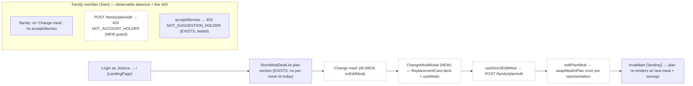
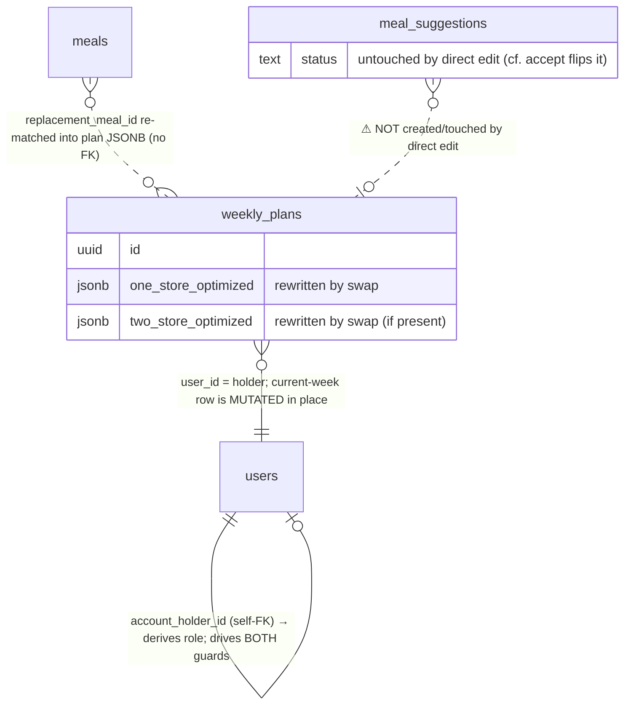
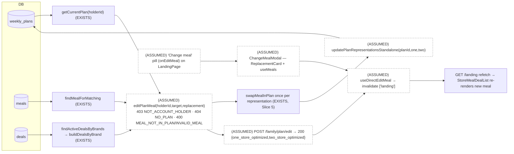

# Slice Abstract — Slice 8: Account holder direct edit + permission hardening

> **Status:** APPROVED — 2026-06-25
> Status legend: **VERIFIED** (cited from a file opened this session, with snippet) · **ASSUMED** (inference) · **UNKNOWN** (needs input)
> Citations are `path:Lstart-Lend`. No implementation has been started — this is a design document for review.

## At a glance

|                           |                                                                                                     |
| ------------------------- | --------------------------------------------------------------------------------------------------- |
| **Slice**                 | 8 — Account holder direct edit + permission hardening (source: `slice-specs/family-member-meal-suggestions/slice-8/slice.md`) |
| **Mockup**                | **PARTIAL** — no holder "Change meal" screen exists; net-new UI is design-by-analogy from Screen 1 (`mockups/groceryhack-mockups.html:591-782`), Screens 3–4 (`:864-1064`), Screen 5 (`:1066-1111`) |
| **Conflicts / decisions** | **0 spec-vs-code conflicts** · **6 decisions** (slice-listed, all carry a recommendation)            |
| **Open questions**        | **2 worth an explicit confirm** (Q6 stale suggestions, Q3 picker reuse) ([jump](#questions-for-the-developer)) |

> Note on args: `/slice-abstract` loaded with only the slice path; the template's `<slice_md>` / `<gherkin_spec>` / mockup came through as empty placeholders. The real files were located and used: slice `…/slice-8/slice.md`, roadmap `…/slices.md`, Gherkin `specs/family-member-meal-suggestions/family-member-meal-suggestions.md`, mockup `mockups/groceryhack-mockups.html` (7 screens; **none depict the holder direct-edit affordance this slice adds**). The slice's own `Status:` is already `APPROVED — 2026-06-24`. Slices 1–7 are **committed** (git log `7fa4c76` approves Slice 8 planning, `541b6ea` Slice 7, `8161690` Slice 5), so every citation below is to committed code. **The slice.md is unusually precise — every file:line it cites was opened this session and verified accurate**; the one textual imprecision is noted in §3.

### What this slice touches

|       | File                                              | Why                                                                                                                                      |
| ----- | ------------------------------------------------- | -------------------------------------------------------------------------------------------------------------------------------------- |
| ✏️    | `backend/src/services/family.ts`                  | **`editPlanMeal(holderId, targetMealId, replacementMealId)`** — sibling of `acceptSuggestion` (`:245-318`); new **403 `NOT_ACCOUNT_HOLDER`** guard (inverse of `:76-78`), then the gather+swap block (`:280-303`) copied verbatim, persisted via the new standalone update. Must live here to reuse file-private `planContainsMeal`/`loadRemainingMeals`/`collectPlanBrandIds` |
| ✏️    | `backend/src/db/queries/family.ts`                | **`updatePlanRepresentationsStandalone(planId, oneStore, twoStore)`** — own `BEGIN`/`COMMIT` wrapper around `updatePlanRepresentations` (`:327-344`); writes only the two JSONB columns, no suggestion coupling (cf. `acceptSuggestionTransaction` `:352-378`). _(Decision 4: could be a plain single `UPDATE`.)_ |
| ✏️    | `backend/src/routes/family.ts`                    | **`POST /api/v1/family/plan/edit`** (`requireAuth`, `validate({ body: editPlanMealBody })`) mirroring the `POST /plan/suggestions` block (`:74-88`); returns **200** with the updated plan reps (Decision 2) |
| ✏️    | `backend/src/schemas/family.ts`                   | **`editPlanMealBody`** — near-copy of `suggestMealBody` (`:4-12`): snake→camel `{ target_meal_id, replacement_meal_id }` + `EditPlanMealInput` |
| ✏️    | `frontend/src/components/StoreMealDealList.tsx`   | Add `onEditMeal?: (meal: PlanMeal) => void` beside the existing callbacks (`:13-23`); render a **"Change meal"** pill in the by-meal action panel (`:841-867`) and View-All meal rows (`:614-658`). **⚠️ those blocks are gated on `onSuggestSwap` (`:630`, `:841`) — the condition must widen to `onSuggestSwap \|\| onEditMeal`** (Register #5) |
| 🆕    | `frontend/src/modals/ChangeMealModal.tsx`         | Thin holder analogue of `SuggestSwapModal` (`frontend/src/modals/SuggestSwapModal.tsx`): reuse `ReplacementCard` + `useMeals(isOpen)`, but YUM calls `useDirectEditMeal` not `useSuggestMeal` (`:65`); holder copy. _(Decision 3.)_ |
| 🆕    | `frontend/src/hooks/useDirectEditMeal.ts`         | `POST /family/plan/edit`; `onSuccess` → `invalidateQueries(['landing'])` only (mirrors `useAcceptSuggestion.ts:16-19`); **does not** touch `['holderSuggestions']`/`['mySuggestions']` |
| ✏️    | `frontend/src/pages/LandingPage.tsx`              | `useState<PlanMeal \| null>(editingMeal)`; pass `onEditMeal={setEditingMeal}` into the `StoreMealDealList` instance (`:287-291`, today passes no per-meal callbacks); render `ChangeMealModal` mirroring `FamilyPlanPage`'s `suggestingFor` pattern (`:160`, `:243-253`) |
| ⬜    | `frontend/src/pages/FamilyPlanPage.tsx`           | **No change** — its *absence* of `onEditMeal` (`:231-240`) and of any accept/dismiss control is the observable guarantee; the slice adds a verification asserting absence, not code |
| ✏️    | `api-contract.yaml`                               | Document `POST /family/plan/edit` under `Family`, after the suggestions block (`:1581-1639`, before `components:` at `:1645`) |
| ✏️    | `docs/architecture/error-codes.md`               | Add `NOT_ACCOUNT_HOLDER \| 403 \| POST /family/plan/edit` to the Family section (`:131-143`); `NOT_SUGGESTION_HOLDER` (`:141`) already documents the accept/dismiss block — no change there |
| ✏️    | `backend/src/services/family.test.ts`             | New `describe('editPlanMeal')`: happy path (swaps, persists via the standalone update, **asserts no suggestion write**), **403 `NOT_ACCOUNT_HOLDER`** (primary new negative), 404 `NO_PLAN`, 400 `MEAL_NOT_IN_PLAN`, 400 `INVALID_MEAL`, two-store-only target. Add `updatePlanRepresentationsStandalone: vi.fn()` to the `vi.mock('../db/queries/family.js')` block (`:7-16`). **No** new accept/dismiss test — `:389-396`/`:480-487` already prove that 403 |

_No new migration — the edit writes existing `weekly_plans.one_store_optimized` / `two_store_optimized` columns and creates no table (migrations end at `008`). No new **domain** type — the swap reuses `GroceryPlan`/`WeeklyPlan`/`PlanMeal` (`packages/shared/types.ts:380-444`)._

### Conflicts & decisions needed first

_One line per item. Stop signs only — detail lives in the Questions section._

> **⚠️ 0 · No spec-vs-code conflicts.** ✅ The three Gherkin scenarios this slice closes are all consistent with the codebase: the role model is `users.account_holder_id`, the swap engine is `swapMealInPlan`, and the accept/dismiss holder-guard already exists. This slice *adds* one guard and *makes observable* one existing guard. The items below are slice-listed **decisions** (all with a recommendation), not contradictions.

> **⚠️ 1 · `StoreMealDealList`'s per-meal affordance is gated on `onSuggestSwap`, not "any per-meal callback".** ❓ → [Question 1](#questions-for-the-developer)
> Adding `onEditMeal` without widening the two render conditions (`:630`, `:841`) yields **no visible "Change meal" control** on `/`. Low-risk but easy to miss — the slice's "gated purely on the prop being passed" understates it.
> `frontend/src/components/StoreMealDealList.tsx:841` — `"hasMealsInAnyStop && viewMode === 'byMeal' && onSuggestSwap && selectedMeal"`

> **⚠️ 2 · Stale pending suggestions after a direct edit are left untouched.** ❓ → [Question 3](#questions-for-the-developer)
> No scenario covers it. Default (recommended): direct edit flips no suggestion. Benign edge case — a later accept of a suggestion whose target was already swapped away no-ops via `swapMealInPlan`'s `containsTarget` guard while still marking the suggestion accepted. Not corrupting; flag for product.
> `backend/src/services/mealSwap.ts:286-289` — `"if (!containsTarget) return representation;"`

> **⚠️ 3 · Picker reuse — new `ChangeMealModal` vs parameterizing `SuggestSwapModal`.** ❓ → [Question 2](#questions-for-the-developer)
> `SuggestSwapModal` hard-codes `useSuggestMeal()` (`:65`) and `mutate(... )` POSTs a *suggestion* (`:79-95`). Parameterizing it risks the holder accidentally creating a suggestion. Recommended: a thin new modal sharing only `ReplacementCard` + `useMeals`.

> **⚠️ 4 · Endpoint path/verb `POST /family/plan/edit`.** ✅ _decided — recommended._
> Holder actions already live under `/family/*` (accept/dismiss `routes/family.ts:42-72`); the new service must live in `family.ts` to reuse the file-private helpers, which strands a REST-ier `PATCH /plans/...` route. Express paths `/plan/edit` and `/plan/suggestions` don't collide.

> **⚠️ 5 · Response shape — return the updated plan reps (200), hook still invalidates `['landing']`.** ✅ _decided — recommended._
> Keeps the swap directly assertable while honoring "one endpoint loads the landing page" (the re-render comes from `['landing']` invalidation, not the edit response). No new domain type (reps are `GroceryPlan`).

> **⚠️ 6 · Persistence + "provable" bar for the accept/dismiss 403.** ✅ _decided — recommended (Decisions 4 & 5)._
> Persist via `updatePlanRepresentationsStandalone` (style parity with `acceptSuggestionTransaction`; a plain single `UPDATE` is an equally-correct alternative). The accept/dismiss 403 is "proved" by the existing unit tests (`family.test.ts:389-396`, `:480-487`) + a live `cdp.py`/`curl` 403 + UI absence — no new HTTP integration harness.

## 1. User capability & journey

- **New capability:** the **account holder** (Jessica), on `/`, can **change any meal in her own current-week plan directly** — open a replacement picker on a plan meal, pick a swap, and it applies immediately with **no suggestion in between**. This is the holder's counterpart to the family member's "Suggest a swap." VERIFIED against the Gherkin: `specs/family-member-meal-suggestions/family-member-meal-suggestions.md:92-95` — `"When I view the current week's meal plan / Then I can change a meal directly without submitting a suggestion"`. The same slice also **makes observable** that a family member (Sam) is blocked — **403** from editing (`NOT_ACCOUNT_HOLDER`, new) and **403** from accept/dismiss (`NOT_SUGGESTION_HOLDER`, existing), and `/family` shows neither control.
- **Getting there:** Jessica is authenticated and lands on `/` (`App.tsx:25` — `"<Route path=\"/\" element={<LandingPage />} />"`). Her plan renders in the `StoreMealDealList` plan section (`LandingPage.tsx:285-302`), which today passes **no** per-meal callbacks. This slice adds an `onEditMeal` callback + a `ChangeMealModal`. The reused machinery is Slice 5's swap engine (`swapMealInPlan`, `mealSwap.ts:277-296`) and the gather block in `acceptSuggestion` (`family.ts:280-303`).
- **Afterward:** confirming the swap re-matches the replacement against deals at the plan's existing store(s), recomputes costs/savings/shopping list across both representations, persists, and the hook invalidates `['landing']` so the plan section re-renders with the new meal. With this slice the feature is **complete** — the only plan mutation a family member can cause is via an **accepted** suggestion.



_Legend: dashed/(ASSUMED) = new code this slice; the `blocked` subgraph is the permission boundary made observable (one new guard + one already-tested guard)._

## 2. Entities

- **Named in the spec/slice:** account holder (Jessica), family member (Sam) and the holder↔member **link**, the holder's current-week **`weekly_plan`** (mutated in place), the **`meals`** shared pool (replacement source), and **`meal_suggestions`** rows (read by the existing accept/dismiss path — **not** created or touched by direct edit).
- **Actually in the DB (VERIFIED):**
  - The family link is a self-FK on `users` resolved by `getFamilyMemberLink` (`backend/src/db/queries/family.ts:44-59` — `"LEFT JOIN users h ON h.id = u.account_holder_id"`). `accountHolderId === null` ⇒ holder/standalone; non-null ⇒ family member. This single column drives **both** guards (the new `NOT_ACCOUNT_HOLDER` is its inverse reading).
  - The plan is the holder's current-week row via `getCurrentPlan(holderId)` (`backend/src/db/queries/landing.ts:118-143` — returns snake_case `{ id, one_store_optimized, two_store_optimized, … }`). The edit writes back the two JSONB columns only.
  - The replacement meal is matched via `findMealForMatching(mealId)` (`backend/src/db/queries/meals.ts:104-120` — `"SELECT id, name, ingredient_keywords, servings FROM meals WHERE id = $1"`), returning `MatchableMeal`-shaped data the swap consumes.
- **Relationships & actions (as the slice describes them):** `editPlanMeal` guards (holder-only → plan exists → target in plan → replacement exists), then `swapMealInPlan` once per representation, then a standalone write. **No `meal_suggestions` row is created or modified** — that is the defining difference from `acceptSuggestion`.
- **Already enforced in DB/codebase:** the accept/dismiss holder guard `NOT_SUGGESTION_HOLDER` is **already present and unit-tested** (`family.ts:256-258`, `:344-346`; `family.test.ts:389-396`, `:480-487`) — a family member's id is never an `account_holder_id`, so they always 403. The code comments at `family.ts:240-243` and `:330-331` literally say this is *"made observable and tested in Slice 8."*
- **CONFLICTS (spec vs. codebase):** **none.** The new `NOT_ACCOUNT_HOLDER` guard is genuinely new (no existing code returns it; grep-confirmed the only `NOT_ACCOUNT_HOLDER` reference is in the slice/abstract). The "family member cannot edit/accept/dismiss" scenarios are satisfied by one new guard + one existing guard + UI absence — all consistent with the established role model.



_Legend: red/⚠ = the deliberately-untouched table — direct edit never writes `meal_suggestions` (the out-of-scope stale-suggestion edge case, Q3). No spec-vs-code structural conflict exists._

## 3. Contracts

| Endpoint (method + path)            | Status      | Shape the slice expects                                                                 | Notes / citation |
| ----------------------------------- | ----------- | --------------------------------------------------------------------------------------- | ---------------- |
| `POST /api/v1/family/plan/edit`     | **MISSING** | body `{ target_meal_id: uuid, replacement_meal_id: uuid }`; `200` → updated plan reps `{ one_store_optimized, two_store_optimized }`; `400 MEAL_NOT_IN_PLAN\|INVALID_MEAL`, `401`, `403 NOT_ACCOUNT_HOLDER`, `404 NO_PLAN` | New route beside `POST /plan/suggestions` (`routes/family.ts:74-88`); router mounted at `/api/v1/family` |
| `POST /api/v1/family/plan/suggestions` | EXISTS   | **unchanged** — the family-member write; returns 201 + `MealSuggestion`                 | The route block to **mirror** (`routes/family.ts:74-88`); contract `api-contract.yaml:1581-1639` |
| `POST /family/suggestions/:id/accept` | EXISTS    | **unchanged** — holder-only; a family member already 403s `NOT_SUGGESTION_HOLDER`       | `family.ts:256-258`; this slice only proves the 403 live (no code change) |
| `POST /family/suggestions/:id/dismiss` | EXISTS   | **unchanged** — holder-only; family member already 403s `NOT_SUGGESTION_HOLDER`         | `family.ts:344-346`; live-403 verification only |

Build of the new endpoint (mirrors the suggestion write path, swaps in the edit service):
- **Schema** `editPlanMealBody` — copy `suggestMealBody` (`schemas/family.ts:4-12`): `z.object({ target_meal_id: uuid, replacement_meal_id: uuid }).transform(snake→camel)` + `export type EditPlanMealInput = z.output<…>`.
- **Service** `editPlanMeal(holderId, targetMealId, replacementMealId)` — guard order: (1) `getFamilyMemberLink(holderId)` → **403 `NOT_ACCOUNT_HOLDER`** if `link?.accountHolderId` is **non-null** (inverse of `family.ts:76-78`); (2) `getCurrentPlan` → **404 `NO_PLAN`** (copy `:267-269`); (3) `planContainsMeal` → **400 `MEAL_NOT_IN_PLAN`** (reuse `:56-71`, as `suggestMeal` does at `:160-162`); (4) `findMealForMatching` → **400 `INVALID_MEAL`** (as `:275-278`); then the gather+swap block `:280-303` verbatim; persist via the standalone update — **no** `acceptSuggestionTransaction` (it flips `meal_suggestions.status`).
- **Route** `router.post('/plan/edit', requireAuth, validate({ body: editPlanMealBody }), …)` → `res.json(await editPlanMeal(req.user!.userId, …))`, **200** (no resource created).
- **Hook** `useDirectEditMeal` — `api.post('/family/plan/edit', { target_meal_id, replacement_meal_id })`; `onSuccess` → `invalidateQueries(['landing'])` only.

> **One imprecision in the slice text (not load-bearing):** slice.md `:38` says `FamilyPlanPage`'s `StoreMealDealList` "only gets `onSuggestSwap`". It actually also receives `pendingSuggestionMealIds` and `onViewPendingSuggestion` (`FamilyPlanPage.tsx:236-239`). The load-bearing claim — it receives **no `onEditMeal`** — is correct.

## 4. Annotated mockup

**No mockup screen depicts the holder direct-edit affordance.** The 7 screens are: Screen 1 Dashboard (`:591-782`), Screen 2 Shopping List by store (`:784-863`), Screen 3 Family Member · Meal Plan (`:864-978`), Screen 4 Family Member · Shopping List by meal (`:980-1064`), Screen 5 Suggest a Replacement · Swipe (`:1066-1111`), Screen 6 Family Member · My Suggestions (`:1113-1164`), Screen 7 Account Holder · Pending Suggestions (`:1166+`). The slice's net-new UI is therefore **design-by-analogy** from three existing screens — and the **code precedent (`FamilyPlanPage` + `SuggestSwapModal`) is the stronger guide** than the mockup here.

- **Where the "Change meal" pill attaches — Screen 1 Dashboard (`:688-779`).** The holder plan's meal-lines today are plain: `mockups/groceryhack-mockups.html:717` — `"<div class=\"meal-line\"><span class=\"nm\">Honey Garlic Chicken Stir-Fry</span><span class=\"pv\">$0.49/serving</span></div>"` — **no per-meal action**. The new pill is added here.
- **The affordance it mirrors — Screen 3/4 "Suggest a swap" (`:914`, `:1026`).** Family-member meal-lines carry the parallel button: `:914` — `"<div class=\"ml-right\"><button class=\"btn-xs\">Suggest a swap</button><span class=\"pv\">$0.49/serving</span></div>"`, and the by-meal action panel `:1026` — `"<button class=\"btn-sm\">Suggest a swap</button>"`. The holder's **"Change meal"** is the holder-side analogue of these, in the same DOM slots — which in the live `StoreMealDealList` are the View-All meal rows (`:614-658`) and the by-meal action panel (`:841-867`).
- **The picker it reuses — Screen 5 Suggest a Replacement Swipe (`:1066-1111`).** The `big-meal-card` + NOPE/YUM deck (`:1081-1109`) is `ReplacementCard` in code. Context bar `:1078` — `"Finding a replacement for <b>Beef Taco Bowl</b>"` — the holder modal swaps this for "Change … to" copy (slice `:152`).
- **Generic components (reused, not rebuilt):** `ReplacementCard` + the YUM/NOPE swipe deck (`SuggestSwapModal.tsx:215-315`); the per-meal pill slot in `StoreMealDealList` (`suggestSwapButtonStyle` `:196-213`, reused for the new pill).
- **One-off:** the holder-facing copy ("Change … to" vs "Suggest a replacement"); the `editingMeal` container state on `LandingPage`.
- **State-management intuition (`ASSUMED`):** `LandingPage` owns `editingMeal: PlanMeal | null`; `StoreMealDealList` lifts the tapped `PlanMeal` via `onEditMeal`; `ChangeMealModal` owns one `useMeals(isOpen)` query + the `useDirectEditMeal` mutation — exactly mirroring `FamilyPlanPage`'s `suggestingFor` → `SuggestSwapModal` flow (`FamilyPlanPage.tsx:160`, `:243-253`).

## 5. Data flow



_Legend: dashed/(ASSUMED) = new code this slice; everything else (swap engine, gather block, queries) is EXISTS from Slices 5–7._

Per-hop status:
- **`getCurrentPlan` / `findMealForMatching` / deals gather:** VERIFIED EXISTS (`landing.ts:118-143`, `meals.ts:104-120`, `family.ts:284-291`). The new service copies the gather block `family.ts:280-303` verbatim.
- **`editPlanMeal` service:** ASSUMED new; structure VERIFIED against `acceptSuggestion` (`family.ts:245-318`) minus the suggestion lookup/flip; the new guard is the verified inverse of `family.ts:76-78`.
- **`swapMealInPlan`:** VERIFIED EXISTS and reused unchanged (`mealSwap.ts:277-296`), no-op-safe via `containsTarget` (`:286-289`).
- **`updatePlanRepresentationsStandalone`:** ASSUMED new; pattern VERIFIED against `updatePlanRepresentations` (`family.ts:327-344`, needs a `PoolClient`) wrapped like `acceptSuggestionTransaction` (`:352-378`).
- **route → hook → re-render:** ASSUMED new; VERIFIED templates `routes/family.ts:74-88`, `useAcceptSuggestion.ts:16-19` (the `['landing']` invalidation pattern).
- **pill → modal:** ASSUMED new; host VERIFIED `LandingPage.tsx:285-302`, modal precedent `SuggestSwapModal.tsx`, container pattern `FamilyPlanPage.tsx:160/243-253`.

## 6. Assumptions & load-bearing decisions register

_Conflicts/decisions first; there are no spec-vs-code conflicts, so the slice's 6 decisions + implementation assumptions follow._

| #   | Description                                                                                                                                   | Type     | Load-bearing? | Needs confirmation? |
| --- | -------------------------------------------------------------------------------------------------------------------------------------------- | -------- | ------------- | ------------------- |
| 1   | **No spec-vs-code conflict.** Three scenarios closed by one new guard (`NOT_ACCOUNT_HOLDER`) + one existing+tested guard (`NOT_SUGGESTION_HOLDER`) + UI absence. | VERIFIED | **Yes**       | No                  |
| 2   | New service **must live in `family.ts`** to reuse file-private `planContainsMeal`/`loadRemainingMeals`/`collectPlanBrandIds` (`:56-71`,`:211-231`,`:197-204`, none exported). Pins the endpoint under `/family/*`. | VERIFIED | **Yes**       | No (slice explicit) |
| 3   | New **403 `NOT_ACCOUNT_HOLDER`** = inverse of `family.ts:76-78` (`accountHolderId` non-null ⇒ family member ⇒ block). Genuinely new code; no existing emitter. | VERIFIED | **Yes**       | No                  |
| 4   | Accept/dismiss 403 (`NOT_SUGGESTION_HOLDER`) **already enforced + unit-tested** (`family.ts:256-258`/`:344-346`, `family.test.ts:389-396`/`:480-487`). Slice only makes it observable. | VERIFIED | **Yes**       | No                  |
| 5   | `StoreMealDealList`'s two action sites are gated on `onSuggestSwap` (`:630`, `:841`) — adding `onEditMeal` is **necessary but not sufficient**. Both gates must widen to `(onSuggestSwap \|\| onEditMeal)`, and `onEditMeal` must be threaded into the `StoreSection` sub-component (~6 touch points). Skipping this is a **silent UI no-op** `tsc` can't catch. | VERIFIED | **Yes**       | ❓ flag (low risk)  |
| 6   | **Stale pending suggestions after a direct edit are left untouched** (MVP). Benign no-op edge case via `mealSwap.ts:286-289`. Out of scope per slice. | VERIFIED | No            | ❓ confirm (product) |
| 7   | Picker = thin new `ChangeMealModal` (share `ReplacementCard` + `useMeals`), **not** parameterize `SuggestSwapModal` (hard-codes `useSuggestMeal` `:65`; mutate POSTs a suggestion `:79-95`). | VERIFIED | No            | ❓ confirm           |
| 8   | Endpoint = `POST /family/plan/edit`, 200, returns updated plan reps; hook invalidates `['landing']` (honors "one endpoint loads landing"). | VERIFIED | No            | No (decided)        |
| 9   | Persist via `updatePlanRepresentationsStandalone` (own `BEGIN`/`COMMIT`); a plain single `UPDATE` is an equally-correct alternative. | VERIFIED | No            | No (decided)        |
| 10  | No new migration; no new domain type (reuses `GroceryPlan`/`WeeklyPlan`/`PlanMeal` `types.ts:380-444`). | VERIFIED | **Yes**       | No                  |
| 11  | Holder view passes no `pendingSuggestionMealIds`, so the "Suggestion pending" branch never fires for the holder — the "Change meal" pill always renders. | ASSUMED  | No            | No                  |
| 12  | No dedicated mockup for the holder edit UI — design-by-analogy from Screens 1/3/4/5; code precedent is the stronger guide. | VERIFIED | No            | No                  |

## 7. Verification plan (Chrome)

Run after implementation. **Tooling:** chrome-mcp does not work in WSL — use `python3 backend/scripts/cdp.py` on `:9222` (`goto`, `eval`, `screenshot`, `click`); run the `debug-frontend` console check first. **Seed:** `cd backend && npm run seed && npm run seed:plans` gives Jessica (`jessica@test.groceryhack.com`) a current-week plan and one pending Sam→Jessica suggestion (`seedPlans.ts:22-49`); both passwords `testpassword123`.

1. **Compile.** `cd backend && npx tsc --noEmit` and `cd frontend && npx tsc --noEmit`. **Expect:** both exit 0 (new service/query/route/schema, `useDirectEditMeal`, `ChangeMealModal`, and the `StoreMealDealList`/`LandingPage` edits all typecheck; the edit response satisfies the plan-rep shape).
2. **Unit — `editPlanMeal` service.** `cd backend && npm test` over the new `family.test.ts` block. **Expect:** (a) holder + plan-with-target → swaps target→replacement, calls `updatePlanRepresentationsStandalone`, and **`acceptSuggestionTransaction`/`createMealSuggestion` are NOT called** (no suggestion write); (b) **family member (Sam) → 403 `NOT_ACCOUNT_HOLDER`, no persist call**; (c) no plan → 404 `NO_PLAN`; (d) target not in plan → 400 `MEAL_NOT_IN_PLAN`; (e) missing replacement → 400 `INVALID_MEAL`; (f) two-store-only target still swapped. _ASSUMED: add `updatePlanRepresentationsStandalone: vi.fn()` to the `vi.mock('../db/queries/family.js')` block (`family.test.ts:7-16`)._
3. **API happy path (AC #1).** Log in as Jessica; `POST /api/v1/family/plan/edit` with a `{ target_meal_id, replacement_meal_id }` from her plan + the shared pool. **Expect:** `200`, body reps no longer contain the target `mealId` and do contain the replacement across both representations; re-`GET /api/v1/landing` shows the swapped meal + recomputed `estimatedSavings` and `forMeal` items; **no new `meal_suggestions` row** (cross-check the holder's `GET /family/suggestions` count is unchanged).
4. **API negative — family member edit (AC #2).** Log in as Sam; same `POST /family/plan/edit`. **Expect:** `403 { error:true, code:"NOT_ACCOUNT_HOLDER", message }`; the holder plan is byte-identical afterward (re-GET landing as Jessica).
5. **API negative — accept/dismiss as family member (AC #3).** As Sam: `POST /family/suggestions/<seeded-id>/accept` and `…/dismiss`. **Expect:** both `403 NOT_SUGGESTION_HOLDER`, standard error shape — the *live* proof of the already-tested guard. _ASSUMED seeded suggestion id from the step-0 seed._
6. **API error shapes (AC #4).** As Jessica: edit with a bogus `target_meal_id` not in plan → `400 MEAL_NOT_IN_PLAN`; bogus `replacement_meal_id` → `400 INVALID_MEAL`; (a holder with no current plan, if seedable) → `404 NO_PLAN`. **Expect:** standard `{error,code,message}` each (`error-codes.md`).
7. **UI happy path (Jessica on `/`).** `cdp.py goto http://localhost:5173/` → run `debug-frontend` (Expect: no console exceptions) → `eval [...document.querySelectorAll('button')].map(b=>b.textContent.trim())` **Expect:** contains `"Change meal"` (both by-meal and View-All). `click` it → modal opens with the `ReplacementCard` deck → `click` YUM/confirm → **Expect:** plan section re-renders with the new meal + updated savings, **no full page reload** (proves `['landing']` invalidation). `screenshot`. _ASSUMED selectors — re-check once the pill markup exists; confirm the `onSuggestSwap||onEditMeal` gating actually renders the pill (Register #5)._
8. **UI absence (Sam on `/family`).** `cdp.py goto http://localhost:5173/` logged in as Sam → `eval document.body.innerText` and button list **Expect:** **no** "Change meal" control and **no** "Accept"/"Dismiss" controls; "Suggest a swap" and "My Suggestions" **are** present. `screenshot`.
9. **Contract + docs.** `api-contract.yaml` documents `POST /family/plan/edit` (request, 200, 400/401/403/404) under `Family`; `error-codes.md` lists `NOT_ACCOUNT_HOLDER | 403 | POST /family/plan/edit`. **Expect:** present.

## Questions for the developer

_The slice is already `APPROVED` and lists 6 decisions, each with a recommendation. The three below carry real tradeoffs worth an explicit nod; the other three (endpoint path, response shape, persistence) are low-stakes and I've taken the recommendation._

1. **Per-meal affordance gating in `StoreMealDealList`** _(Register #5)_ — low risk, easy to miss; "add the prop" is necessary but **not sufficient**.

   `StoreMealDealList` renders meals in two view modes (`StoreMealDealList.tsx:25`, `:706`) — `'byMeal'` and `'viewAll'` — across **three** sites:
   - **Site A — by-meal action panel** (`:840-867`, main component body): `"hasMealsInAnyStop && viewMode === 'byMeal' && onSuggestSwap && selectedMeal"`. Renders the "Showing ingredients for {meal}" box + a "Suggest a swap"/"Suggestion pending" button. **Gated on `onSuggestSwap`.**
   - **Site B — View-All meal rows** (`:614-658`, inside the `StoreSection` **sub-component**): `"{onSuggestSwap && (hasPending ? …Suggestion pending… : …Suggest a swap…)}"`. **Gated on `onSuggestSwap`.**
   - **Site C — meal-selector pills** (`:808-838`): render **unconditionally** in `byMeal` mode (no callback gate); only carry an optional pending **dot** gated on `pendingSuggestionMealIds` (`:831`). The holder always sees these.

   **The trap:** if the implementer takes the slice's *"Gated purely on the prop being passed — `LandingPage` passes it"* literally and only (1) adds `onEditMeal?` to the props + (2) passes it from `LandingPage`, then Sites A and B still test `onSuggestSwap`, which the holder view never passes — both `&&` chains short-circuit to `false`. The outcome: **`tsc` passes** (the prop is optional and unused), the page renders, but there is **no "Change meal" button anywhere**, and in `byMeal` mode the holder can even select a meal via the Site-C pills and find no action beneath them (a dead end). It's a **silent UI no-op** the type checker can't catch — only the Chrome check (verification step 7, asserting `"Change meal"` is in the button list) surfaces it.

   **Concrete impact — ~6 touch points across 2 components** (Site B lives in the `StoreSection` sub-component, so `onEditMeal` must be *threaded*, not just added once):
   1. `StoreMealDealListProps` (`:13-23`) — add `onEditMeal?: (meal: PlanMeal) => void`.
   2. Destructure it in the main component (`:698-705`).
   3. `StoreSection`'s props type (`:545-552`) — add `onEditMeal?`.
   4. Pass it down at the `<StoreSection …>` call (`:876`).
   5. **Site B render** (`:614-658`) — branch on which callback is set.
   6. **Site A** (`:840-867`) — widen the gate `&& onSuggestSwap &&` → `&& (onSuggestSwap || onEditMeal) &&`, and branch the inner button.

   A clean inner branch at both sites (the two callbacks are **mutually exclusive per host**, so only one ever fires):
   ```jsx
   onEditMeal
     ? <button … onClick={() => onEditMeal(meal)}>Change meal</button>
     : onSuggestSwap
       ? (hasPending ? <Pending/> : <Suggest/>)
       : null
   ```

   **Two facts that keep the holder branch clean:** (a) the `hasPending`/"Suggestion pending" path is **dead code** for the holder — `LandingPage` passes no `pendingSuggestionMealIds`, so `pendingSuggestionMealIds?.has(meal.mealId) ?? false` is always `false` (`:618`, `:762-764`); the holder is the suggestion *recipient*, not a suggester, so "Change meal" always renders in the else slot. (b) Both sites already resolve a full `PlanMeal` (`:761` via `mealByName` for Site A; the per-stop `PlanMeal` for Site B), each carrying `mealId` = the `target_meal_id` the edit endpoint wants — so once the gate is widened, `onEditMeal(meal)` → `setEditingMeal` → `ChangeMealModal targetMeal` needs nothing extra.

   **Recommendation:** widen both gates to `(onSuggestSwap || onEditMeal)`, thread `onEditMeal` through `StoreSection`, and render "Change meal" in the non-pending slot at both sites. Confirm you're fine (a) treating the two callbacks as mutually-exclusive per host (family view → `onSuggestSwap`; holder view → `onEditMeal`) and (b) surfacing "Change meal" in **both** view modes (matching family-member parity) rather than only one to shrink the change.

2. **Picker reuse — new `ChangeMealModal` vs parameterize `SuggestSwapModal`** _(Register #7, slice Decision 3)_.

   `SuggestSwapModal` hard-codes `const suggestMutation = useSuggestMeal();` (`SuggestSwapModal.tsx:65`) and its YUM handler `suggestMutation.mutate({ targetMealId, replacementMealId }, …)` POSTs a **suggestion** (`:79-95`). Parameterizing its submit action to optionally call `useDirectEditMeal` is possible but risks the holder accidentally creating a suggestion (the failure mode is silent — a suggestion appears instead of a swap).

   **Concrete impact:** a thin new `ChangeMealModal` re-imports `ReplacementCard` + `useMeals(isOpen)` (the swipe deck has no suggestion coupling) and wires YUM to `useDirectEditMeal`, with holder copy. ~1 new modal file; zero risk to the family path. Parameterizing saves the file but couples two flows with opposite write semantics.

   **Recommendation:** new `ChangeMealModal` (the slice's recommendation). Confirm.

3. **Stale pending suggestions after a direct edit** _(Register #6, slice Decision 6)_ — the one genuine product call.

   No scenario covers what happens to an **open pending suggestion** for a meal the holder swaps out directly. Recommended default: leave them untouched — direct edit flips no suggestion row.

   **Concrete impact:** the benign consequence is that if the holder later **accepts** a pending suggestion whose target meal was already swapped away, `swapMealInPlan` no-ops via its `containsTarget` guard (`backend/src/services/mealSwap.ts:286-289` — `"if (!containsTarget) return representation;"`) — the plan is left unchanged while the suggestion is still marked `accepted` and `acceptSuggestionTransaction` persists the (unchanged) reps. Not corrupting, but the suggester sees "Accepted" with no visible plan change. The alternative is to auto-dismiss suggestions whose target the holder just swapped out (extra write + a product-facing "your suggestion was superseded" semantic).

   **Recommendation:** leave untouched for MVP and flag for product (the slice's recommendation). Confirm — this is the only decision with a user-visible (if rare) consequence.
